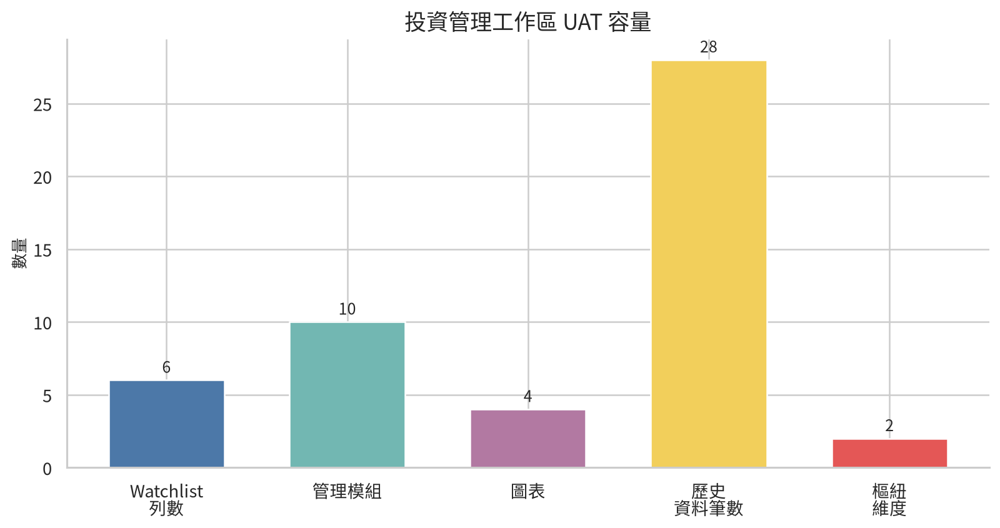
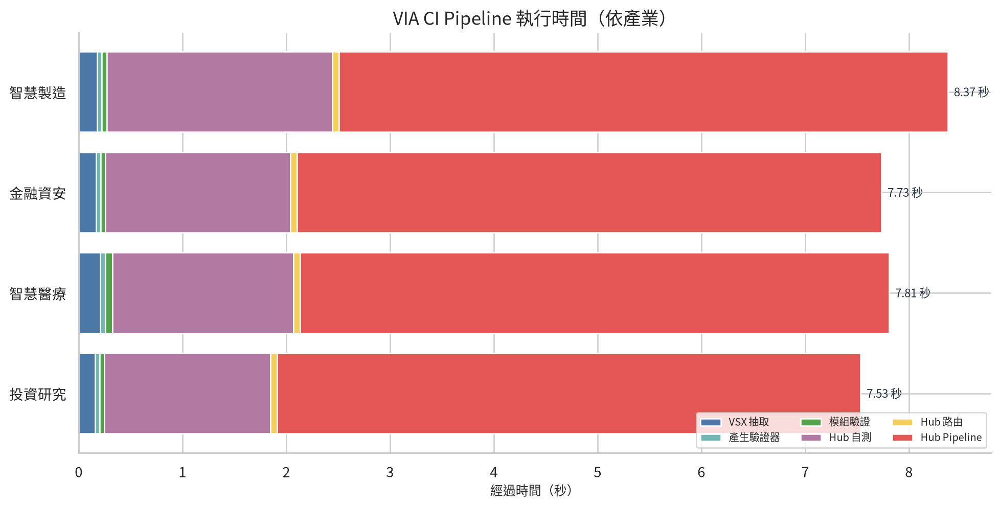
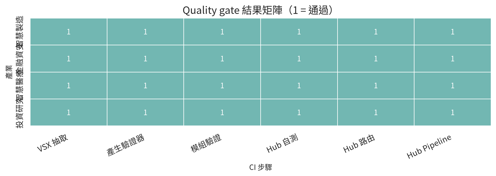
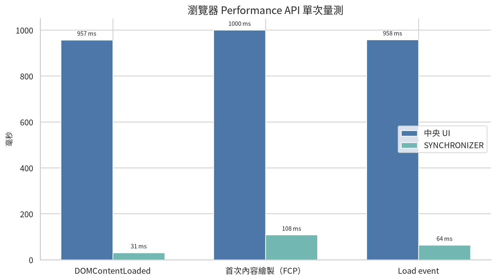
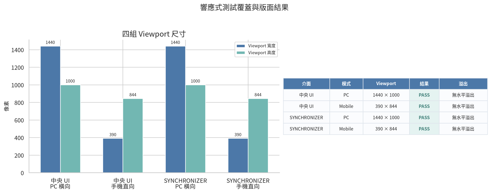

# VIA 投資管理模組效能與響應式測試分析

**分析日期：2026-09-16**  
**作者：Manus AI**  
**測試範圍：VIA Central UI、VIA SYNCHRONIZER、投資研究範本，以及四產業 CI quality gate**

## 執行摘要

目前 VIA 投資管理模組已通過本輪功能、CI 與響應式驗證。四個產業範本共執行 24 個 quality-gate 步驟，全部返回成功，總通過率為 **100%**。[1] 投資研究範本本身的 CI pipeline 執行時間為 **7.533 秒**，是四個範本中最短的一組；相較其他三個範本的平均時間，約快 **5.51%**。[2]

瀏覽器單次 Performance API 量測顯示，SYNCHRONIZER 的載入成本很低：DOMContentLoaded 為 **31 ms**，首次內容繪製為 **108 ms**，Load event 為 **64 ms**。中央 UI 的相同量測則為 **957 ms、1000 ms 與 958 ms**。這個差距主要反映中央 UI 內含較大的完整 dashboard、品牌圖像與投資工作區；它不是伺服器延遲，因為兩個頁面均直接以 `file://` 開啟。[6]

響應式結果同樣穩定。中央 UI 與 SYNCHRONIZER 都在 **1440 × 1000** 的 PC 橫向視圖，以及 **390 × 844** 的手機直向視圖完成檢查。四組視圖均標記為 PASS，並且沒有偵測到水平溢出。[4] [5]

> **重要界線：** 本報告的「效能」包含 CI 執行時間、單次瀏覽器載入量測、DOM 容量與模組資料容量。它不等同於正式壓力測試，也不包含長時間 FPS、記憶體峰值、不同硬體或真實網路條件下的統計分布。

## 1. 測試資料與判讀方式

分析資料來自現有 VIA 本機產物，而不是隨機生成資料。CI 數據取自四產業矩陣報告；投資範本欄位、DOM contract 與模組驗證結果取自投資研究 validator；響應式數據取自已保存的 Chromium 截圖與視覺 UAT 紀錄。[1] [2] [3] [4] [5]

瀏覽器載入數據是每個 `file://` 頁面的一次 Performance API smoke measurement。中央 UI 與 SYNCHRONIZER 的量測使用相同瀏覽器工作階段，但不是重複多次後的平均值。因此，這些數字適合做版本比較與問題定位，不適合宣稱為正式的 P50、P95 或 SLA。

## 2. 投資模組目前容量

投資研究範本在 SYNCHRONIZER 中實際建立 **10 個管理模組、4 個圖表與 28 筆歷史資料**。中央 UI 的 watchlist 顯示 **6 列標的**。匯出模型包含日期與指標兩個樞紐維度，並支援 Charts、History 與 PivotSummary 工作表。[3]

| 指標 | 目前觀測值 | 解讀 |
|---|---:|---|
| Central UI watchlist | 6 列 | 第一視窗可直接檢視的投資觀察清單 |
| 管理模組 | 10 個 | 包含投資總覽、Watchlist、技術觀察、風險透鏡與提醒路由等模組 |
| 自定義圖表 | 4 個 | 相對績效、成交量、波動率與回撤 KPI |
| 歷史資料 | 28 筆 | 投資研究範本目前內建的趨勢資料量 |
| 樞紐維度 | 2 個 | `date × metric` |

容量結果顯示，現有範本已能支援完整的投資研究示範流程，但 28 筆歷史資料仍屬展示規模。若未來要做更長期間的回測或跨資產比較，應另行驗證表格渲染、匯出時間與瀏覽器記憶體使用量。

## 3. CI pipeline 效能

四個產業各執行六個步驟，包含 VSX 抽取、驗證器產生、模組驗證、Hub 自測、Hub 路由與 Hub Pipeline。24 個步驟全部成功，沒有失敗步驟。[1]

| 產業範本 | 總執行時間 | 結果 |
|---|---:|---|
| 智慧製造 | 8.374 秒 | PASS |
| 金融資安 | 7.735 秒 | PASS |
| 智慧醫療 | 7.809 秒 | PASS |
| 投資研究 | 7.533 秒 | PASS |

投資研究 pipeline 的主要瓶頸是 **Hub Pipeline，5.619 秒，約占總時間 74.59%**。其次是 Hub 自測，1.600 秒，約占 21.24%。其餘四個步驟合計只占約 4.17%。因此，若目標是縮短投資範本的 CI 回饋時間，優先檢查 Hub Pipeline 的重複初始化、檔案掃描與產物寫入，比優化 VSX 抽取或模組驗證更可能帶來效果。

## 4. 瀏覽器載入與頁面執行成本

Performance API 單次量測如下。中央 UI 的 HTML 檔案大小約 **1.56 MB**，SYNCHRONIZER 約 **74.7 KB**，前者約為後者的 **20.86 倍**。中央 UI DOM 約 **722 個節點**，SYNCHRONIZER 約 **386 個節點**。[6]

| 介面 | DOMContentLoaded | FCP | Load event | DOM 節點 | 檔案大小 |
|---|---:|---:|---:|---:|---:|
| Central UI | 957 ms | 1000 ms | 958 ms | 722 | 1.56 MB |
| SYNCHRONIZER | 31 ms | 108 ms | 64 ms | 386 | 74.7 KB |

中央 UI 的 FCP 約為 SYNCHRONIZER 的 **9.26 倍**。目前最值得優化的不是 SYNCHRONIZER，而是中央 UI 的初始載入內容。可以優先考慮將嵌入式品牌圖像壓縮或採用更小的透明資產，並延後非首屏的活動流、拓撲細節與次要面板。這些建議是基於檔案大小與單次載入量測提出的工程方向，不是對使用者體驗的絕對判定。

## 5. PC 與手機響應式結果

本輪保存了四組實際 Chromium 視圖。PC 使用 1440 × 1000，手機使用 390 × 844。所有視圖均無水平溢出。[4] [5]

| 介面 | 模式 | 主要版面行為 | 結果 |
|---|---|---|---|
| Central UI | PC 橫向 | KPI 列下方以水平分析帶呈現 watchlist、相對績效圖與 risk lens | PASS |
| Central UI | 手機直向 | KPI 維持兩欄，投資工作區改為垂直堆疊 | PASS |
| SYNCHRONIZER | PC 橫向 | 上方兩個等高面板，下方為範本與分析面板 | PASS |
| SYNCHRONIZER | 手機直向 | 單欄垂直流程，操作按鈕維持兩欄矩陣 | PASS |

這組測試證明目前版面在指定尺寸下沒有出現水平裁切。它尚未證明所有中間寬度都沒有問題，也沒有涵蓋字體放大、瀏覽器縮放、極長模組名稱或大量歷史資料。後續若進入正式產品化，建議增加 768px 平板、820px breakpoint 邊界、200% 瀏覽器縮放，以及長文字與大資料量案例。

## 6. 目前結論與優先順序

目前投資管理模組的**功能可靠度與響應式穩定度高**。證據是 24/24 CI steps 通過，以及四組 PC／手機視圖全部無水平溢出。投資研究範本也完整保留 10 個模組、4 個圖表、28 筆歷史資料與 `date × metric` 樞紐結構。[1] [3]

目前最明確的效能風險集中在**中央 UI 初始載入**，而不是投資範本邏輯本身。中央 UI 的檔案體積和 FCP 明顯高於 SYNCHRONIZER。建議將第一優先放在首屏資產拆分與品牌圖像壓縮；第二優先是將非首屏 DOM 延後生成；第三優先才是處理 Hub Pipeline 的 CI 執行時間。

若要建立正式性能基線，下一輪應固定瀏覽器版本與硬體，對兩個頁面各執行至少 10 次冷啟動與暖啟動，記錄 FCP、LCP、Load event、JS heap、長任務與匯出時間，並以中位數與 P95 取代本次單次量測。這樣才能判斷優化是否真正改善了穩定性能。

## 附件與原始資料

本分析資料夾包含五張圖表、四份 CSV 原始表與一份 JSON 摘要。可直接使用 CSV 進一步製作 Plotly dashboard 或匯入 Excel。

## References

[1]: file:///home/ubuntu/via_complete_package/reports/matrix-summary.json "VIA 四產業 CI 矩陣摘要"
[2]: file:///home/ubuntu/via_complete_package/reports/investment-research/ci_report.json "VIA 投資研究 CI 執行報告"
[3]: file:///home/ubuntu/via_complete_package/reports/investment-research/validation/module-validation-report.json "VIA 投資研究模組驗證報告"
[4]: file:///home/ubuntu/via_complete_package/references/plotly-seaborn-visual-uat.md "VIA Plotly × Seaborn 視覺與功能 UAT"
[5]: file:///home/ubuntu/via_complete_package/references/investment-visual-uat.md "VIA 投資工作區視覺 UAT"
[6]: file:///home/ubuntu/via_investment_analysis/data/runtime_metrics.csv "VIA 本次瀏覽器 Performance API 量測資料"
