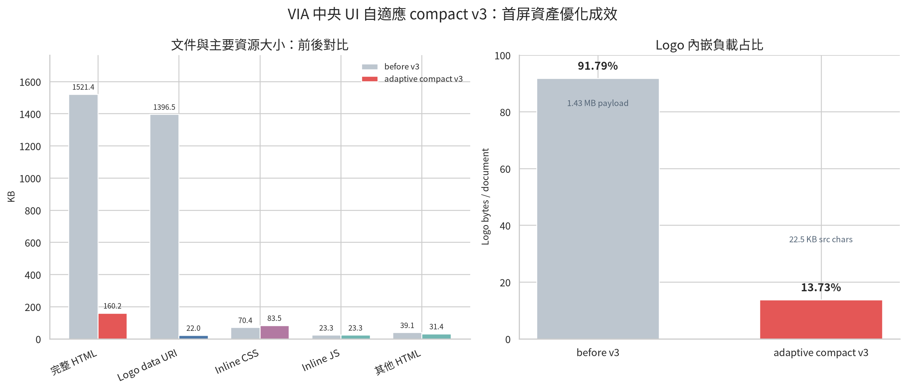

# VIA 中央 UI 自適應 Compact v3 優化回報

**分析日期：2026-09-16**  
**對象：** `VIA-UI-Standalone-NoServer.html` 與 `VIA-SYNCHRONIZER-Standalone.html`  
**模式：** 零伺服器、`file://` 可直接開啟、PC 橫向／手機直向自適應

## 這次已完成的視覺與結構修正

中央 UI 與 SYNCHRONIZER 均改用同一個透明去背印章 Logo。Logo 不再使用框線、圓角、白底膠囊、陰影或 CSS filter；中央 UI 桌機實際繪製為 **27 × 27 px**，手機為 **23 × 23 px**，SYNCHRONIZER 桌機為 **29 × 29 px**。原始提供的圖片檔沒有被覆寫，另產生了 96 × 96 的透明 PNG 小資產。

中央 UI 套用自動最佳化 layout：側欄、header、footer、KPI 卡片、投資工作台與下方資訊區使用 fluid `clamp()`、`auto-fit/minmax()`、breakpoint 與小型 spacing token。桌機維持橫向資訊密度；768px 平板切換為較窄單欄主內容；390px 手機改為垂直堆疊、KPI 2 × 2、投資 watchlist／圖表／risk lens 依序排列。固定 header／footer 保留，捲軸視覺隱藏且不產生水平溢出。

## 負載改善

| 指標 | 修改前 | adaptive compact v3 | 變化 |
|---|---:|---:|---:|
| 中央 UI 原始檔 | 1,557,943 bytes | 164,016 bytes | 約 **9.50× smaller** |
| Logo data URI／src 字元 | 1,429,978 | 22,518 | 約 **63.50× smaller** |
| Logo 在文件中的占比 | 91.51% | 13.73% | 大幅下降 |
| Logo 原始自然尺寸 | 826 × 905 | 96 × 96 | 對應實際小尺寸 render |
| Inline CSS | 72,050 bytes | 85,492 bytes | 增加自適應 v3 規則；仍低於原始 Logo 節省量 |
| Inline JavaScript | 23,816 bytes | 23,816 bytes | 功能腳本未改動 |

CSS bytes 增加是刻意的：v3 加入透明品牌處理、fluid grid、PC／平板／手機 breakpoint、固定 header／footer、無水平溢出與 `content-visibility` 規則。它換取了明確的自適應行為；相較於移除約 1.41 MB Logo payload，成本很小。

## 瀏覽器量測與限制

本次 file:// smoke measurement 量得 **DOMContentLoaded 44 ms**、**Load event 311 ms**、**FCP 412 ms**。這些是單次瀏覽器工作階段的樣本，不能當成正式 benchmark；尤其 file://、快取、瀏覽器啟動狀態與截圖時序都會影響 Performance API。正式驗證應在固定瀏覽器與固定 viewport 下，冷啟動與暖啟動各重複至少 10 次，使用 median／P95 判讀。

目前頁面 outerHTML 約 **168,806 bytes**，live DOM **724 nodes**，無水平 overflow。視覺回歸涵蓋 1440 × 1000 桌機、768 × 1024 平板與 390 × 844 手機；三種 viewport 均無水平溢出。

## UAT 結果

| 測試 | 結果 |
|---|---|
| Logo border／shadow／filter | 通過：0／none／none |
| 中央 UI 搜尋 VDF | 通過：1 筆可見 |
| 投資市場切換至 US | 通過：2 筆可見 |
| 視圖設定 modal | 通過 |
| 新增銜接 modal | 通過 |
| UI Lab 開關 | 通過 |
| 未來 add-on 註冊 | 通過 |
| SYNCHRONIZER 必要控制項 | 通過 |
| 投資研究範本 | 通過：10 個模組、4 個圖表 |
| Console error | 無 |
| 水平 overflow | 無 |

## 交付檔案與後續建議

最新中央 UI：`/home/ubuntu/VIA-UI-Standalone-NoServer.html`。最新 SYNCHRONIZER：`/home/ubuntu/VIA-SYNCHRONIZER-Standalone.html`。透明印章小資產：`/home/ubuntu/via_design_assets/via-stamp-transparent-96.png`。

下一階段若仍要壓縮 FCP，優先把設定 modal、新增銜接 modal 與 UI Lab 改為首次互動才插入；再把投資工作台與拓撲初始化移至 first-paint 後的 idle queue。JavaScript 本身目前只有約 23.8 KB，因此不應先犧牲互動功能做過度切割。
