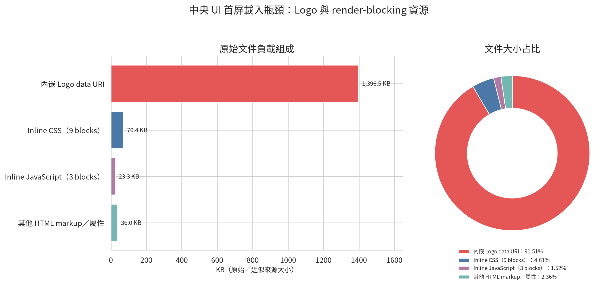
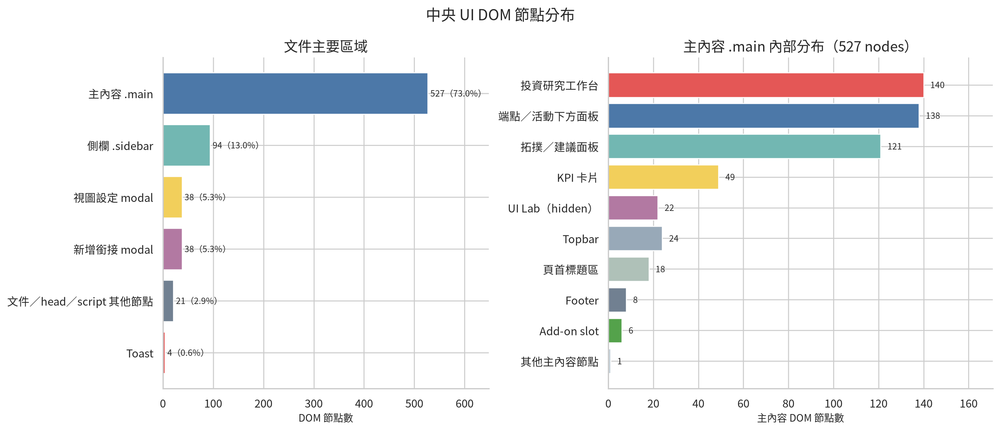
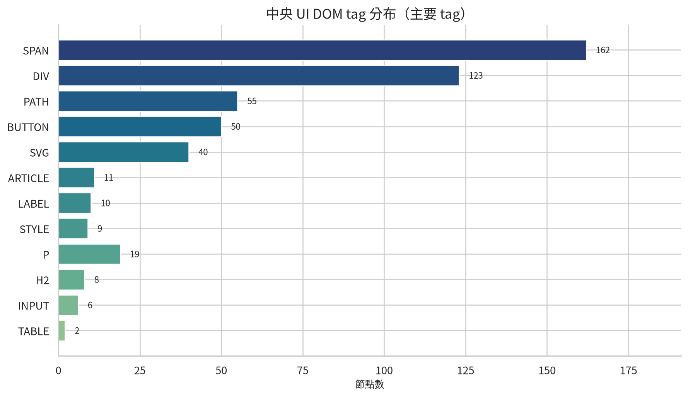
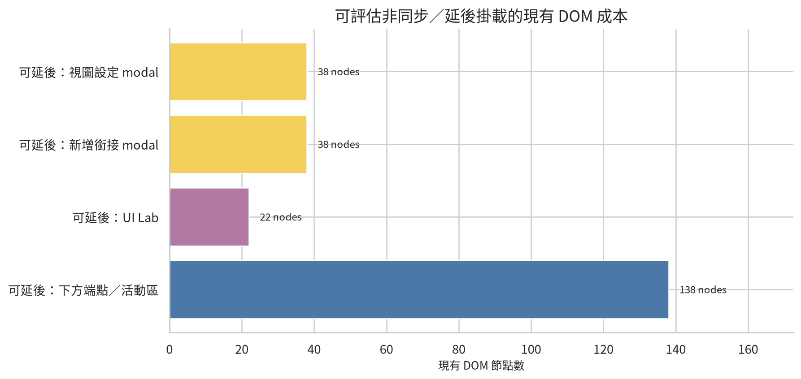

# VIA 中央 UI：非同步載入、Code Splitting 與 DOM 首屏瓶頸分析

**分析日期：2026-09-16**  
**分析對象：`VIA-UI-Standalone-NoServer.html`**  
**分析方式：目前 `file://` 頁面的瀏覽器 DOM 量測、原始 HTML byte 分解與 Chromium 視覺／Performance API smoke measurement**

## 結論先行

目前中央 UI 的第一個優化目標不是把 JavaScript 再切得更細，而是先移除首屏不需要的巨大 inline payload。現有文件約為 **1,562,681 bytes**。其中，Logo 的 data URI 約 **1,429,978 bytes**，占文件約 **91.51%**；它實際只以約 **34 × 34 px** 呈現，但原始 PNG 的自然尺寸為 **826 × 905 px**。這個資產是目前最明確的 FCP 風險。

CSS 共有 9 個 inline block，合計約 **72,050 bytes**。它們位於 HTML 內，瀏覽器必須先解析 CSS 才能穩定完成首屏繪製。JavaScript 共有 3 個 inline block，合計約 **23,816 bytes**。第一段約 11.5 KB，第二段約 11.9 KB，且目前直接位於 `</body>` 前；即使程式碼本身不大，也會在 DOM parser 執行到 script 時增加 DOMContentLoaded 前的同步工作。

因此，最有效的順序是：**先縮小 Logo，再保留極小的 critical CSS 與 bootstrap，最後將投資工作台、拓撲、同步橋接、設定 modal、匯出與 UI Lab 改成事件或 idle 時載入**。若只做 Code Splitting 而保留 1.43 MB inline Logo，FCP 的主要瓶頸仍然存在。

> **量測界線：** 本次 Performance API 數字是單次 smoke measurement。當前樣本為 DOMContentLoaded **473 ms**、FCP **200 ms**；既有報告曾量得 DOMContentLoaded **957 ms**、FCP **1000 ms**。兩次不是控制變因一致的重複 benchmark，不能直接宣稱已改善或退化。資源與 DOM 分布則是目前檔案的實測結構資料。

## 1. 原始文件的首屏負載瓶頸



原始文件的資源分布如下。Logo payload 遠高於 CSS、JavaScript 與其他 HTML。這代表資產壓縮或改為較小的透明 Logo，會比微調 350 bytes 的 UI Lab toggle 更有價值。

| 負載區塊 | 近似大小 | 對 FCP／DCL 的意義 |
|---|---:|---|
| 內嵌 Logo data URI | 1,429,978 bytes | 增加 HTML 解析量與圖片 decode／paint 成本；目前最主要的資產瓶頸 |
| Inline CSS，9 blocks | 72,050 bytes | 影響首屏樣式計算；屬於 render-blocking CSS 成本 |
| Inline JavaScript，3 blocks | 23,816 bytes | 目前在 body 尾端執行；可能增加 DCL 前同步工作 |
| 其他 HTML markup／屬性 | 36,837 bytes | DOM parser 與屬性解析成本 |

### 1.1 先處理 Logo

建議把目前 826 × 905 的 PNG 重採樣到接近實際用途的尺寸，例如 64–96 px 長邊。保留透明背景並改成較小的 PNG 或 WebP。嚴格單檔模式仍可將壓縮後的 data URI 留在 HTML；若允許同資料夾多檔，則改成 `brand-logo.webp`，由瀏覽器獨立快取。

```html
<!-- strict single-file：使用已縮小的 data URI -->


<!-- multi-file serverless：同資料夾資產，可直接以 file:// 開啟的 classic HTML 路徑 -->

```

Logo 仍是品牌首屏元素，不建議對它使用 `loading="lazy"`。應該讓它 eager，但把 payload 變小；若使用 `decoding="async"`，可以降低圖片 decode 對首屏繪製的干擾。

## 2. DOM 節點分布



目前頁面共有 **722 個 DOM 節點**。`.main` 佔 527 個，側欄佔 94 個。兩個尚未開啟的 modal 各有 38 個節點，合計 76 個；隱藏的 UI Lab 仍保留 22 個節點。



主內容 `.main` 內，投資研究工作台有 140 個節點，端點／活動下方面板有 138 個，拓撲／建議區有 121 個。這三個區域合計 **399 個節點**，約占 `.main` 的 75.5%。如果首屏只需要標題、KPI 與投資工作台，拓撲或下方端點表可以用 `content-visibility: auto`，或改在進入 viewport 時生成。

### 2.1 延後掛載的實際候選



這張圖不是預測 FCP 能下降多少，而是列出目前可以延後處理的 live DOM 成本。設定 modal 與新增銜接 modal 尚未開啟卻已各自存在 38 個節點；UI Lab 以 `hidden` 狀態存在 22 個節點。如果把這三組內容改成事件觸發後才插入，理論上可讓 live DOM 從 722 降到約 **624 個節點**。這是結構上的減少，不是未經測試的性能承諾。

## 3. 建議的 Code Splitting 邊界

Code Splitting 應以「首屏是否需要」與「使用者何時觸發」切分，而不是只按照檔案大小切割。建議保留一個很小的 critical bootstrap，並把功能拆成下列模組。

| 模組 | 建議載入時機 | 目前涉及節點或功能 |
|---|---|---|
| `core-shell.js` | inline 或 `defer`，首屏前完成 | 導航、KPI、toast、基本狀態 |
| `investment.js` | 首次 paint 後 idle，或投資工作台接近 viewport 時 | `.investment-desk`，140 nodes |
| `topology.js` | 首次 paint 後 idle；不可見時先暫停 animation | `.content-grid .topology-panel`，121 nodes |
| `settings.js` | 第一次點擊「調整視圖」時 | settings modal，38 nodes |
| `connection.js` | 第一次點擊「新增銜接」時 | connection modal，38 nodes |
| `export.js` | 第一次點擊匯出時 | CSV 產生與下載，不需要首屏載入 |
| `ui-lab.js` | 第一次點擊「元件檢視」時 | hidden UI Lab，22 nodes |
| `sync-bridge.js` | 首次 paint 後，或使用者操作同步器時 | localStorage／BroadcastChannel bridge |

### 3.1 首屏 bootstrap 範例

`DOMContentLoaded` 的目標是讓核心 DOM 已解析，而不是等待所有分析功能完成。對首屏非必要模組，可以在第一個 paint 後交給 idle queue：

```html
<script>
(() => {
  const idle = window.requestIdleCallback
    ? (task) => requestIdleCallback(task, { timeout: 1200 })
    : (task) => setTimeout(task, 0);

  const loadClassic = (src) => new Promise((resolve, reject) => {
    const script = document.createElement('script');
    script.src = src;
    script.onload = resolve;
    script.onerror = reject;
    document.head.appendChild(script);
  });

  const afterFirstPaint = (task) =>
    requestAnimationFrame(() => requestAnimationFrame(() => idle(task)));

  // 只留下真正需要在首屏前完成的功能。
  window.VIA_BOOT = { version: '1.0.0' };

  document.addEventListener('DOMContentLoaded', () => {
    afterFirstPaint(() => Promise.all([
      loadClassic('./modules/investment.js'),
      loadClassic('./modules/topology.js'),
      loadClassic('./modules/sync-bridge.js')
    ]));
  }, { once: true });

  document.addEventListener('click', (event) => {
    if (event.target.closest('#newConnectionBtn')) loadClassic('./modules/connection.js');
    if (event.target.closest('[data-open-settings]')) loadClassic('./modules/settings.js');
    if (event.target.closest('#exportBtn')) loadClassic('./modules/export.js');
    if (event.target.closest('#uiLabBtn')) loadClassic('./modules/ui-lab.js');
  }, { once: false });
})();
</script>
```

上例使用 classic script loader，因為它在 `file://` 的相容性通常比 `import()` 更穩定。若部署環境是 `http(s)`、Tauri 或其他受控 origin，則可以將 `loadClassic()` 換成 `import('./modules/investment.js')`，並使用 ESM 的 tree-shaking 與命名匯出。

### 3.2 `async`、`defer` 與 `import()` 的選擇

`async` 適合完全獨立、載入順序不重要的模組。它可能在 DOM 完成前執行，因此不適合直接操作尚未存在的 `#investmentDesk` 或 `#marketChart`。核心模組應使用 `defer` 或小型 inline bootstrap；非核心模組則在 `DOMContentLoaded` 後透過 `requestAnimationFrame` 加上 `requestIdleCallback` 載入。

`defer` 會平行下載，但會在 DOM 解析完成後執行，且通常仍會影響 DOMContentLoaded。若目標是縮短 DCL，不能把所有功能都改成 defer 後就停止；必須讓 defer 模組只包含核心啟動，把投資、拓撲、匯出與同步橋接移到 DCL 之後的 idle queue。

`import()` 在受控的 `http(s)`、Tauri 或桌面 WebView 中適合做真正的 chunk loading。嚴格以 `file://` 開啟的單檔／無伺服器交付，某些瀏覽器會限制 module import 的 CORS 行為。因此建議提供兩個輸出模式：一個是單檔 fallback，另一個是同資料夾 classic script split 版；不要讓 `file://` 使用者只拿到依賴 module import 的版本。

## 4. CSS 與 DOM 的配合

Code Splitting 不能單獨解決 CSS 與 layout 成本。建議將約 6–10 KB 的 shell critical CSS 留在 `<head>`，涵蓋 body、sidebar、topbar、page head、KPI 卡片與首屏背景。投資圖表、拓撲、設定 drawer、modal、UI Lab 的 CSS 可分開載入，或至少透過 selector 分組後，在模組掛載時才啟用。

對首屏以下的區域，可以先測試：

```css
.bottom-grid,
#uiLab {
  content-visibility: auto;
  contain-intrinsic-size: 300px;
}
```

`content-visibility: auto` 會減少不可見區域的 style、layout 與 paint 工作，但它不會減少 HTML parser 需要讀取的原始 bytes，也不會自動縮短 DOMContentLoaded。因此它應與 modal lazy mount、圖片壓縮與 script split 一起使用。

## 5. 建議的實作順序

第一階段先把 Logo 壓到實際顯示尺寸，並重新量測同一 viewport 下的 FCP、LCP、DOMContentLoaded 與 Load event。第二階段將兩個 modal 與 UI Lab 從 live DOM 移出，改用 template 或首次互動時插入；若目標是同時縮短 DCL，應把它們的 markup 也移到 lazy module，而不只是放進 `<template>`。第三階段保留約 4–8 KB 的 core bootstrap，把投資、拓撲、同步、匯出與 UI Lab 改為 after-paint 或 on-demand 模組。第四階段才調整 CSS 分割與 `content-visibility`，避免在尚未解決 payload 之前過早微調 layout。

每一階段都應在同一瀏覽器、同一 viewport、冷啟動與暖啟動各測至少 10 次，保存 FCP、LCP、DOMContentLoaded、Load event、long task、JS heap，以及互動後模組的載入時間。這樣才能判斷優化是否真正降低首屏成本，而不是受到快取或工作階段狀態影響。

## References

[1]: file:///home/ubuntu/VIA-UI-Standalone-NoServer.html "VIA 中央管理 UI 單檔模板"
[2]: file:///home/ubuntu/via_investment_analysis/data/central_ui_loading_profile.json "中央 UI DOM 與資源量測原始資料"
[3]: file:///home/ubuntu/via_investment_analysis/data/central_ui_code_split_plan.json "中央 UI Code Splitting 實作計畫"
