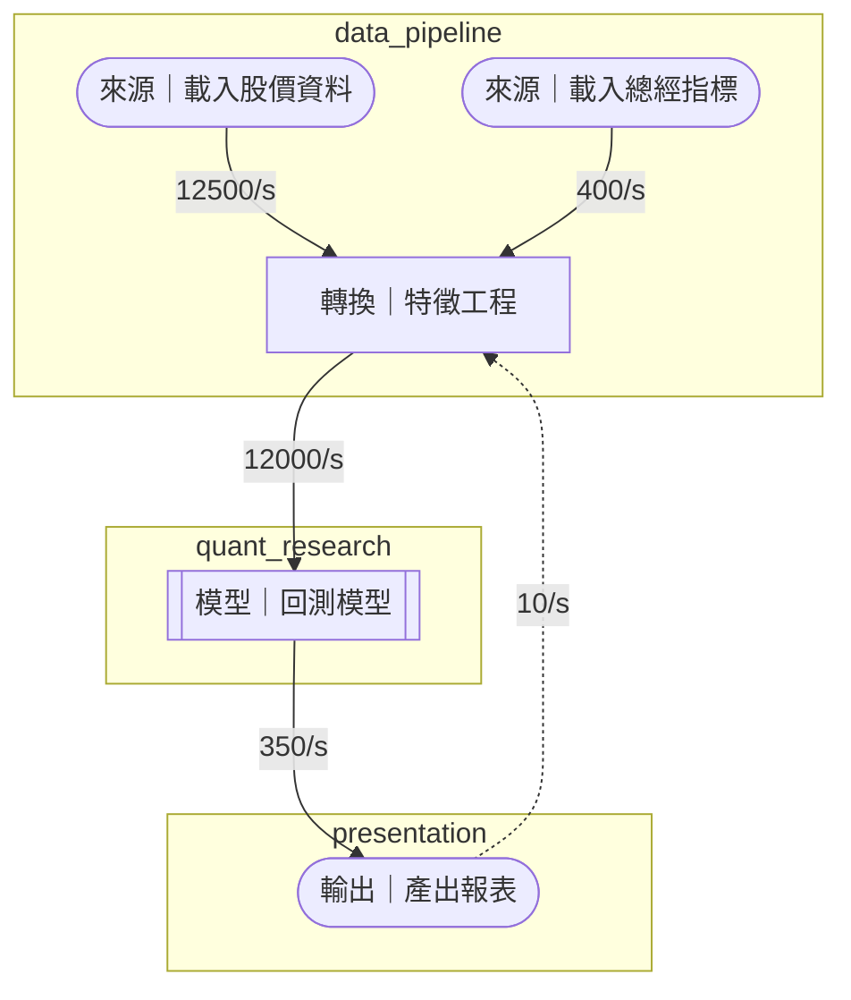

# Workflow: demo_quant_pipeline 架構圖

由 `mermaid_exporter.py` 自工作流 Schema 自動生成；修改請改 Schema 後重新匯出，勿直接編輯此圖。

```mermaid
flowchart TD
    %% Workflow: demo_quant_pipeline
    subgraph data_pipeline [data_pipeline]
        etl_load_quotes(["來源｜載入股價資料"])
        etl_load_macro(["來源｜載入總經指標"])
        feat_engineering["轉換｜特徵工程"]
    end
    subgraph quant_research [quant_research]
        model_backtest[["模型｜回測模型"]]
    end
    subgraph presentation [presentation]
        report_dashboard(["輸出｜產出報表"])
    end
    etl_load_quotes --> |12500/s| feat_engineering
    etl_load_macro --> |400/s| feat_engineering
    feat_engineering --> |12000/s| model_backtest
    model_backtest --> |350/s| report_dashboard
    report_dashboard -.-> |10/s| feat_engineering

    %% Interface 詳情
    %% etl_load_quotes: python:load_quotes(df) -> df
    %% etl_load_macro: python:load_macro(df) -> df
    %% feat_engineering: python:build_features(df) -> df
    %% model_backtest: python:run_backtest(df) -> metrics
    %% report_dashboard: python:render_report(metrics) -> html
```
