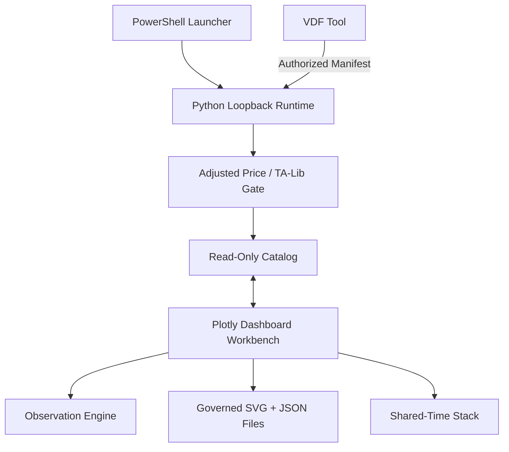

# VAP v025 架構與操作規格

## 執行拓撲



Runtime 必須先完成 VDF Manifest、來源路徑、Adjusted Price 與 TA‑Lib Evidence 驗證，才會把資料表送入 Catalog。Workbench 的 Refresh Request 不是成功證據；只有 Runtime 回覆相同 Request ID 且至少一個資料表通過 Gate 才顯示 `SYNC CONNECTED`。

## Runtime API

| 方法 | 路徑 | 用途 | 寫入邊界 |
|---|---|---|---|
| GET | `/api/health` | Runtime、VDF、選用套件與 Catalog 狀態 | 無 |
| GET | `/api/catalog` | 已驗證的唯讀資料表與語意欄位 | 無 |
| POST | `/api/refresh` | Full／Incremental VDF Refresh | 只寫 Cache／Checkpoint |
| GET | `/api/images` | 受治理圖片 Manifest | 無 |
| POST | `/api/images` | 保存不可變 SVG 與 JSON | 只寫 `output/saved_images` |

## 增量更新狀態

| 狀態 | 意義 |
|---|---|
| `UPDATED` | 來源 Fingerprint 已改變，重新讀取並驗證。 |
| `UNCHANGED` | 來源沒有改變，沿用上一個已驗證 Catalog。 |
| `ERROR_CACHED` | 來源本次失敗，保留上一個可用版本並記錄錯誤。 |
| `RUNTIME_UNREACHABLE` | Workbench 無法連到本機 Runtime。 |
| `RESPONSE_REJECTED` | Runtime 有回覆，但沒有資料表通過 Gate。 |

## 股票資料 Gate

股票類來源必須同時滿足：

1. VDF Connection 為 `AUTHORIZED` 且 `readOnly=true`。
2. Engine 與 Runtime Source 完全相同。
3. Canonical Record Fingerprint 相符。
4. `assetClass` 為 Stock／Equity／ETF／Stock Index 時，必須指定 `adjustedPriceField`。
5. `taLibEvidence.engine=TA-Lib` 且 `status=PASS`。
6. 實際資料列含 Adjusted Price 欄，且可解析為數值。
7. 原始 Price／Close 欄不進入股票來源的可繪圖 Numeric Catalog。

若 Source 要由本機 Runtime 新算技術指標，可在 Source 加上：

```json
"technicalIndicators": ["SMA", "EMA", "RSI", "MACD", "BBANDS"]
```

此時必須安裝 `numpy` 與 `TA-Lib`；缺少套件直接拒絕，不使用自製近似演算法冒充 TA‑Lib。

## 圖片與堆圖

單圖和合成圖保存相同的 Canonical Payload：`schema + chartRecord + svgMarkup`，並計算 SHA‑256。瀏覽器 IndexedDB 和 Runtime Filesystem 內容使用相同 Fingerprint。堆圖只接受驗證過的保存圖，依共同時間點 Strict Intersection 對齊；最下層是唯一可見 X 軸。

標準高度預設 280px，可選 240／280／320／360px；每個面板倍率為 0.5、0.75、1、1.25、1.5、2、2.5、3 或 4。

## Observation Engine

圖表閱讀流程依序為 `Resample → Transform → Time Window → Finite Filter`，確保 YoY 可使用視窗外的前期資料，不因先裁切而少算。頻率彙總取每個期間最後一筆觀察值；YoY Lag 為 Daily 252、Weekly 52、Monthly 12、Quarterly 4、Yearly 1。

每張圖的 Observation Spec 必須保存 `timeRange`、`frequency`、`valueMode`。資料證據至少保存 Source、As Of、Fingerprint、VDF 狀態、Adjusted Price／TA‑Lib 適用狀態與 Proxy Disclosure。收藏採 Append‑Only SHA‑256 冪等 Registry；儲存圖片、載回及共軸堆圖不得丟失這些欄位。
