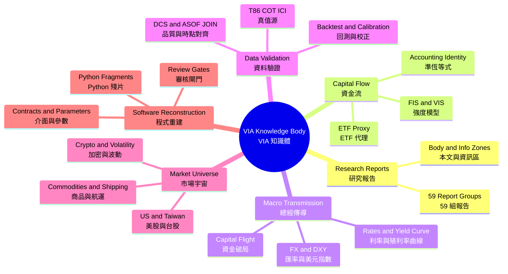

# VIA NLP v1.6.1 雜亂內容整理結果／Messy Content Reconstruction Report

日期：2026-09-08  
輸入：`fetched text to be fixed..txt`、`對話紀錄20260708.docx`  
處理模式：本機 CPU、來源優先、候選修復、程式碼永不執行

## def 結論()

這批資料不能用「直接摘要」處理，因為它同時混合 59 份研究報告、本文／右側資訊區、HTML／MD 格式標記、長篇跳題討論、金融公式、測試案例及不完整 Python 片段。正確整理方式是先保存不可變來源，再分別建立 Layout、Context、Knowledge、Instruction、Code 與 Mind Map 投影。

v1.6.1 已把原本過粗的 38 段／2 主題，改善為 642 段／97 主題，並保留 100% 可逆來源。這代表結構粒度與可追溯性提升，不等同於 97 個主題都已由人工證明正確；最終語意品質仍應以 Gold Set 或人工審核確認。

## def 量化結果()

| 指標 | v1.6.0 | v1.6.1 | 判讀 |
|---|---:|---:|---|
| 合併文字 | 189,128 | 189,128 | 無刪字 |
| Segments | 38 | 642 | 報告、章節與格式邊界已展開 |
| Topics | 2 | 97 | 不再把幾乎全部資料塞入同一主題 |
| Topic Returns | 1 | 268 | 可追蹤跳題後回到舊主題 |
| Report Groups | 0 | 59 | 每份研究報告獨立綁定本文／資訊區 |
| Knowledge Units | 323 | 2,084 | 決策、問題、條件、參數與證據均可索引 |
| Structured Tables | 89 | 90 | 表格逐格保留來源 |
| Instructions | 78 | 355 | 操作、要求、驗證與禁止事項分離 |
| Mind Map Nodes | 580 | 3,778 | 人類樹與 AI typed graph 同步擴充 |
| Mind Map Edges | 681 | 6,056 | 加入來源、回接、衝突及功能關係 |
| 程式語言判定 | TOML 5、CSS 1 | Python 6 | 修正殘片語言誤判 |
| Python AST | 0 可解析 | 3 可解析、3 待審 | 不完整片段不假裝完整 |
| 未解 Topic Overflow | — | 0 | 未強塞容量桶 |

來源 SHA-256：

- TXT extracted text：`9150e7fb3fb405f8e48212516dc450465fe549a862ee8c2086fc4abf35573598`
- DOCX extracted text：`882bb592a25e8a3c3f6be4da18c6c24991219442c1a43b33f350245e8bcca9ba`
- Combined text：`b84bf4306bab33be0478335b0a4680a2017547655654b9e96215620ac334ced8`

## def 整理程序()

1. `Source Ledger`：逐檔保存 bytes、抽取文字、offset、segment SHA-256 與來源雜湊。
2. `Layout Analysis`：辨識報告檔名、DUAL_ZONES、本文區、右資訊區、章節、表格、HTML／MD 標記及未知區塊。
3. `Context Reconstruction`：依原始順序建立 642 個 context units，再標記問題、需求、決策、限制、資料、結果、警告與驗證。
4. `Topic Reconstruction`：排除純布局詞與年份假 Ticker，建立 97 個主題、episodes、transitions 與 268 條 returns-to-topic 關係。
5. `Knowledge Registry`：建立 2,084 個穩定 Knowledge IDs；505 次重複出現只合併索引，不刪原始 occurrence。
6. `Instruction Reconstruction`：將零散的前置條件、操作、禁止事項與驗證重建成 355 條指令及 1 條程序。
7. `Code Reconstruction`：辨識 Python 殘片、AST 狀態、依賴及 module template；禁止執行、寫入或自動補碼。
8. `Mind Map Evolution`：產生中英雙語 human view 與 AI graph；任何改名、合併、淘汰只形成 proposal，不靜默套用。

## def 功能分類()

| 分類 | 數量 | 用途 |
|---|---:|---|
| Heading／標題 | 201 | 還原章節層級 |
| Requirement／需求 | 101 | 找出「必須／需要」內容 |
| Question／問題 | 100 | 建立待回答清單 |
| Data／資料 | 100 | 隔離數據與敘述 |
| Warning／警告 | 74 | 建立風險與禁止事項 |
| Instruction／操作 | 67 | 重建可執行程序的自然語言部分 |
| Decision／決策 | 43 | 區分已決定與仍討論事項 |
| Parameter／參數 | 42 | 建立公式與門檻 SSOT 候選 |
| Citation／引用 | 42 | 保留來源證據 |
| Verification／驗證 | 141 | 對應測試、校正與交叉驗證 |
| Code／程式 | 6 | 進入 AST／殘片審核，不執行 |

同一段可同時具有多個功能標籤，所以數量不應相加當成段落總數。

## def 知識體主幹()



### def 研究報告層()

- 共 59 組 `REPORT-0001` 至 `REPORT-0059`。
- 每組將報告標頭、本文區、右資訊區以相同 `layout_group_id` 綁定。
- 涵蓋台股個股、AI server、PCB／CCL、散熱、記憶體、自動化、金融、鋼鐵、航運與區域市場展望。
- 跨來源檔案遇到 Source Record 邊界會清空 report group，避免上一份 TXT 最後一篇報告黏到 DOCX。

### def 對話知識層()

- ETF 一級市場申贖作為資金流代理，而非全市場 1:1 現金真值。
- FIS／VIS 用於方向、強度及品質調整後金額的推估。
- T86、COT、ICI、ETF flow、融資、當沖、借券及市場價格作為多層觀測來源。
- ASOF JOIN、Stock Differencing、Data-Quality Adjustment 與交叉錨定用於降低時點錯位及假流量。
- Fed、利差、殖利率曲線、DXY、匯率與流動性形成跨區域傳導層。
- 美股、台股、全球 ETF、商品、航運、加密資產與波動率形成資產宇宙層。
- DCS、覆蓋率、回測、校正、壓力測試及準恆等式形成驗證層。

## def 程式還原狀態()

| Code ID | 語言 | AST／語法狀態 | 結果 |
|---|---|---|---|
| `CODE-00001` | Python | invalid fragment | 缺少前置 `if`／函式與縮排脈絡，待審 |
| `CODE-00002` | Python | valid AST | 三個頂層資金流運算式可解析 |
| `CODE-00003` | Python | invalid fragment | `return {` 未完成，缺字典內容與函式外框 |
| `CODE-00004` | Python | valid AST | 廣達案例函式呼叫可解析；被呼叫函式未在片段中定義 |
| `CODE-00005` | Python | valid AST | 緯創案例函式呼叫可解析；被呼叫函式未在片段中定義 |
| `CODE-00006` | Python | invalid fragment | 缺少前置 `if`／函式頭，含 `pd.Series` 回傳片段 |

安全的下一步不是讓 AI 猜補，而是先從其他討論段落找出：

1. `calculate_veritas_flow(...)` 的完整函式頭與參數預設值。
2. `f_M` 第一個 `if` 條件與完整分支範圍。
3. `return { ... }` 的鍵名、值及結尾括號。
4. `quality_adjusted_flow`、`status` 所屬函式與輸入 `row` schema。
5. NumPy、Pandas imports，以及單位（元、張、比例）契約。

缺少上述證據前，module templates 僅可作為重建骨架，不能宣稱是可投產程式。

## def 衝突歸因()

系統列出 12 組待審參數衝突，但其中多數是「作用域未帶入」而非真正互斥：

| 類型 | 參數 | 建議修正 |
|---|---|---|
| 不同標的／報告 | `ADTV` | 加入 ticker、report ID 與日期作用域 |
| 兩個測試案例 | `CLOSE_PRICE`、`DAY_TRADE_RATIO`、`ETF_FLOW`、`MARGIN_DELTA_SHARES`、`MARGIN_RATIO`、`T86_NET` | 綁定 `quanta_case`／`wistron_case`，不可互相覆蓋 |
| 條件分支 | `F_M`、`STATUS`、`ELSE` | 改建為 decision table，不應視為單值參數 |
| 同義數值 | `KAPPA = 1.5B` 與 `1500000000` | 單位正規化後提出等價候選，人工確認 |
| 公式版本 | `RAW_FLOW` | 一版含 ETF flow、一版未含；保留兩個 revision 並確認 canonical |

所有衝突目前都是 `human_required`，沒有靜默選一個覆蓋另一個。

## def 文字修復狀態()

- Unicode／編碼修復：沒有發現可安全自動套用的變更，來源未改寫。
- 衍生完善稿主要補齊句尾標點，不覆蓋 Source Ledger。
- `SEG-000077` 若補標點會把 `NT$650` 改成 `NT$650.`，觸發金融事實閘門，已退回原文。
- `SEG-000150` 若補標點會改變 URL 結尾，觸發 URL 事實閘門，已退回原文。
- `etff`、`驗ˊ算`、簡繁混用等可能錯字應進候選表，由人確認後再形成修訂版；不可直接改原文。

## def 驗收狀態()

| Gate | 結果 |
|---|---|
| Source reconstruction | PASS，189,128 字元可逐字重建 |
| Layout reconstruction | PASS，378 blocks 可逐字重建 |
| Report grouping | PASS，59 組，跨檔重置 |
| Fact integrity | PASS with 2 source fallbacks |
| Knowledge conflict resolution | 0 次自動解決 |
| Automatic source mutation | 0 |
| Automatic segment merge／delete | 0 |
| Automatic code merge／write／execute | 0／0／0 |
| Mind Map graph endpoints | PASS，缺失端點 0 |
| Alias matches | 3,726，未截斷 |
| Near-duplicate candidates | 2，未截斷、未自動合併 |
| Automated tests | 85/85 PASS |

## def 仍需人工處理()

- 52 個未回答問題：需區分真正未回答、章節標題問句及後文已有隱含答案者。
- 12 組參數衝突：依上表加入 report／ticker／case／formula-version 作用域。
- 3 段不完整 Python：必須找到缺失上下文，不能由模型自由補寫。
- 97 個主題：需以人工 Gold Set 抽樣驗證 B-cubed F1、Topic Return F1 與過度合併／切碎率。
- 3,146 個雙語語意標籤仍標記 `needs_translation`；結構標籤已雙語，但未知專有詞沒有假翻譯。

## def 建議日常流程()

```text
新增 TXT／DOCX／Markdown／程式檔
→ 建立不可變 Source Record
→ Layout 分區與語言／程式偵測
→ 文字修復候選（不覆蓋來源）
→ Topic／Return／Function Labels
→ Knowledge／Instruction／Code Registries
→ 中英 Mind Map Snapshot
→ Conflict／Question／Code Review Queue
→ 人工批准修訂
→ 建立新 Snapshot，保留上一版與 rollback reference
```

這種流程能把雜亂內容整理成「可讀、可查、可回溯、可逐步修正」的知識體，同時避免最危險的三件事：摘要漏字、不同案例參數互相覆蓋，以及殘缺程式被補成看似可執行的假程式。
