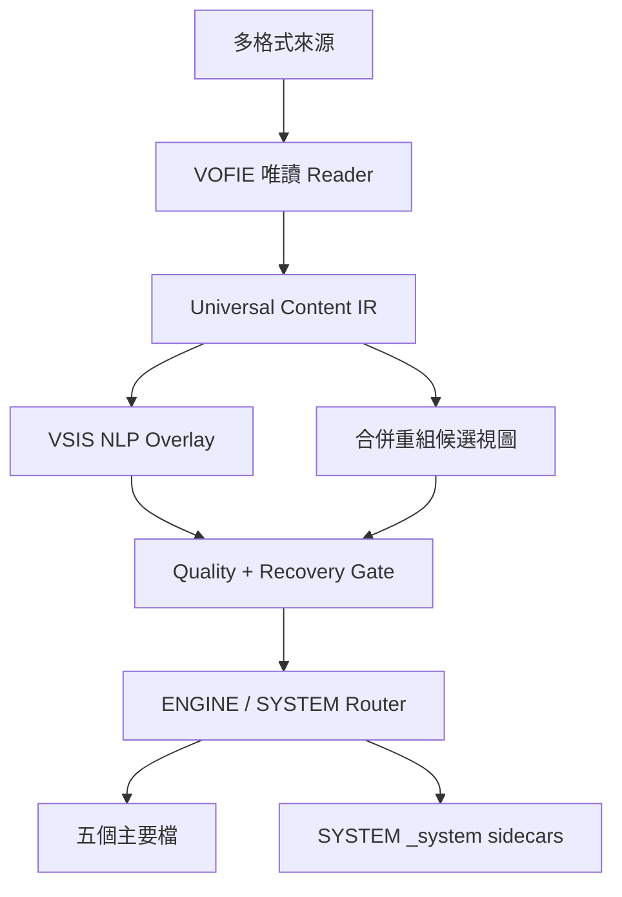

# VOFIE 與 VIA／VSIS 整合規格

## 系統定位

VOFIE 是格式與內容重構層，不取代 VSIS、NLP Fusion、CGE 或任何 VIA Frozen Core。它新增一個 Registry namespace：`veritas.omniformat`，並以 Adapter／Overlay 方式調用既有 `via.semantic_intelligence`。



## Runtime Export

VIA Runtime Bridge 可掛載以下五個純 runtime endpoint：

| Endpoint | 輸入 | 輸出 | 是否寫檔 |
|---|---|---|---|
| `build_ir` | 來源路徑陣列、options | Universal Content IR | 否 |
| `convert` | 來源、formats、output dir | IR + output manifest | 是，僅新目錄 |
| `convert_simple` | 1–5 個來源、role、operations、output dir | 固定五檔 + optional `_system/` | 是，僅新目錄 |
| `gui` | Window I/O／拖放 | 呼叫 `convert_simple` | 是，僅新目錄 |
| `manifest` | 無 | Registration Manifest | 否 |
| `self_test` | 無 | Self-test report | 否 |
| `user_test` | 無 | ENGINE／SYSTEM 流程測試 | 僅暫存測試目錄 |
| `activate` | 無 | ACTIVE／HOLD report | 否 |
| `tool_audit` | language、optional probe | JS／PowerShell Top-20 與 30-row capability matrix | optional report |
| `tool_plan` | 單一程式檔、requested functions | 按需工具計畫或唯讀 syntax result | optional report |
| `hydra_risk_audit` | optional target files | NoHydra Top-20 evidence、breakers、solutions、三輪計畫 | optional report |
| `create_runtime_copy` | 1–5 個來源、output、核准 token | 版本化 Runtime Copy + manifest | 是，只限新 run-local copy |
| `rollback_dry_run` | Runtime Copy manifest | source/runtime hash 復原檢查 | 否 |
| `web_template` | IR | HTML/CSS/JS | 是，僅新目錄 |

## VSIS 調用

```python
from via_semantic_intelligence.registry_bridge import create_subsystem

dispatcher = create_subsystem()
responses = dispatcher.invoke_plan(
    caller_system_id="CGE",
    actions=("normalize", "segment", "categorize", "semantic_check"),
    base_payload={
        "content": canonical_markdown,
        "content_type": "markdown",
        "source_name": source_name,
    },
)
```

VOFIE 不修改 VSIS 的 25 個 Capability、70 aliases、Caller Preset 或 Registry Manifest。VSIS 找不到時回報 `SKIP`；呼叫異常時回報 `WARN`，但只要 VOFIE 核心 Gate 通過，Markdown／JSON／CSV／Web 仍可輸出。

## 資料流與不變量

| 階段 | 不變量 | 失敗策略 |
|---|---|---|
| Reader | 讀取前後 `size + BLAKE2s` 一致 | FAIL CLOSED |
| Normalize | 原始抽取全文寫入 SourceRecord | FAIL CLOSED |
| Topic Split | 每區有 Source ID、行號、hash | FAIL CLOSED |
| Dedup | 只設 `duplicate_of`，不刪 Topic | MARK AND RETAIN |
| HTML/UI | script/style 可讀但 script 不執行 | DENY EXECUTION |
| Code | AI 改寫只可為 candidate | HOLD WITHOUT EQUIVALENCE |
| Output | 已存在非空目錄不覆寫 | NEW TIMESTAMPED RUN |
| Audit | JSONL hash chain append-only | FAIL CLOSED |

## ENGINE／SYSTEM 角色

| 角色 | 主要輸出 | 治理輸出 | 使用情境 |
|---|---|---|---|
| ENGINE | 固定 5 檔 | 無 | 最少檔案、一般使用者、視窗預設 |
| SYSTEM | 固定 5 檔 | `_system/` | VIA 調度、稽核、啟用與故障復原 |

Role Router 不會改變 Universal Content IR 或任何 Reader／Adapter；它只決定治理 sidecars 是否寫入隔離目錄。

SYSTEM 的 `_system/PolyglotToolAudit.json` 是當次可用性快照；ENGINE 仍只產生五個主要檔。兩種角色都不會安裝工具或把語言工具寫入 VIA base。

## v1.2 JavaScript／PowerShell 工具調度層

`config/polyglot_tool_catalog.json` 是新增、可獨立維護的工具目錄；JavaScript 與 PowerShell 各固定 Top 20 免費候選。十項 capability（syntax、static analysis、format、unit test、coverage、dependency graph、unused code、refactor/codemod、schema/UI validate、build automation）各有 Python／JavaScript／PowerShell 路由，矩陣固定 30 rows。

| 語言 | 隔離路由 | 原生 Bridge | 缺工具時 |
|---|---|---|---|
| JavaScript／TypeScript | `via-ui` | `adapters/vofie_polyglot_tool_probe.mjs` | Python 結構檢查或 PLAN_ONLY |
| PowerShell | `via-ps` | `adapters/Veritas.VOFIE.ToolBridge.psm1` | Python brace／quote 結構檢查或 PLAN_ONLY |

調度流程是 `detect → select by requested function → plan → explicit safe execution`。預設只規劃；只有 `syntax_parse` 可以由 `--execute-safe` 執行，而且執行前後必須重新驗證來源 size 與 BLAKE2s。外部工具未安裝時標示 `NOT_INSTALLED`，不得自動下載、安裝或修改 PATH。

## v1.3 NoHydra 治理層

NoHydra Gate 位於 Activation 之前，與一般 Failure Recovery 及工具偵測彼此獨立。它先做 read-only panorama，建立 ownership、dependency、write-set、runtime 與 hash evidence；只有互不共寫的安全提案可進 Round 2，依賴型提案只可進 Round 3 順序審查。

| Gate | 規則 | 失敗行為 |
|---|---|---|
| Authority | namespace／writable path 唯一 owner | HOLD，凍結 pointer |
| Concurrency | global cap 4、parallel fixers 2 | 降為 bounded sequential queue |
| Side effects | no-import、network/process/DB blocked | HOLD，保留 evidence |
| Integrity | canonical 前後 hash 與 audit chain 完整 | FAIL／HOLD，不得 activation |
| Recovery | snapshot、last-known-good、restore dry-run | rollback_ready=false 即 HOLD |
| Activation | Hydra/self/user/recovery/post-scan 全 PASS | 任一缺少即 HOLD |

NoHydra 只輸出偵測結果與解法計畫，不套用修復。完整 Top 20 見 `HYDRA_RISK_PLAYBOOK.md`。

## v1.4 Runtime Copy 治理層

所有真實寫入與 canonical 分離：只有精確 token `YES_FOR_ANY_REAL_WRITE` 可建立新版本化 Runtime Copy；未授權時 `HOLD`。Manifest 記錄來源與副本 BLAKE2s，rollback endpoint 只驗證可復原性，不執行回寫。Hash state machine 嚴格採 `MISSING→APPLY / PROPOSED→SKIP / ORIGINAL→BACKUP_APPLY / OTHER→FAIL_CLOSED`，且系統沒有 canonical promotion endpoint。

## Failure Recovery Router

八個 stages 為 `INTAKE / READER / SEMANTIC / CONSOLIDATION / VSIS_NLP / EXPORT / WINDOW_UI / GOVERNANCE`，每個 stage 固定 Top 20 failures。Catalog 的 stage-level handler 清單會展開到該 stage 的每一項 failure；所有 handler 都是具名 `def`、可 dry-run、不得改來源。

處理順序：

1. Preflight 將已知問題對應到 failure ID。
2. 先執行純驗證／正規化／保留來源處理器。
3. optional 能力失敗時只停用該能力並啟用 deterministic fallback。
4. 來源或治理不變量失敗時 `FAIL CLOSED`／`HOLD`。
5. SYSTEM 將事件、解法與 hash 寫入 `_system/`；ENGINE 只回傳易懂錯誤。

## 程式碼等價改寫 Gate

目前交付版只做「分區、元件抽取、Fence 補標與候選基線」，不對來源程式做未驗證改寫。未來啟用 AI Adapter 時，至少需要：

1. 原語言 AST／結構 parse 通過。
2. 公開函式、類別、參數、事件與輸出集合不少於 baseline。
3. Fixture replay 全部通過。
4. Source hash 在流程前後不變。
5. 候選輸出到新檔，不覆寫來源。

缺少任何一項，Gate 必須為 `HOLD`。

## HTML 規格轉模板

HTML 輸入會產生兩條結果：

- Content lane：Heading、paragraph、list、table、link、image → Markdown。
- UI lane：input、select、textarea、button、link、form、endpoint、script/style evidence → UI Spec。

完整模式由 Python 主引擎產生三個分離檔：

- `Veritas_VOFIE_Template.html`
- `Veritas_VOFIE_Template.css`
- `Veritas_VOFIE_Template.js`

模板採本地資料、無 CDN、單一 Header、PC/Mobile 響應式、鍵盤可操作、深色偏好與 reduced-motion 支援。

簡易模式則把同一套 CSS、JavaScript 與 JSON 內嵌成單一 `Veritas_VOFIE.html`，減少使用者檔案數；兩種模式共用同一 UI Spec 與 JavaScript 邏輯。
