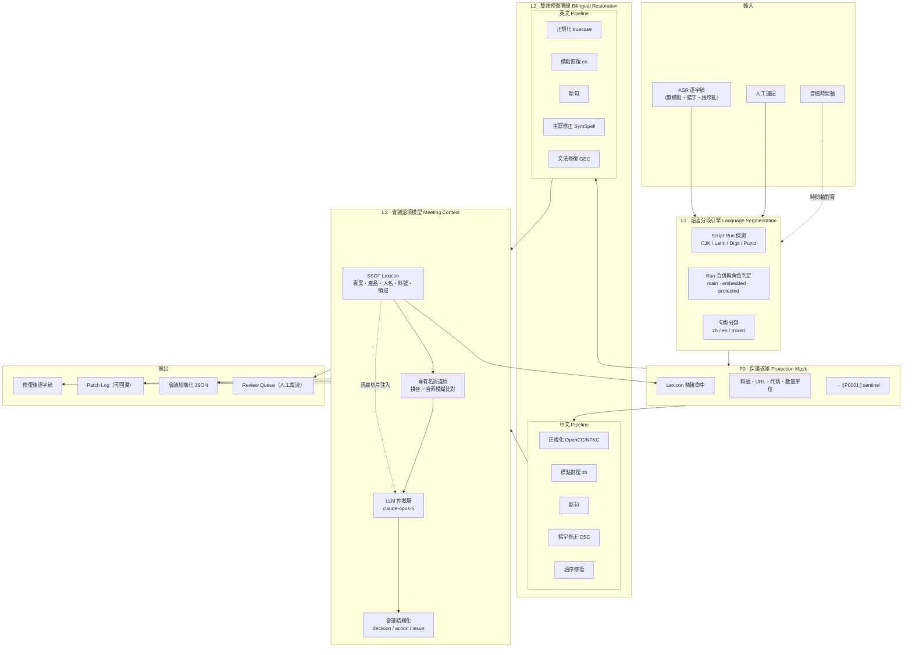
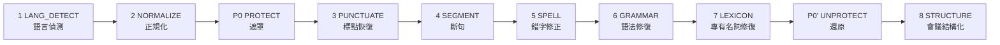
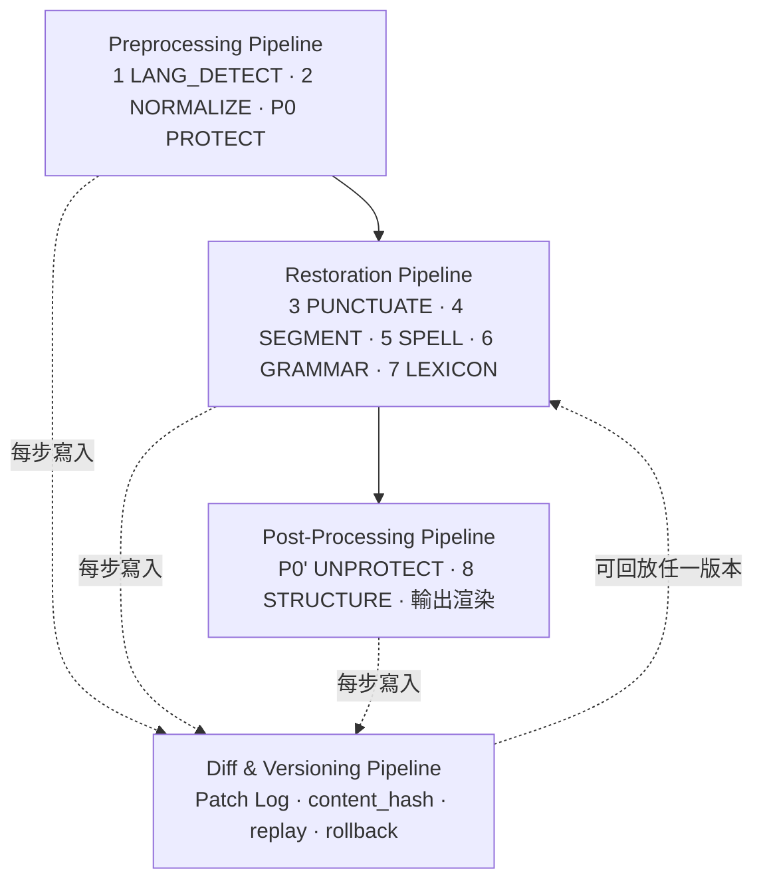
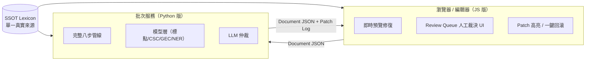

# VTR · 完整修復引擎架構圖

**DG-IN Meeting Transcript Restoration Engine · 中英文會議紀錄修復引擎**
VIA 子系統代號：**VTR**（Veritas Transcript Restoration）

---

## 0. 這份文件負責什麼

Portfolio 定的是「要哪七大模組」；這份文件定的是「這七大模組怎麼接成一台可跑、可驗、可回溯的機器」。
四份工程規格的關係：

| 文件 | 定義 |
|---|---|
| `contracts/vtr-document.schema.json` | **資料契約**（唯一 SSOT，兩版引擎共用） |
| `00_ARCHITECTURE.md`（本文件） | 三層架構、八步管線、遮罩機制、信心度閘門、四大 Pipeline |
| `01_PYTHON_ENGINE_SPEC.md` | Python 版（批次／模型層／權威實作） |
| `02_JAVASCRIPT_ENGINE_SPEC.md` | JavaScript 版（即時／編輯器層／預覽實作） |
| `03_SSOT_LEXICON_SPEC.md` | SSOT Lexicon 結構、治理、比對演算法 |

---

## 1. 系統全景（Architecture Overview）



### 為什麼是三層，而不是一次丟給 LLM

| 層 | 職責 | 不可取代的理由 |
|---|---|---|
| **L1 語言分段** | 決定每個字串該進哪條管線 | 中英混雜句直接送單語模型，會把 `dashboard` 當成錯字改掉、或把中文當雜訊丟棄。**分段錯，後面全錯。** |
| **L2 雙語管線** | 確定性、可解釋、可測 | 標點與錯字有明確 ground truth，用規則＋專用模型的精確度與成本都遠優於 LLM，而且**每一筆改動都有 rule_id**。 |
| **L3 會議語境** | 處理只有你們公司知道的事 | 「威瑞塔斯」vs「VeritasAutoPlot」、料號 `VIA-0162B`、人名同音字 —— 這些不在任何預訓練模型裡，只在 SSOT Lexicon 裡。 |

---

## 2. 八步修復法（工程化定義）

Portfolio 的八步是方法論；以下是可實作版本，含**一個必要的補強**：`PROTECT` / `UNPROTECT` 前後包夾。



### 2.1 每一步的契約

所有 Stage 都是**純函式**，簽名一致：

```
Stage.apply(doc: Document, ctx: Context) -> StageResult {
    doc:     Document      # 新的不可變文件
    patches: Patch[]       # 這一步做了什麼、為什麼、信心多少
    metrics: dict          # 這一步的量測值
}
```

**這條約束換來四件事**：任何一步可單獨測試／任何一步可關閉重跑／Diff & Versioning 免費取得／Python 版與 JS 版可對同一份 Document 交叉驗證。

| # | Stage | 輸入狀態 | 做的事 | 主要失敗模式 |
|---|---|---|---|---|
| 1 | `LANG_DETECT` | 原始字串 | Script run 切分、`lang` 判定、`runs[]` 標註 | 中英混雜句誤判為單語 |
| 2 | `NORMALIZE` | 已分段 | NFKC、全半形統一、簡繁（OpenCC `s2twp`）、空白、ASR 語助詞（嗯／呃／那個）標記 | 過度刪除語助詞導致語氣失真 |
| — | `PROTECT` | 已正規化 | 專名／料號／URL／代碼 → `⟦P0001⟧` | 遮罩邊界切錯 |
| 3 | `PUNCTUATE` | 已遮罩 | 逗號／句號／問號／頓號／冒號恢復 | 中文長句只給句號，語意黏連 |
| 4 | `SEGMENT` | 有標點 | 依標點＋語義切句，寫回 `segments` | 切在專名中間 |
| 5 | `SPELL` | 已斷句 | zh 同音／形近字修正；en 拼寫修正 | **誤改正確詞**（比不改更糟） |
| 6 | `GRAMMAR` | 錯字已修 | en GEC；zh 語序與贅詞 | 改寫語意 |
| 7 | `LEXICON` | 文法已修 | 被 ASR 打壞的專名還原（模糊／音素比對） | 過度匹配，把一般詞改成專名 |
| — | `UNPROTECT` | — | sentinel 還原成 canonical 形式 | sentinel 遺失（見 2.3） |
| 8 | `STRUCTURE` | 全文已修 | 主題分段、decision／action／issue 抽取 | 把討論當成決議 |

### 2.2 為什麼順序是這樣

- **標點必須在斷句之前** —— 斷句依賴標點訊號；反過來做，中文長句會被切在錯的地方。
- **錯字必須在文法之前** —— GEC 模型看到錯字會嘗試「改寫整句」而非改正一個字。
- **專名還原必須在文法之後** —— 需要相對乾淨的上下文才能做模糊比對；但**精確命中的專名必須在最前面就遮罩起來**，這就是 P0 存在的理由。

### 2.3 P0 遮罩機制（本架構最關鍵的一個設計）

沒有遮罩，會發生這些事：

| 原文 | 沒遮罩的結果 | 原因 |
|---|---|---|
| `VIA-0162B` | `VIA-0162 B` | 標點恢復把它當句尾 |
| `VeritasAutoPlot` | `Veritas Auto Plot` | 拼寫修正認為它拼錯 |
| `料號 A7X-2201` | `料號 A7X-2021` | LLM「順手」修正成常見數字 |

**規則**：

1. `PROTECT` 之後、`UNPROTECT` 之前，任何 Stage 看到的都是 `⟦P0001⟧`。
2. **Sentinel 完整性檢查**：每個 Stage 結束時比對 sentinel 集合；若有遺失或變形，**該 Stage 的所有 patch 一律 reject 並回退**，記錄 `VTR.PROTECT.sentinel_violation`。
3. `⟦` `⟧`（U+27E6/U+27E7）選用理由：不出現於中英文會議語料、不被主流 tokenizer 拆成語意單位、視覺上人工複核時一眼可辨。

---

## 3. 信心度閘門（Confidence Gate）

**這是「敢不敢自動套用」的唯一依據。**

| 頻帶 | 門檻 | decision | 行為 |
|---|---|---|---|
| 高 | `≥ 0.85` | `auto` | 直接套用 |
| 中 | `0.60 – 0.85` | `review` | **不套用**，進 `review_queue` |
| 低 | `< 0.60` | `reject` | 丟棄，只留紀錄 |

信心度來源：

| source | 信心度算法 |
|---|---|
| `lexicon`（精確 alias 命中） | `1.0`（確定性） |
| `deterministic`（正規化、全半形） | `1.0` |
| `model`（標點／CSC／GEC） | 模型 token 機率，經校準（temperature scaling） |
| `lexicon`（模糊／音素比對） | `0.5·字面相似 + 0.3·音素相似 + 0.2·語境加權`（見 Lexicon 規格 §5） |
| `llm_arbiter` | 模型自評 × 與確定性層一致性；**單獨 LLM 判斷上限 0.80**，即永遠進 review |

**最後一條是刻意的**：LLM 不允許在無人複核下獨自改動會議紀錄。它的職責是**仲裁**與**解釋**，不是最終權威。

---

## 4. 四大 Pipeline



| Pipeline | 職責 | 可否重跑 |
|---|---|---|
| **Preprocessing** | 把不確定的輸入變成確定的結構 | 冪等，可任意重跑 |
| **Restoration** | 真正修復，全部行為受信心度閘門管制 | 可指定從第 N 步重跑 |
| **Post-Processing** | 還原遮罩、結構化、渲染 Markdown/DOCX | 冪等 |
| **Diff & Versioning** | append-only patch log；`content_hash` 鎖定 | 唯讀，只能追加 |

### 4.1 Diff & Versioning 的具體形式

- Patch log 為 **JSONL**，一行一個 Patch，永不修改。
- 每個 `revision` 記錄套用後的 `content_hash`（SHA-256 of 正規化序列化）。
- `vtr replay --to-rev N` 由 rev 0 重播還原任一中間狀態。
- **回滾即是重播**：不刪除任何東西，只重播到更早的 rev。
- 與 VIA 治理一致：canonical 逐字稿的推進需要 operator 覆核 + hash-locked transaction，引擎本身只產生 candidate。

---

## 5. LLM 仲裁層（L3-F3）

### 5.1 什麼時候才呼叫

**只在確定性層無法收斂時**。呼叫條件（任一成立）：

1. 同一 span 有 ≥2 個來源不同、內容衝突的 patch。
2. Patch 信心度落在 review band，且該 segment 含 `unresolved_entity` flag。
3. `STRUCTURE` 步驟（decision/action 抽取本質上需要語境判斷）。

實務上這覆蓋約 10–20% 的 segment。**其餘 80%+ 由確定性層處理**，因為那些改動有明確 ground truth，用 LLM 只是把可驗證的事變成不可驗證的事。

### 5.2 模型與參數

| 項目 | 值 | 理由 |
|---|---|---|
| 模型 | `claude-opus-5` | 中英雙語 + 長上下文（1M）+ 專名判斷 |
| thinking | `{"type": "adaptive"}` | 仲裁需要推理；Opus 5 預設即為 adaptive |
| effort | `output_config: {"effort": "medium"}` | 仲裁任務範圍窄；`low`/`medium` 在 Opus 5 上表現很強，是主要成本槓桿 |
| 輸出 | `output_config.format` (json_schema) | 仲裁結果必須是結構化 Patch，不能是散文 |
| 快取 | `cache_control: {"type": "ephemeral"}` 掛在 system + lexicon 切片 | Opus 5 最小可快取前綴為 **512 tokens**（Opus 4.8 為 1024），詞庫切片幾乎必然可快取 |
| 批次 | Batch API（離線場景） | 全額 50% 折扣 |

> ⚠️ 不要在請求中送 `temperature` / `top_p` / `top_k` / `budget_tokens` —— Opus 5 一律回 400。語氣與變異度用 prompt 控制。

### 5.3 成本模型（單場 1 小時會議）

以 1 小時中文為主會議 ≈ 9,000 字 ≈ 約 12K input tokens 估算；仲裁覆蓋 15% segment，分 ~20 個批次請求。

| 情境 | Input | Output | 定價 | 單場成本 |
|---|---|---|---|---|
| 全文丟 LLM（**反例**） | ~12K × 3 輪 | ~30K | $5 / $25 per MTok | ≈ $0.93 |
| 本架構（仲裁 15%，含快取） | ~4K 新 + ~20K 快取讀 | ~6K | 快取讀 ≈ 0.1× | ≈ $0.19 |
| 本架構 + Batch API | 同上 | 同上 | 再 −50% | ≈ **$0.10** |

**結論：把 LLM 放在仲裁位置而非主管線，單場成本降約 9 倍，而且 80% 的改動變成可回歸測試的確定性行為。**

---

## 6. 評估指標（沒有這節，前面全是空話）

| 步驟 | 指標 | 目標 |
|---|---|---|
| `LANG_DETECT` | run 邊界 F1 | ≥ 0.98 |
| `PUNCTUATE` | 逐標點類別 F1（，。？、：） | zh ≥ 0.85 / en ≥ 0.90 |
| `SEGMENT` | 邊界 F1 / WindowDiff | F1 ≥ 0.90 |
| `SPELL` | **F0.5**（精確度加權） | ≥ 0.90 |
| `GRAMMAR` | GLEU | ≥ 基線 +0.05 |
| `LEXICON` | 各實體類別 exact-match | ≥ 0.95 |
| `STRUCTURE` | decision/action 抽取 F1 | ≥ 0.80 |
| **端到端** | **Harmful Edit Rate（改壞率）** | **< 0.5%** |

**Harmful Edit Rate 是本引擎的頭號安全指標**：一筆把正確內容改錯的修復，傷害遠大於十筆漏修。所有門檻調整都以壓低此值為優先，而非追求覆蓋率。

黃金測試集：≥ 200 段人工雙盲標註的 DG-IN 實際會議片段，含中文段、英文段、混雜段各三分之一。

---

## 7. 部署拓樸（Python 版 × JavaScript 版如何共存）



**分工原則**：

- **Python 版是權威實作**。所有進入 canonical 的修復都必須經由 Python 版產生。
- **JS 版是低延遲預覽與人工介面**。它跑得動的步驟（正規化、遮罩、詞庫精確命中、斷句、英文拼寫）給使用者即時回饋；跑不動的（中文 CSC、GEC、NER 模型）標記為 `pending_server`，不猜。
- 兩版對同一份 Document 產生的 patch，**同一規則必須使用同一個 `rule_id`**，因此可做交叉驗證：JS 版與 Python 版在同一 rule_id 上結果不一致 → 視為引擎缺陷，進 CI 告警。

---

## 8. 治理（VIA 對齊）

| 項目 | 規則 |
|---|---|
| Canonical 逐字稿 | 引擎**不得**直接改寫；只產生 candidate + patch log |
| 晉升（Promotion） | Operator 覆核 + hash-locked transaction（與 VRN/VDF/VAP 同一閘門） |
| 新詞入庫 | 一律 `enabled=false` 草稿，需覆核（見 Lexicon 規格 §6） |
| Sandbox | 引擎在 sandbox 產出，不觸碰 operator workstation 的 canonical tree |
| 稽核 | 每一筆改動都可回答：誰改的（source）、依據什麼（rule_id）、為什麼（evidence）、信心多少（confidence） |

---

*本文件為 VTR 子系統 canonical 規格的一部分，SHA-256 已登錄於 `VTR_Subsystem_Manifest.json`。*
