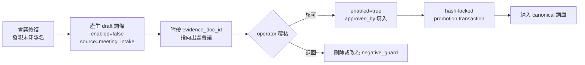

# VTR · SSOT Lexicon 結構規格書

**位置**：`functional modules/VTR/lexicon/`
**Schema**：`lexicon/schema/vtr-lexicon.schema.json`
**驗證器**：`lexicon/tools/validate_lexicon.py`

---

## 1. 為什麼 Lexicon 是整台引擎裡最重要的一塊

標點模型、CSC 模型、GEC 模型都可以換掉、可以升級、可以買到現成的。
**只有 Lexicon 是別人沒有的。** 「威瑞塔斯」「VeritasAutoPlot」「v0162B」不在任何預訓練語料裡 —— 沒有 Lexicon，前面七步做得再好，會議紀錄裡的專案名、料號、人名還是錯的，而那正是會議紀錄真正要記的東西。

Lexicon 在八步管線裡出現**三次**，職責各不相同：

| 出現位置 | 職責 | 失敗後果 |
|---|---|---|
| `PROTECT`（步驟 2 之後） | 精確命中 → 遮罩 | 專名被後續步驟改壞 |
| `LEXICON`（步驟 7） | 模糊／拼音比對 → 還原被 ASR 打壞的專名 | 專名留在錯的狀態 |
| LLM 仲裁層 | 詞庫切片注入 prompt，供語境判斷 | LLM 亂猜專名 |

---

## 2. 實體結構

```
lexicon/
├── schema/
│   └── vtr-lexicon.schema.json    # JSON Schema（契約）
├── projects.json                  # 專案名詞庫    LEX-PRJ-nnnn
├── products.json                  # 產品名詞庫    LEX-PRD-nnnn
├── people.json                    # 人名詞庫      LEX-PER-nnnn
├── partnumbers.json               # 料號詞庫      LEX-PN-nnnn
├── domain.json                    # 領域詞彙庫    LEX-DOM-nnnn
├── lexicon.index.json             # 索引（自動產生，含 SHA-256）
└── tools/
    └── validate_lexicon.py        # 驗證 + 建索引
```

**一個 kind 一個檔** 的理由：不同詞庫的擁有者不同（人名歸 HR／料號歸 PLM／專案名歸 PMO），分檔才能分權審核與分別觸發 CI。

### 2.1 為什麼是 JSON 檔而不是資料庫

- Python 版與 JS 版讀**同一批檔案** —— SSOT 的字面意義。
- 可進 git，diff 可讀，PR 可審 —— 詞庫變更是需要覆核的治理行為，不是資料寫入。
- `lexicon.index.json` 的 SHA-256 直接對接 VIA 的 hash-lock 晉升流程。

規模超過約 50,000 詞條時再考慮改為 SQLite + 匯出 JSON 快照；屆時 SSOT 仍是快照，不是資料庫。

---

## 3. 詞條結構

```jsonc
{
  "id": "LEX-PRJ-0002",              // 永久識別碼；改名時 id 不變
  "canonical": "VeritasAutoPlot",    // 唯一正確寫法，UNPROTECT 的還原目標
  "aliases": [
    { "surface": "VAP",              "type": "abbrev" },
    { "surface": "Veritas Auto Plot","type": "typo"   },
    { "surface": "繪圖模組",          "type": "spoken", "auto_correct": false }
  ],
  "lang": "en",
  "status": "active",                // draft | active | deprecated
  "enabled": true,                   // false 者不參與比對
  "scope": ["global", "project:VIA"],
  "match_policy": { /* 見 §4 */ },
  "provenance": { /* 見 §6 */ }
}
```

### 3.1 `id` 與 `canonical` 分離

**`id` 永不變更；`canonical` 可以變。** 專案改名時：`canonical` 換成新名，舊名以 `type: "legacy"` 移入 `aliases`。歷史 patch log 用 `lexicon_id` 引用，因此舊會議紀錄的稽核鏈不會斷。

### 3.2 `alias.type` 的六類

| type | 意義 | 來源 |
|---|---|---|
| `abbrev` | 縮寫（VIA、VAP） | 人工登錄 |
| `spoken` | 口語說法（「繪圖模組」） | 人工登錄 |
| `asr_error` | **實際觀察到的語音辨識錯誤形** | 會議 intake |
| `legacy` | 歷史名稱 | 改名時自動移入 |
| `translation` | 對譯 | 人工登錄 |
| `typo` | 常見打字錯誤 | 人工登錄 |

**`asr_error` 是價值最高的一類**，因為它直接來自你們真實的會議與真實的 ASR 引擎。這一類詞條會隨使用累積，是引擎「自動進化」的實際載體 —— 但累積路徑必須經過覆核（見 §6.2）。

### 3.3 `auto_correct: false`

代表「辨識得到，但**不**自動收斂成 canonical」。用於語意上仍然正確的別名：
會議中說「繪圖模組」是完全合理的中文表達，把它強制改寫成 `VeritasAutoPlot` 會讓紀錄讀起來很怪。引擎需要知道兩者指同一件事（供結構化與檢索），但不需要改寫原文。

---

## 4. `match_policy` —— 安全閥

| 欄位 | 效果 | 何時使用 |
|---|---|---|
| `exact_only` | 只做精確比對，關閉模糊／拼音 | **所有料號一律 true**；與常用詞衝突的短詞 |
| `threshold` | 覆寫全域門檻（預設 0.75） | 中文人名建議 0.88；英文人名 0.85 |
| `case_sensitive` | 大小寫敏感 | 短碼（DG-IN、KPI、v0162B） |
| `protect` | false = 命中後不遮罩 | 極少用；僅限確定不會被破壞的詞 |
| `negative_guard` | 反向護欄（見 §4.1） | 該詞同時是合法的一般詞 |

### 4.1 反向護欄（negative guard）

**問題**：「系統管理員」既是合法中文詞（指人），也是 `VIA System Manager` 的 ASR 錯誤形。
兩種處理都是錯的 —— 自動收斂會把講「系統管理員這個人」的句子改壞；完全不管則會漏修真正該修的。

**解法**：在 `domain.json` 建立一個 `negative_guard: true` 的詞條，並要求任何以它為別名的詞條把該別名設 `auto_correct: false`。命中時 **一律送 LLM 仲裁**，由語境決定。

```jsonc
// domain.json —— 護欄端
{ "id": "LEX-DOM-0006", "canonical": "系統管理員",
  "match_policy": { "exact_only": true, "protect": false,
                    "threshold": 0.99, "negative_guard": true } }

// products.json —— 引用端
{ "surface": "系統管理員", "type": "asr_error", "auto_correct": false }
```

驗證器強制這條配對規則：只設一邊會直接 `exit 3`。**這是本詞庫設計中唯一被機器強制的語意規則**，因為它是最容易改壞會議紀錄的一類衝突。

---

## 5. 比對演算法

```
score = 0.5 · literal_sim + 0.3 · phonetic_sim + 0.2 · context_boost
```

| 分量 | zh | en |
|---|---|---|
| `literal_sim` | 正規化 Levenshtein | 正規化 Levenshtein |
| `phonetic_sim` | **pypinyin 去聲調拼音** 的編輯距離相似度 | **Double Metaphone** 主碼相似度 |
| `context_boost` | 見下 | 同 |

`context_boost` 累加（上限 1.0）：

| 條件 | 加權 |
|---|---|
| 詞條 scope 與 `meta.lexicon_scopes` 交集非空 | +0.15 |
| 人名詞條命中 `meta.participants` | **+0.25** |
| 同段落已出現同專案的其他詞條 | +0.10 |
| 前後 3 句內出現過該詞條 canonical | +0.10 |

### 5.1 為什麼拼音佔 0.3

中文 ASR 的主要錯誤型態是**同音字**，字面距離完全抓不到：

| ASR 輸出 | canonical | literal_sim | phonetic_sim |
|---|---|---|---|
| 維瑞塔斯 | 威瑞塔斯 | 0.75 | **1.00** |
| 威瑞他斯 | 威瑞塔斯 | 0.75 | **1.00** |
| 卡農尼可 | canonical | 0.00 | 0.62 |

只看字面會漏掉第 1、2 列；只看拼音則第 3 列這種音譯會過度命中。兩者加權才穩。

### 5.2 護欄

| 護欄 | 規則 |
|---|---|
| 常用詞護欄 | 候選詞落在通用詞頻表前 5,000 名內時，門檻由 0.75 提高到 **0.92** |
| 料號護欄 | `LEX-PN-*` 一律 `exact_only` —— **料號模糊比對是禁止的**。把 `A7X-2201` 比成 `A7X-2021` 是本引擎最嚴重的可能故障 |
| 未知料號 | 由 `PROTECT` 的 pattern 規則遮罩並標記 `unresolved_entity`，交人工。**不猜測** |
| 短別名護欄 | 長度 < 3 且 `auto_correct: true` 且未設 `exact_only` → 驗證器 WARN |

### 5.3 跨引擎數值一致性

Python 版與 JS 版讀**同一份權重與門檻設定**（`config/vtr.yaml`）。
CI 對同一組 `(candidate, canonical)` 測資比對兩版 `score`，**差異必須 < 0.01**，否則建置失敗。這是兩版引擎唯一必須數值對齊的地方，也是「SSOT」在計算層面的體現。

---

## 6. 治理（與 VIA 對齊）

### 6.1 入庫政策

| 來源 `provenance.source` | `enabled` 初值 | 說明 |
|---|---|---|
| `operator` | 由 operator 決定 | 人工登錄 |
| `meeting_intake` | **強制 false** | 引擎從會議中發現的候選新詞 |
| `erp_import` | false | 由 PLM／ERP 匯入 |
| `migration` | 可為 true | 既有詞庫遷移，已隨遷移覆核 |

驗證器強制三條：

1. `status: "draft"` ⟹ `enabled: false`
2. `enabled: true` ⟹ `provenance.approved_by` 非空
3. `source: "meeting_intake"` ⟹ `enabled: false`

**即：任何未經 operator 覆核的詞條，都不可能參與比對。** 與 VRN 的 intake policy（新資料只產生 `enabled=false` 草稿）一致。

### 6.2 自動進化的實際路徑

Portfolio 提到「可自動進化」。具體機制如下 —— **進化的是候選，不是詞庫本身**：



引擎每處理一場會議，會在 `unresolved_entity` 段落產生候選詞草稿。**它永遠只能推進到 D 這一步**。

### 6.3 晉升閘門

與 VRN / VDF / VAP 完全相同：

```
promotion_gate: OPERATOR_REVIEW_AND_SEPARATE_HASH_LOCKED_TRANSACTION_REQUIRED
canonical_mutation_by_system_manager: false
sandbox_repair_only: true
```

`lexicon.index.json` 記錄每個詞庫檔的 SHA-256，供晉升交易鎖定。

---

## 7. 驗證器

```bash
python3 lexicon/tools/validate_lexicon.py                # 驗證
python3 lexicon/tools/validate_lexicon.py --write-index  # 驗證並更新索引
```

**退出碼**：`0` 通過 / `2` schema 錯誤 / `3` SSOT 一致性錯誤。

### 7.1 檢查項目

| 類別 | 檢查 | 等級 |
|---|---|---|
| 結構 | id 格式、必要欄位、enum 值、scope 格式 | SCHEMA |
| 結構 | id 前綴與 kind 相符 | ERROR |
| 唯一性 | id 全域唯一 | ERROR |
| 唯一性 | canonical 全域唯一 | ERROR |
| 衝突 | 同一別名被多個詞條宣告（收斂目標不明） | ERROR |
| 衝突 | 別名等同他詞條的 canonical（收斂環） | ERROR（除非正確宣告 negative_guard） |
| 護欄 | negative_guard 配對規則 | ERROR |
| 治理 | draft ⟹ !enabled | ERROR |
| 治理 | enabled ⟹ approved_by 非空 | ERROR |
| 治理 | meeting_intake ⟹ !enabled | ERROR |
| 治理 | deprecated_by 指向存在的詞條 | ERROR |
| 料號 | 範本詞條必須 exact_only | ERROR |
| 料號 | 未設 exact_only / case_sensitive | WARN |
| 比對 | 短別名（<3 字）未設 exact_only | WARN |

已安裝 `jsonschema` 時額外執行完整 Schema 驗證；未安裝時只跑內建檢查（**內建檢查已涵蓋所有會造成誤修的情況**，Schema 驗證是額外保險）。

### 7.2 CI 掛載

```yaml
- run: python3 "VeritasIntelligenceAnalytics/functional modules/VTR/lexicon/tools/validate_lexicon.py"
- run: git diff --exit-code -- "**/lexicon.index.json"   # 索引必須與詞庫同步 commit
```

---

## 8. 目前種子詞庫

| 檔案 | 詞條 | 啟用 | 草稿 | 別名 |
|---|---|---|---|---|
| `projects.json` | 6 | 6 | 0 | 22 |
| `products.json` | 5 | 5 | 0 | 15 |
| `people.json` | 3 | 1 | 2 | 7 |
| `partnumbers.json` | 5 | 4 | 1 | 12 |
| `domain.json` | 10 | 10 | 0 | 18 |
| **合計** | **29** | **26** | **3** | **74** |

（實際數值以 `lexicon.index.json` 為準。）

**`people.json` 刻意只放範本詞條**：人名屬個資，且是誤修風險最高的一類（人名短、同音字多）。實際人名須由 operator 依內部名冊建立並覆核 —— 引擎不自行推斷人名入庫。

### 8.1 建議的擴充優先序

1. **料號**（由 PLM/ERP 匯入，`exact_only`）—— 誤修代價最高，且來源結構化最容易。
2. **人名**（由 HR 名冊匯入）—— 搭配 `meta.participants` 的 +0.25 加權效果最好。
3. **asr_error 別名** —— 跑 20–30 場真實會議後回收，這是最能拉高修復率的一批。
4. 領域詞彙 —— 隨用隨補。

---

*本文件為 VTR 子系統 canonical 規格的一部分，SHA-256 已登錄於 `VTR_Subsystem_Manifest.json`。*
