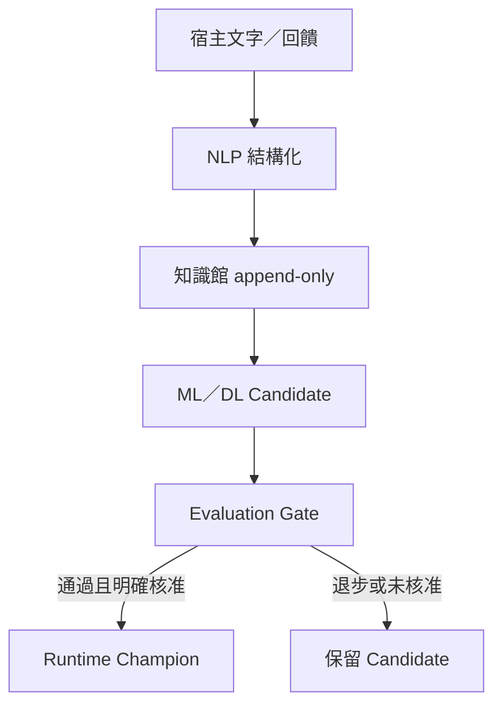

# VUSIPE 泛用外掛整合規格

契約：`veritas.universal-semantic-plugin/1.0`

## 邊界

VUSIPE 是獨立 process／library plugin，不修改宿主程式、不要求 VIA Registry，也不直接讀寫宿主資料庫。宿主送入 JSON Request，VUSIPE 回傳 JSON Response；所有可變知識、feedback、candidate model 與 champion pointer 都隔離在 VUSIPE `runtime-dir`。

## 接口

| 介面 | 適用宿主 | 調用方式 |
|---|---|---|
| Python Adapter | Python 模組 | `GenericModuleAdapter.invoke(action, payload)` |
| CLI JSON | 任意可啟程序模組 | `VUSIPE.py invoke --request/--request-file` |
| JSONL | PowerShell、Node、C#、批次管線 | stdin 一行一個 request，stdout 一行一個 response |
| Local HTTP | 跨語言／同機服務 | `POST /invoke`；另有 health/capabilities |

## 語意能力

20 個 actions 分為五組：

- NLP：normalize、segment、keywords、entities、relations、summarize、actions、analyze。
- 向量／DL：embed、similarity；內建 hashed CPU 與 two-layer tiny-neural CPU。
- ML：classify、train、evaluate、evolve。
- 知識館：knowledge_upsert、knowledge_search、retrieve、feedback。
- 治理：capabilities、health。

## 自適應與演化



Promotion 只更新 VUSIPE 自己的 `models/champion.json`；宿主與來源永遠不變。若沒有訓練樣本，Gate 為 HOLD；未知 action 為 FAIL。

## JavaScript 範例

```javascript
const response = await fetch("http://127.0.0.1:8765/invoke", {
  method: "POST",
  headers: { "Content-Type": "application/json" },
  body: JSON.stringify({ action: "analyze", payload: { text: "semantic input" } })
});
const result = await response.json();
```

## PowerShell 範例

```powershell
$Body = @{ action = 'analyze'; payload = @{ text = '語意輸入' } } | ConvertTo-Json -Depth 8
Invoke-RestMethod -Method Post -Uri 'http://127.0.0.1:8765/invoke' -ContentType 'application/json' -Body $Body
```
