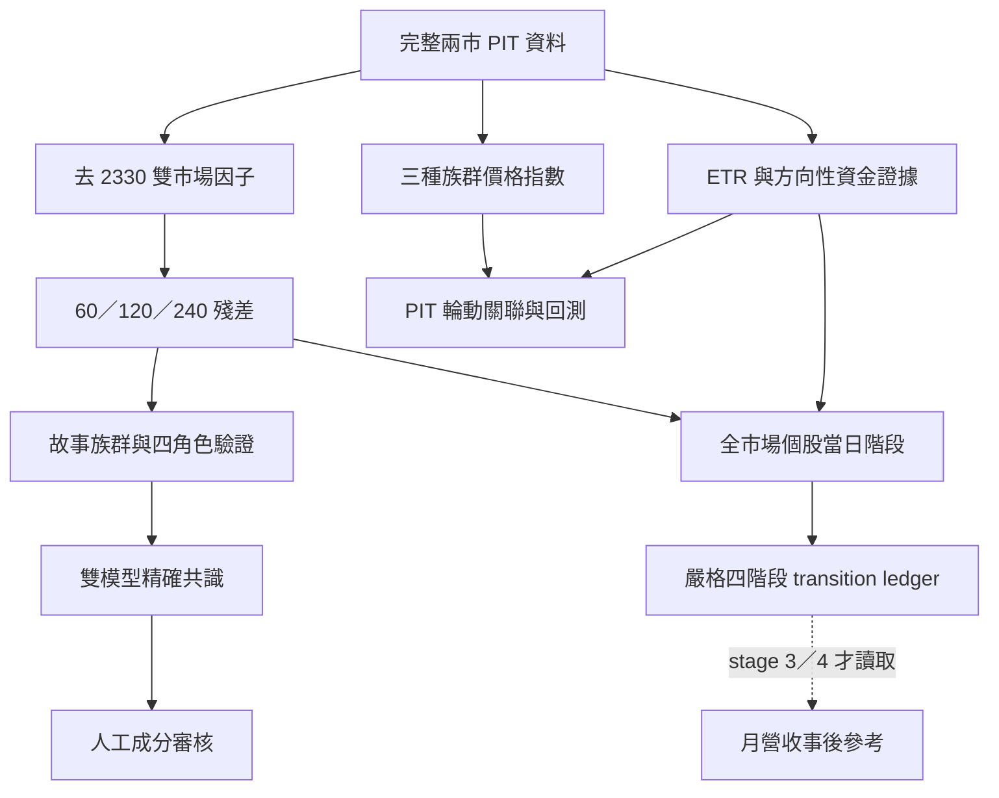

# VIA 台股故事族群輪動引擎 v0.5.0

這個模組用來驗證、追蹤與回測「故事性族群」，不是把股票硬塞進唯一的傳統產業分類。CPO、BBU、高速傳輸、AI 散熱等題材可以重疊；同一檔股票可在不同故事中扮演不同角色。

v0.5 的核心不是產出一個總分，而是把問題拆成可稽核的獨立證據：

- 這批股票在移除台股共同波動後，是否仍有顯著族群性？
- 成員是 `LEAD`、`PEER`、`LAG`，還是與故事無關的 `UNRELATED`？
- 扣除當沖後的市場注意力是否先於價格擴張或退潮？
- 外資、國內法人、融資券與主動式 ETF 的方向是否一致或分歧？
- 個股是否依序出現「籌碼沉澱 → 價格回落／盤整 → 穩定布局 → 價格再啟動」，或先出現籌碼退場？
- 一個族群的注意力下降時，是否與另一族群後續上升存在穩健的輪動關聯？

本資料夾提供可執行引擎、真實資料契約與離線自測，但**不內含真實市場資料，也不宣稱任何真實回測績效或族群已通過驗證**。

## 系統邊界

| 面向 | v0.5 契約 |
|---|---|
| 分類本體 | 可重複歸屬的故事族群，不是單一產業碼 |
| 市場母體 | TWSE + TPEX 普通股完整歷史 |
| 台積電 | 保留為獨立錨點；從市場比較、規模門檻與主要族群指數移除 |
| 規模分類 | 全市場去 2330 後獨立分大／中／小，不依族群各自重切 |
| 驗證期 | 60／120／240 個交易日 |
| 殘差模型 | 來源母體必含 2330 錨點；因子與殘差觀察排除 2330，T-1 市值與 T-1 ETR 兩條 lane 分開估計 |
| 正式模型網格 | 必須恰為 2 條殘差 lane × 3 個同窗 = 6 組；缺少、額外或重複組合皆阻擋正式執行 |
| 個股角色 | `LEAD`／`PEER`／`LAG`／`UNRELATED` |
| 資金語意 | ETR 是非當沖「注意力」；法人、融資券與 ETF 才是方向性證據 |
| 訊號時間 | 取必要證據中最晚的 `AvailableAt`，下一可交易日才生效 |
| 權重與成分時間 | 指數 T 日報酬只能使用 T-1 價格／市值／ETR 權重輸入；成分則以 `AppliedDate=T` 當日有效 membership 為準 |
| 成分治理 | 統計結果只建立 review queue；人工核准前不改 canonical membership |
| 月營收 | 選配、只在機會形成後顯示並做事後基本面驗證；缺少不阻擋主引擎 |
| 參數原則 | 動態分位數與實證虛無分布為主；固定值只用於誤差控制、有限樣本與治理 |
| 綜合分數 | 禁止；各證據 lane 不加權合成、不投票平均 |

## 方法總覽



### 1. 先去除大盤共同波動

每日必須先通過完整兩市普通股母體檢查：來源母體必須含有且只有一筆 2330 錨點，通過後才在市場因子及殘差觀察中排除 2330。兩條因子彼此獨立：

1. `LaggedCap`：用前一交易日市值加權。
2. `LaggedETR`：用前一交易日扣除當沖後的成交注意力加權。

每檔股票的 rolling alpha／beta 只使用 T-1 以前資料，再產出 60、120、240 日殘差報酬。正式 runner 只接受 `LaggedCap`、`LaggedETR` 與 60／120／240 日的完整笛卡兒積，恰好六組；少一組、多一組或重複一組都會 fail closed。兩條 lane 不混合，避免某一種市場代理的選擇直接決定分類。

殘差資料的每一列都必須攜帶 `VIA_FULL_MARKET_RESIDUAL_LINEAGE_V2` 可持久化 lineage：它證明來源是含 2330 錨點的完整 TWSE + TPEX 普通股母體、殘差輸出母體已排除 2330，並綁定 factor lane、beta 窗口、殘差來源欄、T-1 policy 與 lineage digest。V2 另把 `ResidualLineageUniverseVersionPolicy` 與 `ResidualLineageUniverseKnowledgeCutoffPolicy` 納入逐列欄位及 SHA-256 digest，明確證明母體是按 append-only revision 選版，且 knowledge cutoff 是不晚於同一 session 的 `MarketDataAvailableAt`，不是只比較本地日期。這些欄位在 CSV／Parquet 來回後仍是權威證據；`DataFrame.attrs` 只能作一致性稽核，不能取代逐列 lineage。每日還要以 `ResidualUniverseExpectedTickerCount` 及 TWSE／TPEX 分市期望數量對照實際唯一代碼數；任一市缺列就 fail closed。

歷史 bridge 會先依 `as_of_date` 截掉未來列，再對截面內的 lineage、每日兩市 coverage 與模型狀態進行驗證；之後追加的未來列不得改變過去 as-of 的結果。缺欄、lineage 不符或來源身分錯置會阻擋正式執行；只有 beta warm-up 或個別殘差尚未形成時才在該列保持 `HOLD`，絕不以原始個股報酬替代。

### 2. 全市場規模與流動性分桶

大／中／小是股票本身在台股母體中的相對位置，與它屬於哪個故事族群無關。每季以當時已知資料重算，下一交易日生效：

- `LARGE`：rolling 市值位於全市場去 2330 的 P90 以上。
- `MID`：P60 至 P90。
- `SMALL`：P60 以下。
- ETR 流動性另以 P60／P90 獨立分桶，不拿來覆蓋市值級別。

60、120、240 日 rolling 中位數都保留在歷史表；正式階層指數使用 PIT 240 日規模歷史。2330 顯示為 `ANCHOR_EXCLUDED`，不影響門檻。

### 3. 驗證「真的同一群」

每個故事族群在每一個窗口、每一條殘差 lane 上分別檢查：

- 殘差報酬中位數相關性。
- 正相關 pair 比例。
- 第一主成分吸收率（PCA absorption）。

觀察值不對照固定的相關係數或 PCA 門檻，而是與三種資料衍生虛無分布比較：

- 依市場、規模與流動性描述子配對的假族群；60／120／240 日模型必須分別只使用同一窗口的 PIT 規模／流動性 descriptor，不得全部借用 240 日分桶。
- 不限描述子的隨機假族群。
- 保留各股時間結構、破壞同步性的 circular block shift。

三軸使用 intersection-union 證據，再做 Benjamini–Hochberg FDR 控制。樣本不足、母體不完整、無下一交易日或 provenance 不足時是 `HOLD`，不是第五種角色，也不會硬判通過。

### 4. 分成四種個股角色

成員與「不含自己」的族群同儕中位數做 lead/lag 關聯，搜尋半徑由有效樣本長度動態決定；顯著性同樣由三種虛無分布及 FDR 控制。

| 角色 | 統計意義 |
|---|---|
| `LEAD` | 個股變動顯著領先其 leave-one-out 同儕 |
| `PEER` | 顯著同步，最佳 lag 為 0 |
| `LAG` | 個股顯著落後同儕 |
| `UNRELATED` | 對照虛無分布後沒有足夠的關聯提升 |

候選檔原有的 L/P/G 只作來源稽核，不是答案。兩條殘差 lane 必須在同一窗口對族群決策與角色給出完全相同結論，才形成該窗口的 robust consensus；不平均 p-value、不多數決。成分增刪還要求 60／120／240 三個窗口都有完整穩健證據，最後仍須人工核准。

### 5. 三種平行價格指數

三條指數各自回答不同問題，不再加權成一條「最好」的指數：

| 方法 | 用途與權重 |
|---|---|
| `GI_EW` | 等權；作為廣度與稽核基準 |
| `GI_HIER` | L3 故事分支等額 → 非空的全市場規模節點等額 → 節點內以動態截尾後市值加權 |
| `GI_ETR` | 以動態截尾後 ETR 加權；代表可交易注意力，不代表淨流入 |

所有方法以 100 為鏈結基期。`AppliedDate=T` 的成分集合以 T 當日已生效的 PIT membership 為準，因此核准的 ADD／REMOVE 在其生效交易日就會反映；但 `WeightDate=T-1`，價格、市值與 ETR 權重輸入仍只來自前一交易日。角色不是權重輸入；任何成員必要資料缺失時，阻擋受影響的方法，不默默刪除該成員後重正規化。

### 6. 全市場個股布局序列、資金與注意力

資金面保留外資、投信、自營商、國內法人（投信 + 自營商）、三大法人、融資變動、融券變動及主動式 ETF 子集合的原始證據。正式動態狀態固定輸出三條互不合成的方向 lane：`FOREIGN`、`DOMESTIC_EX_FOREIGN`、`ACTIVE_ETF`。另以 USD/TWD 與 DXY 解釋外資的國際因子，保留「全部法人」與「排除外資後的國內資金」兩種視角。

在故事族群聚合前，個股布局引擎先掃描完整 TWSE + TPEX 普通股母體；2330 只保留獨立錨點，不進入同儕門檻或故事映射。每檔股票在 60／120／240 日、每一條方向性 lane 上分開產生證據，不做總分。價格採去大盤殘差；門檻由嚴格 T-1 rolling 中位數與同日 leave-one-out 動態同儕中位數共同決定。

全市場母體以 append-only revision ledger 回放：`UniverseRecordId` 固定指向同一邏輯區間，`RevisionId` 識別不可變修訂，實際知悉時間取 `max(KnownAt, RecordedAt)`。每個交易日只選在該日市場資料完整可得時間以前已知的最新版；晚知修訂不得倒灌歷史。當日市場觀測 ticker 與物化後 PIT roster 必須雙向完全一致，任何未知／未生效 ticker 都直接阻擋，不會被靜默排除。舊 `Ticker + ValidFrom` 格式只支援不可修訂的單版本相容模式。

正式 runner 對每個 60／120／240 日窗口分別接入同窗的 `LaggedCap` 與 `LaggedETR` 殘差。beta warm-up 或個別殘差缺值時，價格證據保持 `HOLD_EX_TSMC_RESIDUAL_NOT_AVAILABLE`，模型共識保持 `HOLD_EX_TSMC_RESIDUAL_NOT_READY`；provenance 不符則阻擋該正式執行。**禁止用個股原始報酬補上正式殘差缺口**。`stock_positioning_grid_audit` 逐一稽核 factor lane、beta 窗口、證據窗口、來源欄、殘差就緒列數與 2330 排除狀態。

ETR／`AttentionETR` 只表示非方向性注意力。只有它與方向性資金都具備 PIT 時間戳，單日證據才可描述下列可觀察階段：

| 階段 | 觀察意義 |
|---|---|
| `DIRECTIONAL_CAPITAL_SETTLEMENT_OBSERVED` | 方向性資金的 rolling 中位數已為正，尚未主張價格啟動 |
| `PRICE_PULLBACK_OR_SIDEWAYS_WITH_SETTLED_CAPITAL_OBSERVED` | 籌碼已沉澱，價格窗口仍為回落或盤整 |
| `STABLE_POSITIONING_DURING_PRICE_PULLBACK_OR_SIDEWAYS_OBSERVED` | 正向資金與注意力同時高於動態基準，價格仍未轉強 |
| `PRICE_RESTART_AFTER_STABLE_POSITIONING_OBSERVED` | 前述穩定布局後，價格殘差轉為顯著正向 |

提前退場另外保留兩個反向狀態：`EARLY_DISTRIBUTION_WHILE_PRICE_HOLDS_OBSERVED` 表示方向性資金先惡化而價格尚未崩解；`EXIT_WITH_PRICE_BREAKDOWN_OBSERVED` 表示資金退場已伴隨價格轉弱。這些名稱描述可觀察順序，不宣稱因果，也不是買賣指令。

較精簡的事件分類同步保留，但每一列只代表一條 `DirectionalLane`：

- `DIRECTIONAL_ACCUMULATION_WATCH`：Attention Share 高於自己的 prior rolling median、**該列所屬方向 lane** 為正且改善，而價格尚未同步走強。
- `EARLY_EXIT_RISK`：Attention Share 低於 prior rolling median、**該列所屬方向 lane** 為負且惡化，而價格尚未同步轉弱。
- 每條 lane 各自檢查完整群組／市場覆蓋、方向值與 `AvailableAt`、注意力、價格及正式交易日曆；任一缺口只讓該 lane fail closed。不得用「至少一條通過」、跨 lane `any`、投票或加權合成另一個狀態。

全市場個股證據只有在價格殘差模型給出可稽核的相同結論時，才可升級為模型共識；分歧保持 `HOLD`，不可平均或投票。共識後才依 PIT membership 映射到故事族群，並同時輸出完整故事曝險與資金守恆視圖。族群間只使用「輪動關聯」名稱；即使出現時間領先，也不宣稱資金從 A 因果性轉移到 B。

#### 當日階段與嚴格轉換序列不可混用

`stock_positioning_group_phase_daily` 是 exact-consensus 後的**當日階段切片**，只彙整各階段的唯一股票數、守恆曝險與注意力；它不證明同一檔股票曾依序走完四階段。

嚴格順序只由 `stock_positioning_transition_ledger` 判定。每個「股票 × 窗口 × 方向性 lane」都是獨立 stream，且必須依序觀察階段 1 → 2 → 3 → 4：不得跳階，重見較早階段不倒退，失序觀察保持 `HOLD`。ledger 只接受在 evidence cutoff 前已可得、且 `EffectiveDate` 已不晚於該 cutoff 本地日期的 exact-consensus 觀察；尚未生效的狀態不會提前寫入。

未完成序列的有效期不是固定天數，而是自己的 `EvidenceWindowDays` 個交易日；逾期重置。觀察到 distribution 或 price breakdown 時立即重置，不等待價格完全反轉。每個 stream 以 SHA-256 hash chain 串接事件；immutable ledger 保留實際觀察，`stock_positioning_transition_latest` 則依正式交易日曆與本次 as-of 物化當前狀態，所以即使沒有新的 exact observation，過期序列也會在到期後第一個交易日顯示 clock-driven reset。整個 ledger 只描述 PIT 可見順序，**不宣稱籌碼造成價格、也不產生交易指令**。

### 7. 多標籤資金守恆

一檔股票可以同時屬於多個故事，因此輸出兩種視圖：

- `STORY_FULL`：每個故事都顯示完整曝險，適合觀察題材覆蓋，但跨群相加會重複。
- `CAPITAL_CONSERVED`：優先使用物化 membership 上已稽核的 `ExposureShare`；完全缺權重時在有效故事間等分，部分已知時把剩餘比例等分給未知項，全部已知但合計不足 1 時才把餘額放入 `UNMAPPED`。每檔每日分配合計必須等於 1。

映射以證據的 `EffectiveDate`（尚無生效日時才用 evidence date）查找有效 PIT membership。membership event 的實際知悉時間 `EventKnownAt` 是 `ApprovedAt`、`RecordedAt`、`KnownAt`、`AvailableAt`、`IngestedAt` 中所有已填欄位的最晚時間；回溯物化只使用 `EventKnownAt <= cutoff` 的事件，避免用早期核准日倒填後來才入庫的變更。

若同群同股有重疊有效區間、同一 effective date 的證據可能被映射倍增，或守恆權重合計不等於 1，引擎會阻擋而非靜默重複。輪動矩陣及跨群資金總量只使用通過上述檢查的守恆視圖。ETR 市場分母或任一族群成分只有部分覆蓋時，原始 ETR 與覆蓋計數仍供診斷，但 `AttentionShare` 保持缺值；該日不建立注意力或方向性 `ROTATION_ASSOCIATION` edge，也不跨越覆蓋缺口計算變化。方向性 edge 還要求該日該 lane 在所有比較族群都是 `PASS_COMPLETE_DIRECTIONAL_COVERAGE`；部分覆蓋或未供應的 lane 只記 `HOLD`／`NOT_SUPPLIED`，不建 edge，也不用其他 lane 代替。

### 8. 主動式 ETF 與機會後月營收參考

主動式 ETF 持股先區分 ETF 規模變動造成的機械持股變化與可能的經理人主動調整。缺 ETF 流通單位時，只能稱「持股快照變化」；不完整快照不推導退出。ETF 交易屬投信子集合，因此不可再加到投信買賣超上。

主動式 ETF 的正式表，包含 `prepared_snapshots`、快照品質、最新持股、持股事件、基金流、個股共識、重疊／擁擠、故事映射、群組聚合與 2330 錨點表，都只能由 `AvailableAt <= evidence cutoff` 的快照衍生；不得在稽核表或正規化表偷留未來 vintage。完整基金守恆稽核可保留 2330，但所有正式故事事件、故事曝險與群組共識先排除 2330，再將其寫入獨立 `active_etf_tsmc_anchor_*` 稽核表。

月營收是 `OPTIONAL_REFERENCE_ONLY`：缺少整份資料、部分月份，甚至檔案內容或欄位無效時，都不阻擋主引擎。它絕不進入族群分類、四角色、指數、權重、布局／退場訊號、選樣或成分異動。正式 pipeline 先從 strict transition latest 建立已到達階段 3 `STABLE_POSITIONING_DURING_PRICE_PULLBACK_OR_SIDEWAYS_OBSERVED` 或階段 4 `PRICE_RESTART_AFTER_STABLE_POSITIONING_OBSERVED` 的機會 ticker 集合，之後才 lazy-load 月營收檔，並在計算前只保留該集合的列。公司輸出不得出現非機會 ticker；族群輸出也只可來自這批 ticker 在 snapshot 當下有效的 PIT membership，不輸出與機會集合無關的族群。最後才顯示其 `Ticker + ReportMonth + AvailableAt` vintage 的 YoY、累計 YoY、季節偏離、正成長廣度與加速廣度，作為事後基本面驗證；結果不得回饋或改寫原訊號。

若沒有任何上述核心機會，pipeline **不開啟也不解析月營收輸入**，兩張結果表保持空白，audit 為 `OPTIONAL_REFERENCE_WAITING_FOR_CORE_OPPORTUNITY`。有核心機會但月營收無效時，audit 才記錄 `OPTIONAL_REFERENCE_INVALID_CORE_UNAFFECTED`、錯誤型別與訊息。兩者的 `CorePipelineBlocked` 都是 `False`。合併多月申報仍列為不可直接比較的 `HOLD`。

### 9. 回測與無風險利率

回測保留三個評估起點：2024-01-01、2025-01-01、2026-01-01，資料終點為輸入的最新可用日或指定 as-of；前置 warm-up 從 2023-01-01 起。事件研究檢查 1、3、5、20 個交易日，並對三種價格指數分別計算表現。

無風險利率只接受具有 `AvailableAt` 與完整列級 provenance 的台灣 10 年期政府公債殖利率：`SourceAuthority` 必須是 `TAIPEI_EXCHANGE_TPEX`，`SourceURL` 必須是 HTTPS 的 `tpex.org.tw` 或其子網域，`SourcePayloadHash` 必須是 64 位 SHA-256 hex，且仍須同時通過既有來源、百分比單位、instrument id 與官方驗證旗標。payload hash 只作完整性 digest 格式檢查，不是櫃買中心的來源簽章；回測會重新驗證原始欄位，不接受呼叫端預填狀態繞過。殖利率以 backward-asof 接入並換算為每日報酬；禁止固定利率替代。若持有路徑含 `HOLD` 指數值或公債 PIT 覆蓋不完整，相關績效統計也保持 `HOLD`。

## 目錄

```text
flow_rotation_v0500/
├── config/system_config.json              # 執行契約與本機輸入路徑
├── data/input/REAL_DATA_SCHEMA.md          # 真實資料欄位、PIT 與阻擋規則
├── engine/                                 # 各獨立引擎及 orchestration
├── ssot/VIA_TW_Story_Group_Rotation_Contract_v0500.json
├── requirements.txt
└── run_system.py                           # candidate／preflight／正式執行 CLI
```

## 安裝

需要 Python 3.10 以上。從本資料夾執行：

```bash
python -m venv .venv
python -m pip install --upgrade pip
python -m pip install -r requirements.txt
```

`pyarrow` 是正式雙格式輸出的必要套件。缺少時整個寫出程序會失敗，不降級成只有 CSV。

## 準備真實輸入

先依 [真實資料契約](data/input/REAL_DATA_SCHEMA.md) 建立本機檔案，再視需要修改 `config/system_config.json` 的路徑。預設位置是：

```text
data/input/full_market_daily.parquet
data/input/market_universe_history.csv
data/input/trading_calendar.csv
data/input/membership_events.csv
data/input/macro_vintages.csv
data/input/active_etf_holding_snapshots.csv
data/input/monthly_revenue_vintages.csv       # 選配事後參考；缺少不阻擋
```

這些大型／授權資料已由 `.gitignore` 排除，不應提交到原始碼庫。`trading_calendar.csv` 必須比 as-of 多包含至少一個交易日，否則無法決定下一期生效日。

## 執行

### 候選 49 群結構稽核

此命令只確認候選檔的形狀、重複歸屬與衝突，不表示族群通過統計驗證：

```bash
python run_system.py candidate49
```

### 真實資料 preflight

```bash
python run_system.py preflight-real
```

preflight 會分列「主線必要」與「選配參考」。主線必要檔案不存在時會列出阻擋狀態並回傳非零 exit code；`monthly_revenue` 缺少只顯示選配未提供，不影響主線通過與 exit code。

### 不寫檔的完整試跑

```bash
python run_system.py run-real --as-of 2026-08-31 --no-write
```

請把日期換成資料實際涵蓋的交易日。此試跑仍會執行所有正式資料閘門，只略過 append-only 輸出。

### 正式 append-only 執行

```bash
python run_system.py run-real --as-of 2026-08-31
```

輸出位於 `data/output/RUN_YYYYMMDD_<hash>/`；每張表同時有 CSV 與 Parquet，並附 `manifest.json`。相同輸入與 as-of 的 run 可冪等跳過，既有不同內容不會被覆寫。

若要使用其他設定檔或指定候選提案時間：

```bash
python run_system.py run-real \
  --config config/system_config.json \
  --as-of 2026-08-31 \
  --proposed-at "2026-09-02 18:00:00+08:00"
```

每次正式執行只有一個不可變的 publication snapshot。有指定 `as-of` 時，先映射到不晚於該日的最近一個正式交易日（因此週末／休市日回到前一交易日）；`full_market_daily` 若缺這個目標 session 就直接阻擋，不得靜默退回更舊行情。未指定 `as-of` 時才使用最新完整 session。所有帶 `Date` 的表都先截到這個 snapshot，後續 membership、驗證、指數、資金、transition 與回測共用同一截面。若收盤後 ETF 快照或月營收資料較晚才可得，可另外指定證據截止時間；它不可早於 snapshot 當日最新市場資料的可得時間，且其 Asia/Taipei 本地日期不可晚於 snapshot。也就是可納入同日收盤後證據，但不可藉較晚 cutoff 偷看次日資料。

```bash
python run_system.py run-real \
  --as-of 2026-08-31 \
  --evidence-cutoff-at "2026-08-31 22:00:00+08:00" \
  --no-write
```

## 主要輸出

| 表 | 內容 |
|---|---|
| `full_market_gate_daily` | 兩市母體與資料完整性稽核 |
| `market_factors`, `rolling_residuals` | 來源含 2330 錨點、輸出排除 2330 的雙市場因子與各窗口殘差；逐列保留可序列化 lineage 及每日 TWSE／TPEX coverage |
| `tsmc_anchor_daily`, `tsmc_anchor_membership` | 2330 的獨立市場錨觀察與候選歸屬稽核；不進比較、角色、分桶或主要指數 |
| `size_history` | 全市場 PIT 市值／ETR 分桶歷史 |
| `group_validation`, `member_roles` | 每條 factor lane、每窗口的原始證據 |
| `group_validation_consensus`, `member_role_consensus` | 雙殘差模型精確共識 |
| `membership_review_queue` | 只供人工核准的新增／移除候選 |
| `index_weights`, `group_index_daily` | `GI_EW`／`GI_HIER`／`GI_ETR` 權重與指數；membership active on `AppliedDate`，量價權重輸入仍為 T-1 |
| `group_flow_daily`, `group_flow_states` | Attention Share 與方向資金；states 以 `Date × GroupId × DirectionalLane` 長格式分列 `FOREIGN`／`DOMESTIC_EX_FOREIGN`／`ACTIVE_ETF`，各自 fail closed，不作跨 lane 合成 |
| `stock_positioning_market_gate_daily`, `stock_positioning_daily_base`, `stock_positioning_window_features`, `stock_positioning_lane_evidence` | 全市場個股 60／120／240 日動態證據；三條方向性 lane 各自保留 |
| `stock_positioning_grid_audit` | 2 條 factor lane × 3 個同窗、共 6 組的殘差身分、就緒列數及 2330 排除稽核 |
| `stock_positioning_raw_story_allocation`, `stock_positioning_conserved_story_allocation` | PIT membership 的完整故事與守恆分攤權重 |
| `stock_positioning_raw_story_evidence`, `stock_positioning_conserved_story_evidence` | 各 factor 模型尚未形成共識前的完整故事與資金守恆映射 |
| `stock_positioning_model_consensus` | 同一窗口與方向性 lane 的雙 factor 模型分類、序列 exact agreement；不平均、不投票 |
| `stock_positioning_raw_consensus_story_evidence`, `stock_positioning_conserved_consensus_story_evidence` | exact-consensus 個股狀態的完整故事與守恆映射 |
| `stock_positioning_group_phase_daily` | 模型共識後的**當日**族群階段廣度切片；不代表已依序走完四階段 |
| `stock_positioning_transition_ledger`, `stock_positioning_transition_latest` | 只記已生效 exact-consensus 的嚴格四階段 hash-chain ledger；latest 依 as-of 時鐘物化無新觀察時的逾期重置 |
| `stock_positioning_raw_transition_story_evidence`, `stock_positioning_conserved_transition_story_evidence` | 轉換事件的完整故事與守恆映射 |
| `rotation_associations` | 完整 ETR 覆蓋且守恆視圖通過時的族群輪動關聯；方向 edge 另須同日同 lane 全群 coverage 完整，部分覆蓋不建 edge，不作因果宣稱 |
| `active_etf_*` | 全部表只含 cutoff 前已知快照；故事比較表排除 2330，完整基金守恆表仍可保留 2330 |
| `active_etf_tsmc_anchor_*` | ETF 對 2330 的持股、事件、共識及故事歸屬獨立稽核；不得回流故事族群比較 |
| `reference_company_revenue_latest`, `reference_group_revenue_latest`, `reference_revenue_audit` | 先取得 strict transition stage 3／4 ticker 才 lazy-load 的選配 PIT 月營收事後參考；非機會 ticker／族群不輸出，無核心機會時不開檔，不回饋主線 |
| `macro_context_daily`, `foreign_flow_fx_residual` | 匯率、美元與官方台灣 10Y 脈絡 |
| `backtest_events`, `backtest_event_summary`, `index_performance` | 三起點事件研究與績效 |
| `group_comparison_daily` | 價格、注意力、方向資金及 FX 殘差的同軸比較資料 |

## 離線驗證

先執行整合契約測試；這些測試驗證 PIT、防洩漏、守恆與阻擋行為，不代表真實資料績效：

```bash
python run_tests.py
```

各核心模組另有 deterministic synthetic self-test：

```bash
python engine/via_pit_membership_engine.py
python engine/via_full_market_factor_engine.py
python engine/via_group_validation_v0500.py --self-test
python engine/via_validation_consensus_engine.py
python engine/via_hierarchical_group_index_engine.py
python engine/via_flow_transfer_matrix_engine.py
python engine/via_active_etf_holdings_engine.py --selftest
python engine/via_pipeline_contract_bridge.py
python engine/via_stock_positioning_engine.py
python engine/via_positioning_transition_engine.py
```

## 解讀原則

1. `PASS` 是「在指定窗口與資料契約下，證據通過」；不是永久產業定義。
2. `UNRELATED` 是統計分類，不會自動刪除成分。
3. `HOLD` 是有意義的結果，表示不能在當下安全下結論。
4. Attention Share 上升不等於資金淨流入；必須與方向性 lane 並讀。
5. `ROTATION_ASSOCIATION` 不等於因果資金轉移。
6. 回溯套用今日故事分類只適合研究，不可包裝為當時可交易績效；正式交易回測只能使用當時已核准的 PIT membership。
7. 月營收只能在機會形成後作事後基本面驗證；不得用來篩選機會或改寫任何分類、角色、指數、權重及訊號。
8. 當日 phase 只是狀態切片；只有 transition ledger 的 `COMPLETE_STAGE_4` 表示四階段曾按 PIT 順序被觀察到，仍不代表因果或交易建議。
