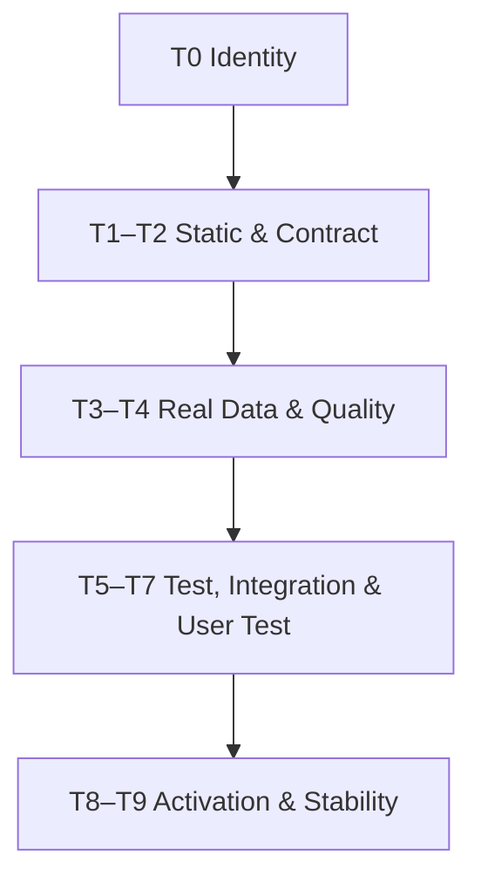

# Veritas Intelligence Analytics

## VIA Central Governance · Complete Integration, Test, Repair, Staging and Controlled Activation Plan

def Plan Version：v1.1.0  
def Plan Date：2026-08-17  
def Evidence Review Window：2026-08-14 ～ 2026-08-17  
def Normative Requirement：`VIA Central Governance Console 終極旗艦版 Mega-Prompt`  
def Approval Owner：Tony／System Owner  
def Control Plane：VIA Central Governance Console（CGC）  
def Source of Truth：Central SSOT Registry + Synonym／Regex Governance  
def Default Mode：`AUDIT`  
def Allowed Modes：`AUDIT／STAGE／PROMOTE`  
def Current Overall State：`HOLD_REMEDIATION_REQUIRED`  
def Activation State：`NOT_ACTIVATED`  
def Runtime Policy：單一 PowerShell 入口；PowerShell 7；`via_core*／via_*` 受治理 Python 環境  
def Root Policy：僅限本機母檔；禁止以 OneDrive 作為 Mother Root 或 Active Runtime  
def Data Policy：Real Data Only／No Synthetic Data／Read-Only First  
def Mutation Policy：Append-Only Evidence／Expected Hash Guard／Checkpoint Before Change／No Blind Promotion  
def Safety Policy：Fail-Closed／Zero-Hydra／No Import or Dot-Source Before Gate  
def Time Estimate：12～20 個工作日，加至少 3 個完整運作週期的 Post-Activation Monitoring；Gate 證據優先於工期  

---

## def 01 · 計畫目標

本計畫將目前分散的 Central Governance、SSOT、VDF、VRN、VAP、System Manager、模板整合器、六流程與十二通道候選，收斂成可稽核、可回滾、可重跑、可逐 Gate 晉級的單一治理系統。

最終成果不是「檔案被找到」或「版本號提高」，而是完成以下狀態鏈：

1. `FILE_DISCOVERED`
2. `AST_PASS`
3. `CONTRACT_PASS`
4. `READ_ONLY_DATA_PASS`
5. `DATA_QUALITY_PASS`
6. `SANDBOX_RUNTIME_PASS`
7. `INTEGRATION_PASS`
8. `USER_TEST_PASS`
9. `ACTIVATED`
10. `POST_ACTIVATION_STABLE`

前一狀態不得自動推導後一狀態；任何 `Proposal／Readiness／Staging／Governance Only／Contract Only` 均不得映射為 `Activated`。

## def 02 · 不可變治理原則

1. CGC 是唯一 Control Plane；SSOT 是唯一治理真相來源。
2. VRN、VDF、VAP 永久保留為核心子系統；新增子系統只能經 Pluggable Contract 註冊。
3. Supportive Adapter 只能 Register／Hash／Classify／Map；通過 Gate 前不得 Import、Dot-Source 或 Execute Target。
4. 所有寫入均要求 Expected Current Hash、Plan SHA-256、Checkpoint、Hash-Chain Ledger 與明確 Approval。
5. 所有執行預設 `AUDIT`；`STAGE` 只能寫入隔離 Run Folder；`PROMOTE` 需要一次性 Approval Token。
6. 禁止直接刪除 Windows `(1)/(2)/(3)/(4)` 副本；先 Hash、Diff、Evidence Arbitration，再封存或隔離。
7. 禁止以版本號、檔名、目錄名稱或修改時間單獨決定 Canonical Owner。
8. 禁止 OneDrive 作 Mother Root、Active Runtime、共同寫入目錄或長時間執行路徑。
9. 禁止合成資料替代真實資料 Gate；測試 Fixture 必須清楚標記且不得進入業務輸出。
10. 禁止在 Data Quality Gate 前靜默補值；價格補值必須留旗標，Volume 絕不 Forward-Fill。
11. 禁止多 Lane 共寫 Canonical Source、Registry、同一 JSON、同一 CSV 或同一 HTML。
12. 三輪修補後仍有 Blocking Finding 時必須 `HOLD`，不得進入無限修補迴圈。

## def 03 · 已確認基線與當前狀態

| 工作流／資產 | 已確認狀態 | 已確認證據 | 本計畫判定 |
| --- | --- | --- | --- |
| SSOT Integration `v0111` | `CENTRAL_GOVERNANCE_SSOT_READY_FOR_STAGING` | 22 Core Resources、0 Missing、3,006 Discovered、3 Prompt Templates、5 Integration Actions | Staging Ready；未啟用 |
| ID Numbering `v0112` | `CENTRAL_GOVERNANCE_ID_NUMBERING_READY` | 3,006 Assigned、0 Reused、0 Duplicate、0 Missing | Registry Ready；未啟用 |
| Synonym／Regex Intake `v0113` | `CENTRAL_GOVERNANCE_SPEC_INTAKE_SYNONYM_REGEX_READY` | 3,005 Spec Sources、8 Synonym Groups、8 Regex Rules、7 Supportive Modules、4 Prompt Templates | Register-Only |
| Synonym／Regex Validation | `PASS` | VCG、VIA、Supportive Modules 與相關 Alias | 規則批次通過；不得外推 Runtime |
| Accelerated Integration `v0139A` | `LAUNCHER_ACTIVE_RUNTIME_NOT_EXECUTED` | Launcher、Embedded Engine Hash／AST | Runtime 未執行 |
| Gate 9 `v0139B` | `GOVERNANCE_ONLY_ACCEPTED` | 6/6 Governed Hash Evidence | 資料／Runtime 未通過 |
| Real Data `v0140A` | `CONTRACT_ONLY_PASS` | 7 Governed Files Contract | 真實資料未讀取 |
| Real Data `v0140B` | `HOLD_REMEDIATION_REQUIRED` | 15 Checks、8 Findings、3 Source Reads | T4 Blocking |
| VDF Group Rotation `v0161` | `FAILED` | `OpenHtml` 型別、Null／Empty `Supported`、Exit Code 3 | T2／T5 Blocking |
| VDF Repair `v0162` | `STATIC_AND_FOCUSED_REGRESSION_PASS` | 2 Exact Repairs、PowerShell AST、Focused Tests | 等待真實參數 E2E 重跑 |
| System Manager `v0163A` | `DISCOVERED_EVIDENCE_REQUIRED` | 3 個入口候選 | 等待 Root／Owner／Hash 仲裁 |
| `v0140E～v0140K` | `CANDIDATE_EVIDENCE_REQUIRED` | 只有候選角色與檔名 | 不得 Activate |

## def 04 · 範圍

### def 04.1 · In Scope

- Central Governance Console、SSOT Registry、Synonym／Regex Dictionary。
- System Manager 與單一 PowerShell 入口。
- VRN、VDF、VAP 與新增子系統 Plug-In Contract。
- Python／PowerShell／JavaScript Native Parser 與 Embedded Engine 驗證。
- Real-Data Read-Only、Data Quality、Incremental Update 與 Resume。
- 六個獨立流程、十二通道全景檢視、20 個加速器。
- 常備模板 + AI 功能模板離線合併與 30 項回歸測試。
- HTML UI Matrix、JSON／CSV／Markdown／Log Evidence。
- Audit、Stage、Promote、Checkpoint、Rollback、Post-Activation Monitoring。

### def 04.2 · Out of Scope Until Separate Approval

- 直接修改使用者 Windows 母檔。
- 自動刪除、覆寫或搬移原始碼。
- 自動切換 Mother Root。
- 未經 Token 的 Promote 或 Activation。
- 對外發布、Git Push、PR、雲端部署或第三方系統寫入。
- 使用合成資料替代真實資料驗收。

## def 05 · Canonical Root 與目錄策略

### def 05.1 · Root 候選

| 候選 | 目前角色 | 規則 |
| --- | --- | --- |
| `C:\Users\tonyk\Downloads\VeritasIntelligenceAnalytics` | 舊來源候選 | Read-Only Inventory；不得自動 Promote |
| `C:\Users\tonyk\Downloads\movies-dataset\VeritasIntelligenceAnalytics` | 新權威候選 | 必須通過 T0 Root Arbitration 才能成為 Canonical |
| 任何 OneDrive 路徑 | 禁止 Active Root | 只能作未啟用來源候選；需先複製至本機 Staging 並核對 Hash |

### def 05.2 · Root Arbitration 必要證據

- Root Marker／Manifest。
- Canonical Owner ID。
- Git Remote／Branch／HEAD。
- Registry Active Path。
- 22 個核心治理資源 Hash Set。
- 最近一次通過 Gate 的 Evidence Path。
- PowerShell 版本與 `via_core*／via_*` 環境快照。
- 舊根與新根的 File／AST／Token Diff。
- 未決 `DIVERGENT_VARIANT` 清單。

### def 05.3 · 建議相對目錄

```text
<MotherRoot>\
  governance\
    registry\
    schemas\
    synonym_regex\
    gates\
  subsystems\
    VRN\
    VDF\
    VAP\
    EXTENSIONS\
  runtime\
    launchers\
    engines\
    environments\
  tests\
    unit\
    contract\
    dataset\
    integration\
    regression\
    failure_injection\
    user_test\
  _governance_runs\
  _checkpoints\
  _review_quarantine\
  _append_only_archive\
```

## def 06 · 單一 PowerShell 入口計畫

def Proposed Launcher：`Invoke-VIA-Central-Governance-CompletePlan-v0164A.ps1`  
def Default：`-Mode Audit`  
def Console Policy：不自動關閉 PowerShell 7；動態進度條；保留結束摘要  

未來腳本所有參數必須集中在最上方，至少包含：

| 參數 | 型別／預設 | 規則 |
| --- | --- | --- |
| `Mode` | `Audit` | `Audit／Stage／Promote` |
| `MotherRoot` | Null | 由 T0 仲裁，禁止 OneDrive |
| `CandidateRoots` | Array | 僅讀取 |
| `RunRoot` | `<MotherRoot>\_governance_runs` | 每次建立唯一 RunId |
| `PythonEnvironment` | `via_core*` | 必須在核准清單 |
| `StartDate` | `2023-01-02` | VDF Group Rotation 基線 |
| `EndDate` | `Latest` | 由來源解析 |
| `UpdateMode` | `Incremental` | 先檢查現有資料 |
| `TargetHotStockCount` | `240` | v0161/v0162 真實重跑 |
| `OpenHtml` | `[switch]` | 禁止文字隱式轉型 |
| `Retry` | `1` | 重試不得遮蔽首次失敗證據 |
| `MaxRounds` | `3` | 超過即 HOLD |
| `LaneTimeoutSeconds` | 由 SSOT 設定 | 不得寫死於 Worker |
| `ApprovalToken` | Null | 只供 Promote；一次性 |
| `ExpectedRegistrySha256` | Null | Promote 必填 |
| `ExpectedPlanSha256` | Null | Promote 必填 |
| `OpenHtmlOnComplete` | Switch | 只在報告通過後開啟 |

布林值由單一 `ConvertTo-VIABoolean` 邊界函式轉換；集合由 `@(...)` 正規化；跨 PowerShell 呼叫使用 Hashtable Splatting；Python 與 PowerShell 使用版本化 JSON Contract。

## def 07 · 三輪全景式分析與修補

### def Round 1 · Comprehensive Discovery and Parallel-Safe Repair

- Read-Only Inventory、Hash、Encoding、Parser、Dependency、Schema、Data Profile。
- 分類 `Parallel-Fixable／Sequence-Dependent／Proposal-Only／Hydra-Blocked`。
- 只處理無共享副作用、Anchor 唯一且有回歸測試的修補。
- 產出 Round 1 Findings、Patch Proposals、Lane Plan 與 Gate Snapshot。

### def Round 2 · Topology-Ordered Repair

- 依依賴拓撲逐項處理 Root、Registry、Contract、Data、Runtime。
- 每一 Patch 先驗 Source Hash 與 Anchor Count，再寫 Staging Copy。
- 每一變更立即執行 Native AST、Unit、Focused Regression。
- Hydra 高風險只輸出 Proposal，不自動修補。

### def Round 3 · Consolidation and Hardening

- 執行全域 Regression、Failure Injection、Performance、Resource Cleanup。
- 合併 Evidence，驗證 Count、Hash Chain、Coverage 與 UI Matrix。
- Blocking Finding 必須為 0，否則 `HOLD_AFTER_ROUND_3`。

## def 08 · 六個獨立流程

| Pipeline | 目的 | 主要輸入 | 主要輸出 | 可並行範圍 | 必要 Gate |
| --- | --- | --- | --- | --- | --- |
| P1 Code AST & Syntax Repair | 多語言 AST、Anchor、最小 Diff | Immutable Snapshot | AST Report、Patch Proposal | 靜態掃描可並行 | T1／S03／S04 |
| P2 SSOT & Regex Normalization | Alias、Field、ID、Regex 對齊 | Registry、Spec Sources | Canonical Mapping、Conflict Queue | Read-Only Profile 可並行 | T2／S05 |
| P3 Pluggable & Decoupling | 模組註冊、依賴、生命週期 | Manifest、Dependency Graph | Registration Proposal、Topo Order | 不同子系統掃描可並行 | T0／S01／S02 |
| P4 Performance & Resource | 效能、死碼、記憶體、資源釋放 | Profile、Runtime Metrics | Optimization Proposal | Profile 可並行 | S10 |
| P5 Sandbox & Regression | Unit、Dataset、Integration、Failure Injection | Staged Candidate | Test Evidence、Coverage | 獨立 Fixture 可並行 | T5／S08／S09 |
| P6 UI & Deployment Monitoring | HTML Matrix、Progress、Stage／Promote | Aggregated Evidence | HTML／JSON／CSV／Markdown | Render 可並行；Promote 串行 | T7／T8／T9／S11／S12 |

所有 Pipeline 讀取相同 `InputSnapshotSha256`，但使用獨立工作目錄；任一 Blocking Lane 失敗時，全域 Gate 必須 HOLD。

## def 09 · 20 個加速器啟用與證據計畫

每個加速器使用 `DECLARED → DETECTED → EXERCISED → PASSED` 四段狀態；`Enabled=True` 不算通過。

| ID | Accelerator | 使用階段 | 必要證據 | Release 驗收 |
| --- | --- | --- | --- | --- |
| A01 | AST 精準解析 | T1 | Parser、Node Count、Error Location | 外層與 Embedded Engine 全通過 |
| A02 | 多語言語意模型 | T1／T2 | Python／PS／JS Mapping | 無未決語意衝突 |
| A03 | Hydra 風險預測 | 全階段 | Coupling／Blast Radius | Critical／High Hydra=0 |
| A04 | 依賴拓撲排序 | T0／T6 | DAG、Cycle Report | Cycle=0 或已隔離 |
| A05 | 沙盒隔離執行 | T5 | Process、Timeout、Write Boundary | 無越界寫入 |
| A06 | 修正建議生成 | Round 1～2 | Source Hash、Anchor、Diff | Anchor Count 符合預期 |
| A07 | 三輪全景分析 | Round 1～3 | Round Evidence | 最多 3 輪完成或 HOLD |
| A08 | SSOT 對齊 | T2 | ID／Alias／Field Matrix | Duplicate／Missing=0 |
| A09 | 視覺矩陣 | T7 | HTML Snapshot、Overflow Test | 9 狀態欄完整 |
| A10 | 錯誤分類分群 | Round 1 | Severity／FixType | 未分類 Finding=0 |
| A11 | 效能與複雜度 | S10 | CPU／Memory／Duration | 無未解資源洩漏 |
| A12 | 多子系統同步 | T6 | VRN／VDF／VAP Lane Status | Blocking=0 |
| A13 | 版本差異與回滾 | T0／T8 | Hash／Diff／Checkpoint | Rollback Drill 通過 |
| A14 | 覆蓋率與回歸 | T5 | Test Count／Coverage | Critical Tests 100% Pass |
| A15 | 修正順序最佳化 | Round 2 | Topology Plan | 無越序 Mutation |
| A16 | 動態進度條 | 全階段 | Weighted Stage Events | 0～100% 單調遞增 |
| A17 | 動態說明 | 全階段 | Reason Code／Narration | 機器狀態與文字一致 |
| A18 | 非阻塞 PowerShell | Runtime | Heartbeat／Process Handle | 終端不關閉、不假死 |
| A19 | 多引擎整合 | T5／T6 | Versioned JSON Contract | Exit Code／Schema 全通過 |
| A20 | 自動部署與初始化 | T8 | Preflight／Path／Environment | 只在 Token 與 Hash Guard 下執行 |

## def 10 · Global T0～T9 Gate



| Gate | 名稱 | 必做工作 | 最低通過條件 | 失敗狀態 |
| --- | --- | --- | --- | --- |
| T0 | Inventory & Identity | Root、Owner、Manifest、Hash、副本仲裁、Checkpoint | Root 唯一；Duplicate/Missing=0；未決 Variant=0 | `HOLD_IDENTITY` |
| T1 | Native AST & Static Safety | 外層／Embedded PS、Python、JS Parser；Forbidden API | Syntax Error=0；High Static Risk=0 | `HOLD_STATIC` |
| T2 | Contract & Binding | YAML／JSON Schema、Boolean、Null／Empty、Encoding、Path | Contract Tests 100% Pass | `HOLD_CONTRACT` |
| T3 | Real-Data Read-Only | Source Read、Rows、Grain、Field Profile、Freshness | 真實資料來源與 Count 有證據 | `HOLD_DATA_ACCESS` |
| T4 | Data Quality | Duplicate、Null、Ticker、Date、OHLC、Adjustment、Cross-Source | Unexplained Blocking=0 | `HOLD_DATA_QUALITY` |
| T5 | Sandbox Tests | Unit、Dataset、Regression、Failure Injection | Critical Tests 100% Pass | `HOLD_TEST` |
| T6 | Multi-Lane Integration | 6 Pipeline／12 Lane、Exit Code、Hash、Isolation | 每 Lane Terminal；Blocking=0 | `HOLD_INTEGRATION` |
| T7 | User Test & Visual Lock | 數值、Viewport、Wrap、Overflow、HTML／PNG／PDF | User Test Blocking=0 | `HOLD_USER_TEST` |
| T8 | Controlled Activation | Token、Expected Hash、Plan Hash、Checkpoint、Rollback | 5 項全存在且 Approval 明確 | `HOLD_ACTIVATION` |
| T9 | Post-Activation Stability | Heartbeat、Error Rate、Resource、Freshness、Regression | 至少 3 個完整週期穩定 | `ROLLBACK_OR_ISOLATE` |

## def 11 · 每個子系統的 S01～S12 Gate

VRN、VDF、VAP、Central Governance、System Manager 與每個新增模組均須獨立通過：

| Gate | 名稱 | 驗收 |
| --- | --- | --- |
| S01 | Identity | ArtifactId、Owner、Version、Source Hash 完整 |
| S02 | Dependency | DAG 無未隔離 Cycle；版本相容 |
| S03 | Native AST | 目標語言 Parser 通過 |
| S04 | Security | Forbidden API、Secret、Path Escape=0 |
| S05 | Contract | Input／Output／Parameter Schema 通過 |
| S06 | Data Access | Real Source 唯讀成功或明確 N/A |
| S07 | Data Quality | 模組特定 DQ Rule 通過 |
| S08 | Unit／Regression | Critical Tests 100% Pass |
| S09 | Integration | 上下游 JSON Contract 與 Exit Code 通過 |
| S10 | Performance | Timeout、Memory、Resource Release 通過 |
| S11 | UI／Evidence | 數值與 Evidence 可追溯 |
| S12 | Activation Readiness | Checkpoint、Rollback、Approval 齊全 |

不得用另一子系統的 PASS 抵銷本子系統的 FAIL。

## def 12 · P0 Blocking Remediation

### def P0-01 · v0140B R06：205／1,871 筆 OHLC 不一致

def Current State：`HOLD_DATA_QUALITY`  
def Root Cause：`HYPOTHESIS`，尚未證明  

工作步驟：

1. 匯出 205 筆失敗列完整 Row Context，不修改來源。
2. 記錄 `Date／Ticker／Open／High／Low／Close／Adj_Close／Adj Open／Adj High／Adj Low／Source`。
3. 將每列分類為 `RAW_OHLC_ERROR／ADJUSTMENT_BASIS_MISMATCH／MISSING_FIELD／TYPE_ERROR／UNKNOWN`。
4. Raw Ordering 僅使用 Raw Open／High／Low／Close。
5. Adjusted Ordering 僅在 Adjusted OHLC 四欄同基準時執行。
6. `normalized_close` 逐列採有效 Adjusted Close 優先，否則 Close，並保留 `price_source`。
7. 同義欄位先 Profile；本批 `Adj_Close` 為完整候選，空白 `Adj Close` 不得覆蓋。
8. 若需要衍生 Adjusted OHL，新增 `Adjustment_Factor／Adjustment_Method／Source_Field`，不得覆寫 Raw。
9. 價格缺值補前一交易日只可在 DQ 後執行，新增 `Imputation_Flag`。
10. Volume 缺值不得 Forward-Fill；改為重抓、保留 Null 或排除成交量指標。

驗收：

- 205 筆全部有 Root Cause Class。
- Comparable Rows 的 OHLC Rule 100% 通過。
- `UNKNOWN=0` 或每筆有人工 Review Decision。
- `Date + Ticker` Duplicate=0。
- `normalized_close` 與 `price_source` 一致率 100%。
- 原始資料 Canonical Mutation=0，直到 T8。

### def P0-02 · v0162 真實參數端到端重跑

固定參數：

- `StartDate=2023-01-02`
- `EndDate=Latest`
- `UpdateMode=Incremental`
- `TargetHotStockCount=240`
- `OpenHtml` 使用真正 Boolean／Switch
- `Retry=1`

前置測試：

- Boolean：`true／false／1／0／yes／no／invalid`。
- `Supported`：Missing／Null／Empty／Single／Multiple／Parameterless／Empty Pipeline。
- Worker Exit Code 對應 Reason Code。

驗收：

- PowerShell AST Pass。
- 7 個 Null／Empty 案例全通過。
- Boolean 合法輸入全通過，非法輸入 Fail-Closed。
- Worker Exit Code=0。
- Real Data Read Count、Output Row Count、Output Hash、Duration 完整。
- 無 Synthetic Data、無 Duplicate、無 Canonical Mutation。
- HTML UI 只在 Evidence 完成後開啟。

### def P0-03 · v0163A Canonical Entry／Mother Root 仲裁

候選：

- `Start-VIA-SystemManager-v0163A.ps1`
- `Start-VIA-Unified-v0163A.ps1`
- `Invoke-VIA-SystemManager-AllInOne-v0163A.ps1`

工作步驟：

1. 建立 Root Checkpoint 與 Bookmark。
2. 驗證三個入口 Source Hash、PowerShell AST、Parameter Contract。
3. 建立 Call Graph，區分 Canonical Orchestrator、Convenience Wrapper、Legacy Entry。
4. 比對舊來源與新權威候選 Root。
5. 驗證 Git HEAD、Registry Active Path、22 Core Resources Hash Set。
6. 產生 Canonical Owner Decision Proposal；不執行切換。

驗收：

- Mother Root 唯一且非 OneDrive。
- Canonical Orchestrator 唯一。
- Wrapper 不複製核心邏輯，只轉交參數。
- Hash／Manifest／Registry／Git HEAD 一致。
- Rollback Path 可執行且已做 Read-Only Drill。

## def 13 · P1 Completion Work

1. 對 `v0140E～v0140K` 逐檔補 Source Hash、Native AST、Contract、Sandbox、Regression、Role Evidence。
2. 將 17 筆 Lesson Learned 寫入 Append-Only JSONL Registry。
3. 將每筆 Prevention Rule 轉成 Test、Schema、Regex 或 Gate。
4. 修正 Name Database 2,064 Rows 中 188 Blank：Mapped／Legitimate Blank／Review 三分流。
5. 保留 `8349A.TWO` 於 `SPECIAL_TAIWAN_REVIEW`；`NVDA` 於 `GLOBAL_EQUITY_REFERENCE`。
6. HTML UI Matrix 增加 9 欄：File／AST／Contract／Data／DQ／Runtime／Integration／UserTest／Activation。
7. 建立 Accelerator 20/20 Evidence Matrix。
8. 完成 Embedded PowerShell／Python／JavaScript 分層 Parser。
9. 建立 Evidence JSON Schema 與 Exit Code／Reason Code Dictionary。

## def 14 · P2 Consolidation Work

1. 對括號副本與 `_Deploy` 目錄計算 Hash、AST Diff、Token Diff。
2. `EXACT_DUPLICATE` 移入 Append-Only Archive；`DIVERGENT_VARIANT` 進 Review Quarantine。
3. 清理 Registry 中已證明的 Alias，不刪除歷史 Ledger。
4. 產生 Legacy／Deprecated／Superseded Map。
5. 建立 Docs／Specs／Examples／Executable／Evidence 五類 Intake 路由。
6. 只有完全通過的候選才建立 Promote Plan；不自動 Promote。

## def 15 · 30 項常備模板 + AI 模板離線回歸

| Test ID | 風險 | 測試與預期結果 |
| --- | --- | --- |
| TPL-001 | Import 重複／衝突 | AST 建立 Import Set；只產生去重 Proposal，不改 Canonical |
| TPL-002 | `__future__` 位置 | 必須位於 Docstring 後、其他 Import 前 |
| TPL-003 | Tab／Space／Indent | Native AST + Formatter Check；語意 Diff=0 |
| TPL-004 | Global Variable Collision | Symbol Table 命中即隔離或 Namespace Proposal |
| TPL-005 | Hardcoded Path | 偵測固定磁碟／OneDrive；轉為治理參數 Proposal |
| TPL-006 | Circular Import | Dependency DAG；Cycle 必須隔離 |
| TPL-007 | Encoding | UTF-8／UTF-8-SIG 探測；轉換前後 Hash 與文字 Diff |
| TPL-008 | Missing Dependency | 對照核准 Lockfile／Wheel Cache；不得自動安裝 |
| TPL-009 | Multiple Main Entry | 只能有一個 Canonical Entry；其他為 Test／Wrapper |
| TPL-010 | Class／Function Collision | 比對 Name + Signature + Scope；禁止盲目更名 |
| TPL-011 | Decorator Chain | 驗證 `functools.wraps`、順序與 Side Effect |
| TPL-012 | Logging Override | 禁止重設 Root Logger；注入治理 Logger |
| TPL-013 | Broad Exception／Pass | Forbidden Pattern；必須記錄 Reason Code 與 Trace |
| TPL-014 | Missing EOF Newline | Buffer Boundary Test；AST 必須通過 |
| TPL-015 | Relative Path | 以 Mother Root Context 解析；禁止 CWD 漂移 |
| TPL-016 | Resource Leak | File／Socket／DB Context Manager 與 Teardown Test |
| TPL-017 | Constant Conflict | SSOT 優先；AI 值只可成為 Namespaced Override Proposal |
| TPL-018 | Type Hint Compatibility | 對 `via_core*` Python 版本做 Compile Test |
| TPL-019 | Docstring Damage | Parser、Triple Quote Boundary、Encoding Test |
| TPL-020 | Control Character | 掃描非法字元；保留合法中文與必要 Unicode |
| TPL-021 | Builtin Shadowing | Symbol Table 對照 Builtins；輸出精準位置 |
| TPL-022 | Missing `super()` | Inheritance Chain／Constructor Contract Test |
| TPL-023 | Invalid Regex | 所有 Regex Compile；8 條治理規則回歸 |
| TPL-024 | Thread Unsafe／Blocking | Timeout、Lock、Shared State Test；優先 Process Isolation |
| TPL-025 | Duplicate Version Check | 收斂至 SSOT Environment Contract |
| TPL-026 | Secret／Token | Secret Scanner；不得把 Secret 寫入 Report／Log |
| TPL-027 | Closure Scope Error | Def-Use／Scope Analysis；Runtime Fixture |
| TPL-028 | Memory Growth | 多輪執行 Memory Delta 與上限閘門 |
| TPL-029 | Deprecated API | Deprecated Map；只產生 Adapter／Migration Proposal |
| TPL-030 | Infinite Loop | Static Loop Check + Process Timeout + Circuit Breaker |

每個測試必須具有 `TestId／FixtureSha256／ExpectedResult／ActualResult／EvidencePath／Result／DurationMs`。

## def 16 · 資料治理與增量更新

### def 16.1 · Canonical Grain

- Stock Price Grain：`Date + Ticker`。
- 重複鍵必須在寫入前去重；保留來源、擷取時間與衝突理由。
- 增量更新前先讀取現有最大日期與分割區，不重複擷取。
- 失敗需保存 Checkpoint、Ticker Cursor、Date Cursor 與 Retry Count。

### def 16.2 · Price Selection

- `normalized_close` 同欄位逐列採有效 Adjusted Close 優先，否則 Close。
- 必須保留 `price_source=ADJUSTED_CLOSE／CLOSE／MISSING`。
- `Adj Close／Adj_Close／Adjusted Close` 先做 Alias Resolution，再做 Completeness Profile。
- Adjusted Open／High／Low／Close 必須同一調整基準才可套 OHLC Ordering。
- 原始欄位不可被衍生欄位覆寫。

### def 16.3 · Missing Data

- 價格：僅在 DQ 後依核准規則參照前一交易日，並設 `Imputation_Flag=1`。
- Volume：不得 Forward-Fill；缺值須重抓、保留 Null 或排除相關計算。
- 顯示名稱：不得以空字串默認；進 Mapping／Review Queue。
- 指數、匯率、無風險利率：需日期同步與 Freshness Evidence。

### def 16.4 · Output

- Parquet 與 CSV 同步產生；格式與無副檔名政策由 SSOT 參數控制。
- CSV 使用可處理繁體中文的明確編碼並記錄 Encoding。
- 資料輸出日期 `YYYY/MM/DD`；圖表日期 `YYYY-MM-DD`。
- 每個輸出保存 Row Count、Column Count、Schema Hash、Content Hash。

## def 17 · 測試策略

固定循環：

```text
test → debug → upgrade → test → debug → optimize → test → debug
→ consolidate → test → debug → user-test → debug
→ controlled activation → post-activation test → debug
```

| 測試層 | 最低案例 |
| --- | --- |
| Native Parser | PowerShell 外層 + Embedded PS + Python + JavaScript |
| Contract | Boolean 7 案、Null／Empty 7 案、Path、Encoding、JSON Schema |
| Template | TPL-001～TPL-030 全部 |
| Data | Grain、Duplicate、Null、OHLC、Adjustment、Ticker Lane、Freshness |
| VDF Real Data | v0161 原始參數 + v0162 修補版本 |
| Failure Injection | Worker Exit、Timeout、API 中斷、Parser Error、Hash Mismatch、Lane Crash |
| Integration | VRN／VDF／VAP／CGC／System Manager |
| Regression | 17 Lesson Learned 對應規則 |
| User Test | HTML Matrix、視覺鎖定、報告開啟、錯誤敘述、進度條 |

### def 17.1 · Release Threshold

- Critical／High Finding=0。
- Hydra Critical／High=0。
- T0～T8 全部 PASS，T9 啟用後完成。
- S01～S12 對所有 Active Subsystem 全部 PASS。
- 6/6 Pipeline 與適用的 12/12 Lane 皆有 Evidence。
- 20/20 Accelerator 至少 `EXERCISED`，Release-Critical 項目 `PASSED`。
- 17/17 Lesson Learned Prevention Regression PASS。
- 30/30 Template Tests PASS。
- SSOT Duplicate／Missing／Reused ID=0。
- UI Horizontal Cutoff=0；Unwrapped Critical Cell=0。
- Runtime Exit Code=0；Blocking Warning=0。

## def 18 · Evidence 與輸出契約

每次 Run 產生：

```text
RUN_<YYYYMMDD_HHMMSS>_<PlanVersion>\
  manifest.json
  checkpoint.json
  inventory.csv
  hash_inventory.json
  dependency_graph.json
  gate_matrix.json
  accelerator_matrix.json
  findings.json
  findings.csv
  lesson_learned.jsonl
  test_results.json
  lane_status\
  diffs\
  logs\
  report.html
  report.md
```

每個 Lane Event 至少包含：

- `RunId／LaneId／Stage／ArtifactId／ArtifactVersion`
- `SourceSha256／InputSnapshotSha256／OutputSha256`
- `ExitCode／ReasonCode／ExceptionType`
- `StartedAt／EndedAt／DurationMs`
- `CanonicalMutation／RuntimeExecuted／ActivationCommitted`
- `EvidencePaths／Result／Blocking`

## def 19 · HTML UI Matrix

### def 19.1 · 四大分區

- MODULE：VRN／VDF／VAP／Extensions。
- ENGINE：Python Engine／PowerShell Launcher／Sandbox／Hydra。
- FUNCTION-LIB：AST／SSOT／Regex／Topology／Evidence／Rollback。
- OTHERS：UI Renderer／Log Stream／Environment／Storage。

### def 19.2 · 必要矩陣

- File／AST／Contract／Data／DQ／Runtime／Integration／UserTest／Activation 九狀態矩陣。
- Error、Optimization、Hydra、Dependency、Fix Order、Count Reconciliation、SSOT／Regex Matrix。
- Accelerator 20/20 Matrix。
- Pipeline 6/6 與 Lane Status Matrix。
- R06 Root Cause Matrix。

### def 19.3 · 視覺驗收

- 小字體、高資訊密度、儲存格 Wrap。
- 自適應寬高，無水平裁切溢出。
- RYG 只由 Gate Evidence 決定，不由檔名或版本號決定。
- Header 顯示 RunId、Mother Root、Git HEAD、Plan Hash、Updated At。
- HTML／PNG／PDF 數值一致。

## def 20 · 風險登錄

| Risk ID | 風險 | 觸發 | 控制 | Stop Condition |
| --- | --- | --- | --- | --- |
| RSK-001 | 錯誤 Mother Root | 多個 Active Path | T0 Root Arbitration | Root 非唯一 |
| RSK-002 | OneDrive Lock／Sync | Path 命中 OneDrive | 禁止 Active Runtime | 任何 Active Path 命中 |
| RSK-003 | 副本誤刪 | `(1)/(2)` 檔案 | Hash／Diff／Archive | 未仲裁即刪除計畫 |
| RSK-004 | 版本號誤晉級 | Higher Version Only | Owner+Hash+Evidence+Gate | 缺任一因子 |
| RSK-005 | Blind Regex Patch | Anchor 0 或 >Expected | AST／Token Anchor | Anchor Count 不符 |
| RSK-006 | Embedded Parser Failure | 外層 PASS、內層 FAIL | 分層 Native Parser | 任一 Syntax Error |
| RSK-007 | Contract Type Drift | Boolean／Evidence Type | Versioned Schema | Contract Test Fail |
| RSK-008 | Null／Empty Crash | `Supported` Cardinality | 7 案回歸 | 任一 Critical Fail |
| RSK-009 | R06 假陽性／真異常 | OHLC Basis 混用 | Row Context 分類 | Unknown Root Cause |
| RSK-010 | Volume 重複計算 | Forward-Fill Volume | 禁止補量 | 偵測補量 |
| RSK-011 | Lane Shared Write | 相同 Output Path | Per-Lane Directory | Shared Writer >1 |
| RSK-012 | Hydra Chain | 高耦合 Patch | Blast Radius／Proposal Only | High Hydra >0 |
| RSK-013 | Evidence 不可解析 | JSON Shape Drift | Evidence Schema | Schema Fail |
| RSK-014 | Secret 外洩 | Token／Key 命中 | Secret Scanner／Redaction | Secret in Output |
| RSK-015 | 無限修補 | Round >3 | MaxRounds=3 | Round 3 Blocking >0 |
| RSK-016 | 假啟用 | Launcher／Staging 當 Active | 三欄狀態分離 | Activation Evidence 缺失 |

## def 21 · Promote、Activation 與 Rollback

### def 21.1 · Promote 前五個硬閘

1. `ApprovalToken` 有效且一次性。
2. `ExpectedRegistrySha256` 與實際一致。
3. `ExpectedPlanSha256` 與核准計畫一致。
4. Checkpoint 完整且 Rollback Instruction 可解析。
5. T0～T7 與所有 S01～S12 必要 Gate PASS。

### def 21.2 · Promote 順序

1. 再次 Read-Only Preflight。
2. 鎖定 Canonical Source Hash。
3. 建立 Backup／Checkpoint。
4. 只套用核准的最小 Patch／Registry Mutation。
5. 立即重跑 AST、Contract、Focused Regression。
6. 執行 Controlled Runtime Smoke Test。
7. 更新 Hash-Chain Ledger。
8. 產生 Activation Evidence；不自動關閉 PowerShell。

### def 21.3 · Rollback 觸發

- Expected Hash Mismatch。
- Runtime Exit Code 非 0。
- Critical／High Finding。
- Data Count 或 Schema 不一致。
- Heartbeat 中斷或 Memory 持續上升。
- UI 顯示數值與 Evidence 不一致。
- 任何未核准 Canonical Mutation。

Rollback 必須復原 Registry、Manifest、Launcher Pointer 與受影響 Artifact；Evidence Ledger 不回滾，只追加 Rollback Event。

## def 22 · 角色與責任

| 角色 | 責任 | 不得執行 |
| --- | --- | --- |
| Approval Owner | Root／Promote／Activation 決策 | 不得跳過 Gate |
| CGC | Gate、Policy、Aggregation | 不執行未驗證 Candidate |
| SSOT Registry | ID、Owner、Alias、Path、Status | 不從檔名猜狀態 |
| System Manager | 單一 Orchestration、Heartbeat、Exit Code | 不複製子系統核心邏輯 |
| VDF Owner | Data Access、DQ、Incremental／Resume | 不靜默補 Volume |
| VRN Owner | Parse、Extract、Normalize、Evidence | 不執行未驗證文件內程式碼 |
| VAP Owner | Chart／HTML／Visual Lock／Export | 不以視覺綠燈取代 Data Gate |
| Test／Evidence Owner | Fixture、Regression、Hash、Report | 不修改 Canonical Source |

## def 23 · 交付物

1. `VIA_Canonical_Root_Arbitration.json`
2. `VIA_Canonical_Owner_Registry.jsonl`
3. `VIA_SSOT_Synonym_Regex_Matrix.json`
4. `VIA_Dependency_Topology.json`
5. `VIA_17_Lesson_Learned_Registry.jsonl`
6. `VIA_30_Offline_Template_Tests.json`
7. `VIA_R06_Row_Context_Evidence.csv`
8. `VIA_v0162_RealData_E2E_Evidence.json`
9. `VIA_v0163A_EntryPoint_Arbitration.md`
10. `VIA_20_Accelerator_Evidence_Matrix.json`
11. `VIA_6_Pipeline_12_Lane_Status.json`
12. `VIA_T0_T9_S01_S12_Gate_Matrix.json`
13. `VIA_Central_Governance_UI_Matrix.html`
14. `VIA_Activation_Checkpoint.json`
15. `VIA_Rollback_Plan.md`
16. `VIA_Post_Activation_Stability_Report.md`

## def 24 · 建議時程與 Critical Path

| Wave | 估計 | 工作 | 退出條件 |
| --- | --- | --- | --- |
| W0 Freeze | 0.5～1 日 | Freeze、Input Snapshot、Checkpoint | Immutable Baseline |
| W1 Identity | 1～2 日 | Root／Owner／Hash／副本仲裁 | T0 PASS |
| W2 Static／Contract | 2～3 日 | Parser、Schema、SSOT、Boolean、Null | T1～T2 PASS |
| W3 P0 Data／Runtime | 2～4 日 | R06、v0162 E2E、v0163A | T3～T5 PASS |
| W4 Template／Subsystem | 3～5 日 | 30 Tests、v0140E～K、17 Lessons | S01～S10 PASS |
| W5 Integration | 2～3 日 | 6 Pipeline／12 Lane／20 Accelerators | T6 PASS |
| W6 User Test | 1～2 日 | UI Matrix、Visual Lock、Export | T7 PASS |
| W7 Controlled Activation | 1 日 | Token、Promote、Smoke Test | T8 PASS |
| W8 Stability | 至少 3 週期 | Heartbeat、DQ、Regression、Resource | T9 PASS |

Critical Path：`T0 Root → T1 Parser → T2 Contract → P0 R06/v0162 → T5 Regression → T6 Integration → T7 User Test → T8 Activation`。

## def 25 · 每日／每輪操作節奏

### def Start-of-Run

- 驗 Mother Root、Git HEAD、Environment、Registry Hash。
- 確認 Mode 與 Approval Token 狀態。
- 建立 RunId、Input Snapshot、Checkpoint。

### def During-Run

- 每 Lane 發 Heartbeat。
- 每 Gate 追加 Evidence Event。
- Critical Finding 即停止相關 Lane；不污染其他 Lane。
- 進度條依 Gate 權重單調遞增。

### def End-of-Run

- 聚合 Lane Status、Count、Hash、Coverage。
- 產生 HTML／JSON／CSV／Markdown。
- 記錄 Canonical Mutation、Runtime Executed、Activation Committed。
- PowerShell 保持開啟，顯示下一個 Gate 與阻塞原因。

## def 26 · Definition of Done

只有同時達成以下條件，整體計畫才能標記 `POST_ACTIVATION_STABLE`：

- Canonical Mother Root、Owner、Manifest、Git HEAD、Hash 鎖定。
- 22 Core Resources 0 Missing；3,006 Registry Baseline 已核對，所有 Delta 有解釋。
- 3,005 Spec Sources 已分流；8 Synonym Groups 與 8 Regex Rules 通過。
- T0～T9 全部 PASS。
- 所有 Active Subsystem 的 S01～S12 全部 PASS。
- P0 三項全部關閉。
- 17/17 Lesson Learned Regression PASS。
- 30/30 Offline Template Tests PASS。
- 6/6 Pipeline、適用 12/12 Lane、20/20 Accelerator Evidence 完整。
- Data Quality Blocking=0；R06 Unknown=0；Volume Forward-Fill=0。
- HTML UI Matrix 無裁切、數值一致、User Test Blocking=0。
- Controlled Activation 有 Token、Checkpoint、Hash Guard、Ledger。
- 至少 3 個完整運作週期無 Critical Regression。

## def 27 · 立即執行順序

1. 建立 `W0 Freeze` 與不可變 Checkpoint。
2. 以 `AUDIT` 模式執行 T0 Root／Owner／Hash 仲裁。
3. 在隔離 Staging 產生 v0140B 205 筆 R06 Row Context Evidence。
4. 使用固定真實參數執行 v0162 E2E 重跑。
5. 完成 v0163A 三入口角色仲裁。
6. 關閉三個 P0 後，再處理 v0140E～K 與 30 項模板測試。
7. 完成六流程、十二通道、20 加速器 Evidence。
8. 完成 User Test 後提出 Promote Plan。
9. 只有 Approval Owner 提供 Token，才進 Controlled Activation。

def Current Recommended Action：`START_W0_FREEZE_AND_T0_AUDIT_ONLY`  
def Canonical Mutation Authorized：0  
def Runtime Execution Authorized：僅隔離 Sandbox／Read-Only Test  
def Promote Authorized：0  
def Activation Authorized：0  
def Final Plan Gate：`COMPLETE_PLAN_READY_FOR_OWNER_REVIEW_AND_AUDIT_EXECUTION`

## def 28 · Mega-Prompt Requirement Traceability Matrix

本節把 Mega-Prompt 轉成可測量的 Requirement ID。任何需求不得只標記「已導入」；必須具備 Owner、Implementation、Test、Evidence 與 Gate。

| Requirement ID | Mega-Prompt 要求 | 計畫實作位置 | 驗收證據 | Gate |
| --- | --- | --- | --- | --- |
| MP-001 | 啟動 Central Governance Console | def 01、06、10、21 | Launcher Hash、AST、RunId、Heartbeat | T0／T1／T8 |
| MP-002 | 啟用全部 20 加速器 | def 09 | Accelerator 20/20 Matrix；四段狀態 | T6 |
| MP-003 | 掛載中央 SSOT／Synonym／Regex | def 03、08、13 | 3,006 Registry Reconciliation、8 Synonym、8 Regex | T2 |
| MP-004 | 治理 VRN／VDF／VAP／新增子系統 | def 04、08、11、22 | 每子系統 S01～S12 | T6 |
| MP-005 | 全函式庫掃描與 Python Engine 整合 | def 06、08、15 | Import Inventory、Dependency DAG、JSON Contract | T1／T5 |
| MP-006 | 非阻塞 PowerShell Launcher | def 06、09、25 | A18 Evidence、Heartbeat、終端保持開啟 | T5／T6 |
| MP-007 | 自動環境與路徑配置 | def 05、06、21 | Root Arbitration、Environment Snapshot、Preflight | T0／T8 |
| MP-008 | HTML UI Matrix 自動顯示 | def 18、19 | HTML／PNG／PDF、9 狀態欄、Overflow=0 | T7 |
| MP-009 | Dynamic Progress／Narration | def 09、25 | A16／A17 Event Stream | T6／T7 |
| MP-010 | Panoramic Analysis | def 07 | Round 1～3 Inventory／Finding Evidence | T1～T6 |
| MP-011 | Error Identification | def 07、17 | Findings JSON／CSV；Unclassified=0 | T1～T5 |
| MP-012 | AST Elastic／Precision Location | def 07、09、15 | Node Location、Anchor Count、Minimal Diff | T1 |
| MP-013 | Optimization Points | def 08 P4、09 A11 | CPU／Memory／Complexity／Dead-Code Proposal | S10 |
| MP-014 | SSOT & Regex Alignment | def 08 P2、13 | Canonical Mapping、Conflict Queue | T2 |
| MP-015 | Hydra Risk Detection | def 02、09、20 | Blast Radius；Critical／High=0 | 全 Gate |
| MP-016 | Parallel-Fixable 分流 | def 07 Round 1、08 | FixType、Lane Assignment | T1／T5 |
| MP-017 | Sequence-Dependent 拓撲修復 | def 07 Round 2、09 A04/A15 | DAG、Fix Order、無越序 Mutation | T5／T6 |
| MP-018 | Multi-Subsystem Synchronization | def 08、11 | VRN／VDF／VAP／Extensions Status | T6 |
| MP-019 | 每輪更新 HTML RYG | def 19、25 | Round Snapshot、Gate-derived RYG | T7 |
| MP-020 | Pipeline 1 AST Repair | def 08 P1 | AST Report、Patch Proposal、Regression | T1／T5 |
| MP-021 | Pipeline 2 SSOT／Regex | def 08 P2 | Registry／Alias／Regex Evidence | T2 |
| MP-022 | Pipeline 3 Pluggable／Decoupling | def 08 P3 | Manifest、Dependency、Registration Proposal | T0／T6 |
| MP-023 | Pipeline 4 Performance／Dead Code | def 08 P4 | Profile、Resource Test、Dead-Code Proposal | S10 |
| MP-024 | Pipeline 5 Sandbox／Regression | def 08 P5、17 | Test／Coverage／Failure Injection | T5 |
| MP-025 | Pipeline 6 UI／Deployment Monitor | def 08 P6、19、21 | UI Matrix、Stage／Promote Events | T7～T9 |
| MP-026 | Round 1 Comprehensive Fix | def 07 Round 1 | Parallel-Safe Patch Set | T1～T5 |
| MP-027 | Round 2 Sequential Fix | def 07 Round 2 | Topology-ordered Evidence | T5／T6 |
| MP-028 | Round 3 Hardening | def 07 Round 3 | Full Regression、Performance、Cleanup Proposal | T6／T7 |
| MP-029 | 最多三輪 | def 02、07、20 | `MaxRounds=3`；Round 3 Blocking 則 HOLD | 全 Gate |
| MP-030 | Test→Debug→Upgrade→Optimize→Consolidate→User-Test | def 17 | 每段 Test Run 與 Evidence Link | T5／T7 |
| MP-031 | Activation 後持續 Test／Debug | def 10 T9、21、24 | 至少 3 個完整週期 Stability Report | T9 |
| MP-032 | 四面板 MODULE／ENGINE／FUNCTION-LIB／OTHERS | def 19 | 四區塊存在且 Count Reconciled | T7 |
| MP-033 | 七類 UI Matrix | def 19 | Error／Optimization／Hydra／Dependency／Fix Order／Count／SSOT Regex | T7 |
| MP-034 | 小字體、自適應、Wrap、無裁切 | def 19 | Viewport／Overflow／Export Test | T7 |

### def 28.1 · Mega-Prompt 關鍵語句的受控執行定義

| 原始意圖 | 受控執行定義 |
| --- | --- |
| `啟用全部 20 個加速器` | 20/20 必須從 `DECLARED` 走到 `DETECTED／EXERCISED`；Release-Critical 項目必須 `PASSED`，不可只改設定旗標 |
| `自動修正` | 僅限 Parallel-Safe、Anchor 唯一、Source Hash 相符且有 Regression 的 Staging Patch；Hydra 高風險只產生 Proposal |
| `自動部署` | 可自動部署到隔離 Stage；Canonical Promote／Activation 仍要求 Token、Expected Hash、Checkpoint、Rollback |
| `六流程無限制推進` | 在 Lane Isolation、Timeout、Resource Limit、Gate 與 MaxRounds=3 內推進；Blocking Finding 立即 HOLD |
| `刪除死碼` | 先產生 Dead-Code Evidence 與 Remove Proposal；不得在 Audit／Stage 直接刪除 Canonical Code |
| `Until Perfect` | 以 def 26 Definition of Done、Threshold、Coverage、Evidence 與 3 個穩定週期判定，不使用主觀描述 |

def Mega-Prompt Coverage：34/34 Requirements Planned  
def Unmapped Requirement：0  
def Automatic Canonical Mutation Authorized：0  
def Safe Next Mode：`AUDIT`

## def 29 · v0.2.0 Central Registry Implementation Checkpoint

def Checkpoint Scope：本地隔離參考引擎；不代表正式環境 Activated  
def Checkpoint Result：`SANDBOX_IMPLEMENTATION_PASS`  
def Production State：維持 `NOT_ACTIVATED`

本次已把 P3 Pluggable／Decoupling 的核心骨架實作成可執行 v0.2.0：

| Capability | 已完成實作 | Sandbox Evidence | 正式環境尚缺 Gate |
| --- | --- | --- | --- |
| Singleton SSOT | Process Singleton + Writer-Preferring RW Lock | Unit／Concurrency PASS | 多 Process 壓力與故障注入 |
| Auto ID | SQLite Transaction + Immutable URN | Idempotent URN PASS | Canonical Registry Migration／Owner Approval |
| Runtime Record | instance／PID／state／dependencies／metrics | Snapshot PASS | 長時間 heartbeat／retention policy |
| DAG Resolver | Batch topo setup + reverse teardown + dependent guard | Integration PASS | VRN／VDF／VAP 真實 Manifest E2E |
| Module Contract | setup／on_load／health_check／execute／teardown | Contract PASS | 正式外掛簽章／權限 Allowlist |
| Watchdog | AST／JSON scan + `DISCOVERED` staging | Risk rejection PASS | 受控 Loader／Process Sandbox |
| UI Binding | Schema Form + stable selector + URN | Digital Twin 19/19 PASS | Browser E2E／Accessibility／Viewport Matrix |

### def 29.1 · 這幾天測試整合 Lesson Learned

1. `Discovered`、`Staged`、`Ready`、`Activated` 必須是不同狀態；前一狀態不得外推後一狀態。
2. Watchdog 監聽新檔時不得直接 import；Python import 本身就是任意程式執行。
3. 註冊 ID 不可依賴檔名；Manifest、Version、Source SHA-256 才能提供可重跑且可追溯的身份。
4. 輸入驗證必須發生在 DI 資源建立前；否則失敗 Payload 仍可能取得 DB／連線。
5. DAG 不只決定 setup 順序，也決定卸載保護與逆拓撲 teardown。
6. `setup()` 無例外不等於健康；首次 `health_check()` 通過後才能進入 `READY`。
7. SQLite Ledger 是跨 Process 的 durable identity／event evidence，不是跨 Process Python object memory。
8. HTML Boolean Attribute 不能用字串 `false` 關閉；不存在才是 false。
9. UI 測試應綁定 `data-via-*` 語意 Selector，不應綁定易變 CSS class。
10. 同步 Python 外掛的強制 timeout 需要 Process Sandbox；Thread 不能提供安全強制中止保證。

def v0.2.0 Local Test Result：Unit／Integration `32/32 PASS`；Digital Twin `19/19 PASS`  
def Residual Production Gates：Windows PowerShell 7、Process Sandbox、Signed Loader、真實子系統 E2E、User Test、Promote Token
