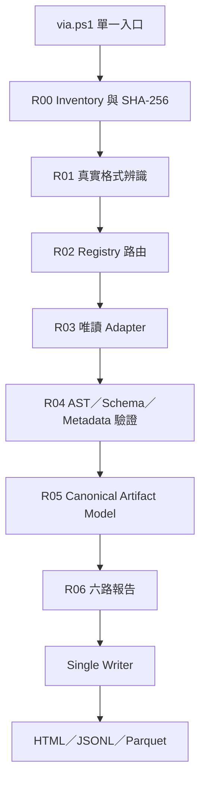

# VIA Inspector 多語言與資料工件安全讀取引擎擴充規格 v0100

> Engine：`VIA Inspector Polyglot Artifact Reader`  
> Engine ID：`VIA_IPAR`  
> Parent：`VIA_OGTTE`、`VIA Central Registry`  
> 版本：`v0100`  
> 狀態：`PLAN_ONLY / READ_ONLY / NO_IMPORT / NO_EXECUTION / NO_SOURCE_MUTATION`  
> 入口：`via.ps1` → `via.pyz` → Adapter Registry → Append-only Report

---

## 0. 決策摘要

本引擎可以納入以下內容：

- `MD / JSON / TXT / HTML / XML / YAML / TOML / INI` 等文字、標記與設定檔；
- `PY / PS1 / PSM1 / PSD1 / IPYNB / JS / TS / C / C++ / C# / Java / Go / Rust / R / SQL` 等程式碼與 Notebook；
- `Parquet / Arrow / Feather / DuckDB / SQLite` 等資料工件；
- `SHA256 / SHA512 / checksums` 等驗證清單；
- `.bak / .backup / .db` 等意義不固定的備份或資料檔；
- ZIP/TAR/GZIP 等容器內的上述工件；
- EXE/DLL/SO 等二進位檔只做 metadata、hash、字串與簽章層級盤點，不執行、不反編譯為正式內容。

最重要的治理邊界：

1. **副檔名不是格式真值。** 必須經過 extension、MIME/magic bytes、container probe、content probe 四層辨識。
2. **讀取程式碼不等於執行程式碼。** 禁止 import、dot-source、Notebook kernel、macro、Node/Python/PowerShell runtime execution。
3. **資料庫只以唯讀連線開啟。** 只允許 schema、metadata 與受限制 `SELECT`；禁止 DDL/DML、extension loading、ATTACH 任意外部來源與網路。
4. **`.sha256` 是驗證清單，不是被驗證內容。** 必須找到對應目標檔才可判定 PASS/FAIL。
5. **`.bak` 不是單一格式。** 先辨識真實內容；若為 SQL Server 原生 backup，只做 header/identity 提案，完整還原必須進入另行批准的隔離 SQL Server 流程。
6. **中央 Registry 先決定 adapter。** Registry 找不到格式時只產生新增審核，不猜測後直接執行。
7. **六路只讀、單一寫入者、No-Hydra。** 每一工件最多 `1 Primary + 1 Challenger`。

---

## 1. 頂層參數

```yaml
def_config:
  engine_id: VIA_IPAR
  version: v0100
  mode: PLAN_ONLY

  safety:
    read_only: true
    source_mutation: false
    import_source_modules: false
    execute_source_code: false
    powershell_dot_source: false
    notebook_kernel_start: false
    macro_execution: false
    database_write: false
    database_extension_load: false
    default_network: deny
    follow_symlink: false

  scope:
    root: VIA_mother_system_only
    include_hidden: false
    include_reparse_points: false
    max_file_bytes: 2147483648
    max_text_bytes: 67108864
    max_archive_entries: 10000
    max_archive_uncompressed_bytes: 4294967296
    max_compression_ratio: 100
    max_parse_depth: 512
    max_preview_rows: 1000
    parquet_batch_rows: 65536
    query_timeout_seconds: 60

  detection_order:
    - extension_hint
    - mime_magic
    - container_probe
    - content_probe
    - registry_arbitration

  orchestration:
    lanes: [L01, L02, L03, L04, L05, L06]
    canonical_writers: 1
    max_primary: 1
    max_challenger: 1
    hydra_fanout: false
    append_only_reports: true

  outputs:
    registry_db: via_registry.duckdb
    snapshot: via_registry_snapshot.parquet
    rules: via_rules.yaml
    report_html: via_report.html
    evidence: [jsonl, csv, parquet]
```

所有執行參數由 YAML/Registry 提供，不散落在各 adapter 程式碼內。

---

## 2. 引擎層級



### 正式順序

| Round | 動作 | 是否執行來源程式碼 | 是否寫來源 |
|---|---|---:|---:|
| `R00 Inventory` | path、size、mtime、SHA-256、ACL、symlink/reparse | 否 | 否 |
| `R01 Detect` | extension、MIME、magic、container、content probe | 否 | 否 |
| `R02 Gate` | Registry、授權、大小、路徑、壓縮炸彈、依賴 | 否 | 否 |
| `R03 Read` | 由 Primary adapter 讀取；必要時 Challenger 旁路 | 否 | 否 |
| `R04 Validate` | AST、Schema、語法、DB integrity、hash | 否 | 否 |
| `R05 Normalize` | 轉為 Canonical Artifact Record，保留 raw hash/locators | 否 | 否 |
| `R06 Report` | 六 Lane append-only evidence | 否 | 否 |
| `R07 Commit` | Single Writer 更新 Registry 與報告 | 否 | 否 |

---

## 3. 格式家族與 Adapter 矩陣

### 3.1 文字、標記與設定檔

| 家族 | 副檔名 | Primary | Challenger／輔助 | 提取內容 |
|---|---|---|---|---|
| Plain Text | `.txt .log .out .err` | Python `pathlib/io` + `charset-normalizer` | `chardet` | 行、段落、編碼、控制字、時間戳 |
| Markdown | `.md .markdown` | `markdown-it-py` | `mistune`／CommonMark parser | heading、list、table、link、code fence |
| JSON | `.json .jsonl .ndjson` | Python `json`／`orjson` | `ijson` 大檔串流 | object path、schema、records |
| YAML | `.yaml .yml` | `ruamel.yaml` safe/round-trip read | `PyYAML.safe_load` | key path、anchors、types；禁止 object constructors |
| TOML | `.toml` | Python `tomllib` | `tomli` | section、key、types |
| INI/CFG | `.ini .cfg .conf` | `configparser` | line parser | section、key/value、重複鍵 |
| XML | `.xml .xsd .svg` | `defusedxml` + `lxml` | stdlib ElementTree | element、attribute、text；禁止外部 entity |
| HTML | `.html .htm` | `lxml.html` | `html5lib`／BeautifulSoup | title、text、table、link、script/style child artifact |
| CSS | `.css .scss .less` | `tinycss2` | Tree-sitter grammar | selector、rule、URL、變數 |

### 3.2 程式碼與腳本

| 語言 | 副檔名 | Primary（不執行） | Challenger／語法檢查 | 提取內容 |
|---|---|---|---|---|
| Python | `.py .pyi .pyw` | stdlib `ast` + `tokenize` | `compile(..., PyCF_ONLY_AST)`／Ruff parser | imports、functions、classes、calls、syntax errors |
| PowerShell | `.ps1 .psm1 .psd1` | `System.Management.Automation.Language.Parser.ParseFile` | PSScriptAnalyzer | functions、parameters、commands、tokens、parse errors |
| JavaScript | `.js .mjs .cjs .jsx` | Tree-sitter JavaScript | `node --check`／Acorn | imports、exports、functions、calls、DOM refs |
| TypeScript | `.ts .tsx` | Tree-sitter TypeScript | TypeScript compiler `--noEmit`（隔離、無網路） | symbols、types、imports、diagnostics |
| C | `.c .h` | Tree-sitter C | Clang `-fsyntax-only` | includes、macros、functions、types、diagnostics |
| C++ | `.cpp .cc .cxx .hpp .hh` | Tree-sitter C++ | Clang++ `-fsyntax-only` | namespaces、classes、templates、includes |
| C# | `.cs .csx` | Tree-sitter C# | Roslyn syntax tree | namespace、type、method、using |
| Java | `.java` | Tree-sitter Java | JavaParser／`javac` parse-only proposal | package、class、method、imports |
| Go | `.go` | Go `parser`/Tree-sitter | `go/parser` diagnostics | package、functions、imports |
| Rust | `.rs` | Tree-sitter Rust | rust-analyzer parser | modules、items、uses、macros |
| Shell | `.sh .bash .zsh` | Tree-sitter Bash | `bash -n`／ShellCheck | functions、commands、expansions |
| Batch | `.bat .cmd` | Pygments/line grammar | custom Windows CMD parser | labels、commands、variables |
| R | `.r .R` | Tree-sitter R | R parser in parse-only isolated mode | functions、calls、libraries |
| Julia | `.jl` | Tree-sitter Julia | Julia parser proposal | modules、functions、imports |
| Ruby | `.rb` | Tree-sitter Ruby | `ruby -c` proposal | classes、methods、requires |
| PHP | `.php` | Tree-sitter PHP | `php -l` proposal | namespace、functions、includes |

Tree-sitter 作跨語言 CST Primary；語言官方 AST／syntax-only 工具作 Challenger。Pygments 只用於語言提示與 token 預覽，不能當完整語法正確性證明。

### 3.3 Notebook 與混合文件

| 格式 | Primary | 安全規則 | 輸出 |
|---|---|---|---|
| `.ipynb` | `nbformat.read(..., as_version=NO_CONVERT)` + `nbformat.validate` | 不啟動 kernel、不信任 output HTML/JS、不執行 cell | cell index/type/source/output metadata、language、execution count |
| `.qmd` | Markdown parser + fenced-code child adapters | 不 render、不執行 code chunk | section、code chunk、language、options |
| `.Rmd` | Markdown parser + R child adapter | 不 knit、不啟動 R | narrative、R chunks、dependencies |
| HTML with JS/CSS | HTML parent + JS/CSS child adapters | `<script>` 只抽取為 child artifact | DOM、tables、scripts、styles、links |
| Markdown code fence | Markdown parent + language adapter | fence language 未知即 `LANGUAGE_UNKNOWN` | prose、code block、line mapping |

Notebook 的既有 outputs 可能包含敏感資料、HTML 或 JavaScript；它們只能當資料節點，不可由報告 UI 直接信任執行。

### 3.4 表格、資料檔與資料庫

| 格式 | Primary | Challenger | 唯讀策略 |
|---|---|---|---|
| Parquet | `pyarrow.parquet` | DuckDB `read_parquet`／Polars lazy scan | metadata/footer 先讀，再 projection + batch；不整檔載入記憶體 |
| Arrow IPC/Feather | PyArrow IPC/Feather | Polars | schema 先讀，batch stream |
| CSV/TSV | PyArrow CSV／Python `csv` | DuckDB `read_csv_auto` | sample 推斷後固定 schema；保留 raw line |
| DuckDB | `duckdb.connect(path, read_only=True)` | DuckDB CLI safe mode | 只讀 catalog/schema/SELECT；禁止 INSTALL/LOAD/ATTACH/COPY/DDL/DML |
| SQLite | stdlib `sqlite3` URI `file:...?...mode=ro` | SQLite CLI `--readonly` | `PRAGMA query_only=ON`、`trusted_schema=OFF`、禁止 load_extension |
| SQL text | SQLGlot dialect parser | `sqlparse`／Tree-sitter SQL | 只解析，不送至 DB；DDL/DML 只分類與風險標記 |

### 3.5 Hash、備份、容器與二進位

| 格式 | 行為 | 結果 |
|---|---|---|
| `.sha256 / SHA256SUMS` | 解析 `<digest><spaces>[*]filename`，以 `hashlib.file_digest(..., 'sha256')` 驗證 | `MATCH / MISMATCH / TARGET_MISSING / MALFORMED` |
| `.sha512 / checksums` | 依 manifest 宣告算法驗證 | 同上 |
| `.bak / .backup` | 只把副檔名當 hint；做 magic/container/content probe | 路由至 SQLite、DuckDB、SQL dump、ZIP、text 或 `UNKNOWN_BACKUP` |
| SQL Server `.bak` | 只做 header/type/size/hash inventory | `EXTERNAL_RESTORE_REQUIRED`，不得用一般 Python parser 假裝完整解析 |
| `.zip .tar .gz .7z` | 列目錄、檢查 path traversal、entry 數、解壓上限與壓縮比 | child artifacts；只在隔離 run directory 展開 |
| `.exe .dll .so .dylib` | hash、PE/ELF/Mach-O metadata、imports/exports、strings（可選） | metadata-only，禁止執行與自動反編譯 |
| `.pyc .class .jar .wasm` | container/header/version metadata | binary artifact；除非另行批准，不重建來源碼 |

---

## 4. 真實格式辨識

### 四層一致性

| 層 | 證據 | 範例 |
|---|---|---|
| Extension Hint | 檔名副檔名 | `.db` 可能是 SQLite、DuckDB 或未知 binary |
| MIME/Magic | header bytes、BOM、magic signature | SQLite header、Parquet `PAR1`、ZIP `PK` |
| Container Probe | ZIP/TAR/JAR/Office container 目錄 | `.bak` 實際可能是 ZIP |
| Content Probe | JSON token、SQL text、AST parse、delimiter | 無副檔名內容仍可分類 |

### 判定規則

- 四層一致：`FORMAT_CONFIRMED`；
- extension 與 magic 不同：以 magic/container 為主，標記 `EXTENSION_MISMATCH`；
- 只有 extension、無可驗證內容：`FORMAT_PROVISIONAL`；
- 兩種候選分數接近：只選 Primary 做 metadata probe，Challenger 旁路，不同意即 Review；
- 任何 parser crash 不得改用「依副檔名強制執行」。

---

## 5. 六條唯讀 Lane

| Lane | 驗證內容 | 主要輸出 |
|---|---|---|
| `L01 Identity` | path、URN、hash、size、mtime、duplicate | `identity.jsonl` |
| `L02 Format/Contract` | 真實格式、adapter contract、schema version | `contract.jsonl` |
| `L03 Syntax/Structure` | AST/CST、JSON/Notebook schema、Parquet footer、DB schema | `structure.jsonl` |
| `L04 Policy/Security` | execution risk、unsafe SQL、archive bomb、symlink、網路、license | `policy.jsonl` |
| `L05 Quality` | parse coverage、round-trip locator、truncation、determinism | `quality.jsonl` |
| `L06 Conflict` | duplicate IDs、parser disagreement、dependency graph、No-Hydra | `conflict.jsonl` |

六 Lane 共用相同 immutable snapshot，各寫自己的 append-only report；完成後由 Single Writer 依 `L01 → L06` 寫入 Registry。

合併規則不變：

- `missing → append registration proposal`
- `same identity + same hash → skip`
- `same identity + different hash/contract → fail closed`

---

## 6. Canonical Artifact Model

### def ArtifactIdentity

保存 `asset_urn`、relative path、raw SHA-256、size、mtime、owner、parent container 與 child index。

### def FormatEvidence

保存 extension、MIME、magic、container、content probe、各自分數與最終分類。

### def TextUnit

保存段落／行／heading／cell 的 raw text、normalized text、byte/line locator 與 encoding。

### def CodeSymbol

保存語言、AST/CST node、function/class/module、parameters、imports、calls、source range。

### def NotebookCell

保存 cell id/index/type、source、language、metadata、output 類型與執行序號；禁止執行內容。

### def TableArtifact

保存 schema、columns、types、row groups、rows count、statistics、partition 與 preview locator。

### def DatabaseArtifact

保存 engine、storage version、tables/views/indexes、columns、constraints、row-count estimate 與唯讀 evidence。

### def HashVerification

保存 algorithm、expected digest、actual digest、target path 與 verdict。

### def DependencyEdge

保存 source artifact、target module/file/package、edge type、dynamic/conditional flag 與可解析狀態。

### def ParseFinding

保存 error code、severity、stage、adapter、line/byte locator、evidence 與 remediation proposal。

---

## 7. 30 個常見錯誤與自動處理

| ID | 錯誤 | 自動處理／支援工具 |
|---|---|---|
| `F01` | 權限不足／無法開啟 | 記錄 ACL/errno；不改權限、不重試寫入 |
| `F02` | symlink/reparse 越出母目錄 | `pathlib.resolve`/Windows path check；阻擋 |
| `F03` | 副檔名與內容不符 | magic/container 優先；Registry Review |
| `F04` | MIME 不一致 | libmagic + content probe 仲裁 |
| `F05` | 未知 magic/header | metadata-only；建立 format proposal |
| `F06` | 檔案超過上限 | metadata-only 或 batch/stream reader |
| `F07` | 編碼無法判定 | BOM→UTF-8→charset-normalizer；保留 raw bytes hash |
| `F08` | binary 被當 text | NUL/control-byte ratio + magic 阻擋 text parser |
| `F09` | 檔案截斷 | parser EOF/footer/schema 驗證；標記 incomplete |
| `F10` | 重複內容不同路徑 | SHA-256 dedupe；保留 alias，不重複解析 |
| `S11` | JSON/JSONL 無效 | `json`/`orjson` + line locator；JSONL 逐行隔離 |
| `S12` | Notebook schema 無效 | `nbformat.validate`；不靜默修正原檔 |
| `S13` | Markdown fence 未閉合 | markdown token/line check；保留其後 raw text |
| `S14` | HTML 損壞／瀏覽器修復差異 | lxml Primary + html5lib Challenger，差異送 Review |
| `S15` | Python syntax error | `ast.parse`/PyCF_ONLY_AST；輸出 line/column |
| `S16` | PowerShell parse error | `Parser.ParseFile` 回傳 tokens/errors；不 dot-source |
| `S17` | JavaScript syntax error | Tree-sitter error node + `node --check` Challenger |
| `S18` | C/C++ 語法或 include 缺失 | Tree-sitter parse；Clang `-fsyntax-only` 分離 syntax/include error |
| `S19` | SQL dialect 不明 | SQLGlot 多 dialect parse score；不執行猜測結果 |
| `S20` | AST 深度／節點爆量 | max depth/node count；partial tree + finding |
| `D21` | Parquet footer/row group 損壞 | PyArrow metadata read；按 row group 隔離 |
| `D22` | Parquet/CSV schema drift | Arrow schema union report；不自動強制 cast critical columns |
| `D23` | row count/statistics 不一致 | PyArrow vs DuckDB metadata Challenger |
| `D24` | DuckDB storage/version 不相容 | read-only open failure + version evidence；不升級原檔 |
| `D25` | SQLite integrity/query-only 失敗 | `mode=ro` + `PRAGMA quick_check`；禁止 repair write |
| `D26` | Database locked | read-only retry with bounded backoff；超時即 Review |
| `D27` | SQL 含寫入／外部副作用 | AST 分類 INSERT/UPDATE/DELETE/DDL/COPY/ATTACH/LOAD；一律不執行 |
| `D28` | Notebook output 過大或含 active HTML/JS | output 截斷預覽、hash 保存、HTML escape |
| `D29` | SHA manifest 缺目標／不符 | `TARGET_MISSING` 或 `MISMATCH`，不自動找相似檔替代 |
| `D30` | archive path traversal／zip bomb | normalize member path、entry/size/ratio gate；阻擋展開 |

---

## 8. 安全讀取規則

### 原始碼

- Python 用 `ast.parse`/tokenize，不 `importlib.import_module`；
- PowerShell 用 Parser AST，不 `Invoke-Expression`、`&`、dot-source；
- JavaScript 可用 `node --check`，但不可 `node file.js`；
- C/C++ 只允許 Clang `-fsyntax-only`，不產生 object/executable；
- 外部 syntax checker 必須有 timeout、無網路、隔離 cwd、限制 child process；
- 任何 adapter 只回傳結構資料，不直接取得 Registry write handle。

### Notebook

- 不設定 trusted；
- 不啟動 kernel；
- 不執行 cell；
- HTML/SVG/JavaScript output 一律 escape 或當附件 metadata；
- embedded image 可記錄 MIME、size、hash，不自動 OCR，除非另走 VIA_OGTTE 影像 Gate。

### 資料庫

- DuckDB 使用 `read_only=True`；
- SQLite 使用 URI `mode=ro`，再加 `PRAGMA query_only=ON`；
- query allowlist 僅接受 Registry 產生的 metadata queries 與受限制 `SELECT`；
- 不接受工件內自帶 SQL 直接執行；
- 禁止 extension load、external access、網路 filesystem、秘密管理與環境變數擴張；
- preview 必須 `LIMIT`，大表採 batch/Arrow stream；
- schema 與資料 preview 分開分級，避免敏感資料出現在 HTML。

### 容器與備份

- 列表先於展開；
- 驗證所有 member path 留在隔離 run directory；
- 阻擋 absolute path、`..` traversal、device file、symlink member；
- 解壓前計算 entry count、宣告大小、壓縮比與總量；
- child artifact 各自重新 hash、辨識與進 Registry，不繼承父檔副檔名。

---

## 9. Adapter 自動選擇

### 硬閘門

1. Adapter 已在 Registry 為 `ACTIVE/CANARY`；
2. 格式 evidence 符合；
3. `read_only=true`；
4. 不 import、不 execute、不連網、不寫來源；
5. Runtime 與依賴相容；
6. 輸出符合 Canonical Artifact Schema；
7. 有該格式 Golden fixtures；
8. 沒有 unresolved identity/conflict。

### 排序原則

1. 官方／原生 parser；
2. 可產 AST/CST/schema/locator；
3. 決定性；
4. 可串流／projection；
5. 記憶體與時間；
6. 可離線；
7. 活躍維護與授權證據。

### No-Hydra

- 一般情況只跑一個 Primary；
- 只有格式不明、語法錯誤、資料損壞或關鍵結果不一致時，才跑一個 Challenger；
- Challenger 必須使用不同 parser mechanism；
- 兩者不一致時輸出 Review，不以多數決修改 raw content。

---

## 10. Registry 格式宣告

```yaml
format_id: urn:via:format:python-source:v1
family: source_code
extensions: [.py, .pyi, .pyw]
mime_hints: [text/x-python]
magic_rules: []
content_probes:
  - python_tokenize
  - python_ast

primary_adapter: urn:via:adapter:python-ast:v1
challenger_adapter: urn:via:adapter:tree-sitter-python:v1

policy:
  read_only: true
  execute: false
  import: false
  network: false
  source_write: false

outputs:
  - ArtifactIdentity
  - TextUnit
  - CodeSymbol
  - DependencyEdge
  - ParseFinding

schema_version: 1
golden_fixture_set: golden/python/v1
```

Registry 應集中於 `classification_registry.yaml` 與 `conflict_matrix.yaml`，並帶 `schema_version`。任何新格式先產生 proposal，不能由 adapter 自行擴充 canonical 規則。

---

## 11. 主要函式介面

```python
def def_inventory_artifacts(config, root_path, registry_snapshot): ...
def def_compute_file_identity(config, artifact_path): ...
def def_detect_extension_hint(config, artifact_identity): ...
def def_detect_mime_magic(config, artifact_path): ...
def def_probe_container(config, artifact_path, limits): ...
def def_probe_content(config, artifact_path, format_candidates): ...
def def_arbitrate_format(config, evidence, classification_registry): ...
def def_apply_security_gates(config, artifact_identity, format_evidence): ...
def def_select_read_adapter(config, format_evidence, adapter_registry): ...
def def_read_text_artifact(config, artifact_path, encoding_policy): ...
def def_read_markdown_artifact(config, artifact_path, parser): ...
def def_read_json_artifact(config, artifact_path, schema, streaming): ...
def def_read_python_ast(config, artifact_path, feature_version): ...
def def_read_powershell_ast(config, artifact_path, parser_runtime): ...
def def_read_notebook(config, artifact_path, nbformat_policy): ...
def def_read_html_artifact(config, artifact_path, parser_policy): ...
def def_read_javascript_cst(config, artifact_path, grammar_version): ...
def def_read_c_cst(config, artifact_path, grammar_version): ...
def def_read_parquet_metadata(config, artifact_path, column_projection): ...
def def_read_duckdb_catalog(config, artifact_path, query_allowlist): ...
def def_read_sqlite_catalog(config, artifact_path, query_allowlist): ...
def def_parse_sql_text(config, artifact_path, dialect_candidates): ...
def def_verify_checksum_manifest(config, manifest_path, root_path): ...
def def_inspect_backup_container(config, artifact_path, limits): ...
def def_build_dependency_edges(config, canonical_artifacts): ...
def def_run_six_lane_validation(config, immutable_snapshot): ...
def def_commit_registry_single_writer(config, lane_reports, registry_snapshot): ...
def def_emit_polyglot_report(config, canonical_records, findings): ...
```

所有函式的參數來源必須在頂層配置、Registry 或明確 context 中；不得在函式內偷偷讀取未知全域設定。

---

## 12. 一個 PowerShell 入口的發佈結構

```text
VIA_Inspector/
  via.ps1
  via.pyz
  duckdb.exe
  via_registry.duckdb
  via_registry_snapshot.parquet
  via_rules.yaml
  classification_registry.yaml
  conflict_matrix.yaml
  via_report.html
  schemas/
  grammars/
  golden/
  adapters/
  _runs/
```

### PowerShell Round

| Round | 進度 | 任務 |
|---|---:|---|
| `Round 0` | 0–20% | Preflight、Registry snapshot、inventory、SHA-256 |
| `Round 1` | 20–45% | 真實格式辨識、風險與 adapter proposal |
| `Round 2` | 45–75% | 六路唯讀 parse/validate；動態進度 |
| `Round 3` | 75–95% | Single Writer 合併 Registry/report |
| `Round 4` | 95–100% | HTML Matrix、JSONL/CSV/Parquet evidence、Final Gate |

PowerShell 7 console 完成後保持開啟；任何單一工件錯誤只隔離該工件，不中斷其餘 inventory。

---

## 13. 實作階段

### Phase 1：格式辨識與治理

1. Classification Registry、Conflict Matrix、Schema；
2. SHA-256 identity、path/symlink/reparse gate；
3. MIME/magic/container/content probe；
4. 六 Lane + Single Writer；
5. append-only HTML/JSONL/Parquet reports。

### Phase 2：文字與主要程式碼

1. TXT/MD/JSON/YAML/TOML/XML/HTML；
2. Python AST；
3. PowerShell AST；
4. JavaScript/TypeScript Tree-sitter；
5. SQLGlot；
6. dependency/import graph。

### Phase 3：資料工件

1. Parquet/Arrow metadata + batch reader；
2. DuckDB read-only catalog；
3. SQLite `mode=ro` catalog；
4. CSV/TSV schema drift；
5. row/table/column quality profile。

### Phase 4：Notebook、Hash 與 Backup

1. IPYNB `NO_CONVERT` + schema validation；
2. embedded code child routing；
3. SHA256/SHA512 manifest verifier；
4. BAK true-format probe；
5. archive traversal/bomb guards。

### Phase 5：擴充語言

1. C/C++ + Clang `-fsyntax-only`；
2. C#/Java/Go/Rust；
3. Shell/Batch/R/Julia/Ruby/PHP；
4. binary metadata；
5. 每種語言先 Golden/Shadow，再註冊 Active。

---

## 14. 驗收標準

- 能辨識並唯讀處理使用者列出的所有格式家族；
- `.bak`、`.db`、無副檔名檔案不會只靠名稱誤判；
- Python、PowerShell、JS、Notebook、C 在掃描過程中均不執行；
- DuckDB/SQLite 開啟後 source hash 不變；
- SQL 工件內含 `DROP/DELETE/ATTACH/LOAD` 也不會被執行；
- Notebook 不啟動 kernel，active output 不進入 HTML DOM 執行；
- Parquet 大檔以 metadata、projection、batch 讀取；
- SHA256 可區分 malformed、missing、mismatch、match；
- archive traversal 與高壓縮比工件被阻擋；
- 六 Lane 不共寫；Registry 只有一個 writer；
- 同一檔案同一配置重跑，Canonical Artifact Record hash 一致；
- 任一 adapter crash 只隔離該工件與新 adapter；
- 正式輸出保留 raw hash、工具版本、格式 evidence、line/byte/cell/table locator。

---

## 15. 官方技術依據

- Python `ast` 可從來源建立抽象語法樹：<https://docs.python.org/3/library/ast.html>
- Microsoft PowerShell Parser 可回傳 `ScriptBlockAst`、tokens 與 parse errors：<https://learn.microsoft.com/en-us/dotnet/api/system.management.automation.language.parser.parsefile>
- Jupyter Notebook 格式由 JSON Schema 定義，`nbformat` 支援 read/validate 且可用 `NO_CONVERT`：<https://nbformat.readthedocs.io/en/latest/format_description.html>、<https://nbformat.readthedocs.io/en/latest/api.html>
- Tree-sitter 是可產生 concrete syntax tree 的多語言 incremental parsing library：<https://tree-sitter.github.io/>
- PyArrow 提供 Parquet metadata、column projection 與 table/batch reading：<https://arrow.apache.org/docs/python/parquet.html>
- DuckDB Python 連線支援 `read_only=True`：<https://duckdb.org/docs/current/clients/python/dbapi>
- SQLite URI 支援 `mode=ro`；CLI 另有 `--readonly`：<https://sqlite.org/uri.html>、<https://sqlite.org/cli.html>
- `markdown-it-py` 將 Markdown 解析為 token stream：<https://markdown-it-py.readthedocs.io/en/latest/using.html>
- `lxml` 提供 XML/HTML parser；html5lib 可作瀏覽器式 HTML5 Challenger：<https://lxml.de/parsing.html>、<https://lxml.de/html5parser.html>
- SQLGlot 提供多 dialect SQL parser：<https://sqlglot.com/>
- Node.js `--check` 可檢查語法而不執行 script：<https://nodejs.org/api/cli.html#-c---check>
- Clang `-fsyntax-only` 只進行 preprocessor、parser 與 semantic analysis：<https://clang.llvm.org/docs/ClangCommandLineReference.html#cmdoption-clang-fsyntax-only>
- Python `hashlib.file_digest` 可對檔案計算 SHA-256：<https://docs.python.org/3/library/hashlib.html>
- Pygments 可提供多語言 lexer/token hint，但本規格不把 highlighting lexer 當完整 AST：<https://pygments.org/docs/lexers/>

---

## 16. 最終定位

此擴充不是「萬用執行器」，而是：

> **對多語言程式碼、文字、Notebook、表格、資料庫、備份、hash 與容器進行離線、唯讀、可驗證、可追溯的工件理解與治理引擎。**

正式建置時先完成 Phase 1 的格式辨識與 Registry，再逐類加入 adapters；不能因為副檔名已列入支援清單，就跳過安全、Golden、Shadow 與 Single Writer Gate。
