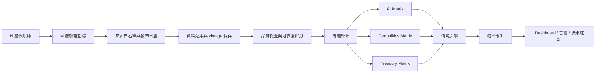
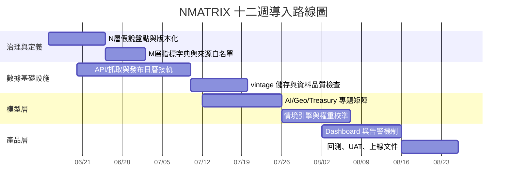

# NMATRIX 方法論深度摘要與資料蒐集設計報告

## 執行摘要

依你提供的草稿，**NMATRIX** 最適合被定義為一個「由上而下的假說驗證系統」：先在 **N 層**寫出市場敘事與宏觀假說，再在 **M 層**把每一個假說拆成可量測、可追蹤、可反駁的資料欄位，之後再把資料餵入 **AI、地緣政治、Treasury 三個專題矩陣**，最後由 **情境引擎**把異質訊號合成機率，並由 **儀表板**做持續監控。這個架構與你草稿中的核心設計一致。fileciteturn0file0

若要把 NMATRIX 做成可長期運作的研究基礎設施，最佳做法不是先做視覺化，而是先建立一條**官方資料優先、保存 vintage、可回測、可追責**的資料鏈。可作為骨幹的來源包括：Fed 與 New York Fed、FRED/ALFRED、BLS、BEA、Census、Treasury、IMF Data、EIA、SEC EDGAR；這些來源同時提供官方發布頁、發布日曆、API 或可機器讀取的資料管道。citeturn33view1turn33view0turn45view0turn42view0turn15view1turn16view0

就研究方法而言，NMATRIX 的關鍵不是「資料多」，而是四件事：第一，**每個假說只有少數幾個核心驗證指標**；第二，**官方／私人／市場三條證據鏈必須交叉驗證**；第三，**每筆資料都要有可靠度分數與 revision 管理**；第四，**情境機率必須透明地由公式得出，而不是主觀拍板**。官方資料存在修正與補發的事實，因此保存即時版本與歷史版本是必要而非可選項。ALFRED 專門保存歷史 vintage，FRED 多個系列頁面也明示所有資料可能修正；Census 住房與新屋銷售頁面也公開列出更正公告。citeturn33view0turn40view0turn31view0turn43view0turn43view1

本報告因此把 NMATRIX 具體化為一個可實作的研究框架：**N 層假說庫、M 層指標字典、來源白名單、品質與可靠度機制、情境機率引擎、儀表板、資料庫 schema、12 週導入路線圖**。以下內容採「簡潔但可執行」的標準撰寫。

## 方法目的與範圍

NMATRIX 的目的，不是替代傳統總經分析，而是把原本分散在報告、圖表、新聞與盤感中的判斷，轉成一套**可以持續更新、可以追蹤誤差、可以回頭檢討**的結構化方法。用一句話概括，它要回答的是：

> **現在市場正在交易哪個敘事、這個敘事要看哪些證據、證據是否一致、如果不一致該如何修正情境機率。**

依你草稿設定，NMATRIX 的實際範圍至少包含五個層次：  
**宏觀就業／通膨／消費／住房／流動性／利率曲線**，再加上 **AI、地緣政治、Treasury** 三個跨域專題矩陣，再往上是 **情境引擎**，最終落在 **dashboard 與投資決策節點**。fileciteturn0file0

在資料治理上，建議 NMATRIX 採用明確的來源等級：

| 層級 | 定義 | 典型來源 | 角色 |
|---|---|---|---|
| 第一層 | 官方原始來源 | Fed、NY Fed、BLS、BEA、Census、Treasury、IMF、EIA、SEC | 作為基準值與驗證主錨 |
| 第二層 | 官方再分發 / 公共介面 | FRED、ALFRED、官方 API、官方 JSON/ICS 日曆 | 作為抓取與版本管理介面 |
| 第三層 | 私人 / 產業 / 調查 | University of Michigan、Conference Board、公司 IR、產業協會 | 補充官方未涵蓋維度 |
| 第四層 | 市場價格 / 授權資料 | ICE、CME、LSEG、Bloomberg、交易所行情 | 提供即時預期與風險定價 |

這樣做的好處是：**官方值決定事實，私人資料補充解釋，市場價格反映預期與交易結果**。例如：就業是否轉弱，以 BLS 與 DOL 為主；市場如何交易這件事，則由殖利率曲線、信用利差與利率期貨補充。BLS、BEA 與 Census 都公開發布日程；FRED 與 ALFRED 提供 API 與 vintage 支援，使這種三層式結構可以自動化。citeturn38view0turn22view0turn45view0turn42view0turn33view1turn33view0

## 從 N 層到儀表板的工作流程

NMATRIX 最重要的不是表格形式，而是**工作流**。建議標準流程如下。

第一步是建立 **N 層假說庫**。每個 N 項目都必須是可以被反駁的句子，例如：「就業市場仍具韌性」、「通膨下行但服務通膨黏著」、「住房活動觸底回升」、「美債供給壓力正在主導長端利率」等。這種寫法的好處是，後面可以直接對應驗證規則，而不是停留在抽象主題。fileciteturn0file0

第二步是把每個 N 假說拆成 **M 層資料列**。每個假說原則上只綁定 3 到 7 個核心指標；超過 7 個通常會稀釋訊號。M 層不只要存名稱，還要存**單位、季節調整狀態、更新頻率、發布時點、資料轉換方式、正負方向、可靠度分數、是否保存 vintage**。FRED API 可批量與增量抓取 series；ALFRED 可回到歷史發布當下的版本；BEA 亦提供 JSON 與 ICS 發布格式。citeturn33view1turn33view0turn45view0

第三步是進入 **專題矩陣層**。這一層的目的，不是重複宏觀資料，而是把跨域風險納入。  
AI matrix 關注「投資、供給、變現」；Geopolitics matrix 關注「能源、航運、制裁、供應鏈中斷」；Treasury matrix 關注「供給、需求、期限結構、流動性吸收與政策傳導」。SEC EDGAR 可作為 AI matrix 的季報／年報第一手資料入口；IMF Data 已把 AI Preparedness Index、WEO、IFS、PortWatch 等資料集中在同一門戶；Treasury Quarterly Refunding、Fed H.15、H.4.1 與 New York Fed RRP 則足以支撐 Treasury matrix。citeturn16view0turn15view1turn21view1turn28view0turn30view0turn31view1

第四步是進到 **情境引擎**。這裡不直接看單一指標，而是先把指標轉換成標準化訊號，再按矩陣與情境做聚合，最後輸出後驗機率。儀表板的角色不是重新計算，而是把機率、分歧、修正、資料發布與告警，在同一個操作面板上可視化。BLS online calendar、BEA release schedule、FOMC calendar、EIA weekly release、H.15 與 H.4.1 的固定/規則性發布節奏，都很適合作為 dashboard 的事件時間軸來源。citeturn26view0turn45view0turn46view1turn27view0turn28view0turn30view0

### 專題矩陣的最小可行定義

| 專題矩陣 | 核心問題 | 最低必備欄位 | 首選來源 |
|---|---|---|---|
| AI Matrix | AI 投資是否仍在擴張、供給是否瓶頸、收入是否變現 | Capex、DC 投資、GPU 供給、AI 收入、管理層指引、估值張力 | SEC EDGAR、公司 IR、法說簡報；可輔以 IMF AI Preparedness Index 作宏觀背景 citeturn16view0turn15view1 |
| Geopolitics Matrix | 地緣衝突是否轉化為能源、航運或制裁壓力 | 油價、庫存、航線/港口中斷、出口限制、事件嚴重度 | EIA Weekly Petroleum Status Report、IMF PortWatch、官方海關與貿易統計 citeturn27view0turn15view1 |
| Treasury Matrix | 長端利率的主導因子是政策、供給還是需求 | Refunding、發債結構、曲線斜率、RRP、Fed BS、外資需求 | Treasury Quarterly Refunding、Fed H.15、H.4.1、NY Fed RRP、TIC/相關 Treasury 資源 citeturn21view1turn28view0turn30view0turn31view1 |

## 資料需求與 NMATRIX 對照表

正式建置時，建議先把資料需求分成三類。  
第一類是**官方硬資料**：就業、通膨、所得、消費、住房、產出、資金條件。  
第二類是**市場定價資料**：殖利率曲線、信用利差、美元、波動率。  
第三類是**專題補充資料**：AI capex、航運中斷、能源庫存、Treasury 供給結構。官方來源能取代私人來源時，優先用官方；若官方沒有足夠高頻或細項，再用私人或市場資料補齊。BLS、BEA、Census、Fed、Treasury、IMF、EIA 都提供公開發布頁或資料入口；其中 FRED/ALFRED 尤其適合做統一抓取與 vintage 管理。citeturn38view0turn38view1turn45view0turn42view0turn33view1turn33view0turn15view1turn27view0

### 完整 NMATRIX 對照表

| ID | Hypothesis | Verification Metrics | Data Source | Frequency | Update Cadence |
|---|---|---|---|---|---|
| N01 | 勞動市場仍具韌性 | NFP、失業率、平均時薪、初領失業金、JOLTS 開缺/離職率 | BLS Employment Situation；DOL Weekly Claims；BLS JOLTS citeturn38view0turn22view0turn39view1 | 月 / 週 | 就業報告每月；Claims 每週四；JOLTS 每月 |
| N02 | 通膨下降但服務通膨仍黏著 | CPI headline/core/shelter、PPI final demand、PCE headline/core、進出口價格、消費者通膨預期 | BLS CPI/PPI/Import-Export Prices；BEA Personal Income and Outlays；UMich Sentiment/Inflation Expectations via FRED citeturn38view1turn38view2turn38view3turn26view0turn45view0turn40view0 | 月 | CPI/PPI 多在月中；PCE 多在月底；進出口價格每月；Michigan 每月 |
| N03 | 消費與所得仍支撐成長 | Retail sales、real PCE、personal income、saving rate、consumer sentiment | Census Monthly Retail Trade；BEA Personal Income and Outlays；UMich/FRED citeturn43view2turn45view0turn40view0 | 月 | Retail 多在月中；PCE/所得月底；Sentiment 每月 |
| N04 | 住宅市場正在觸底或回升 | Building permits、housing starts、under construction、new home sales、months supply | Census New Residential Construction；Census New Residential Sales citeturn43view0turn43view1 | 月 | 住房開工與新屋銷售每月 |
| N05 | 製造與實體經濟擴張或降溫 | Industrial production、capacity utilization、耐久財/工業鏈補充指標 | Fed G.17；必要時再接 BEA/Census 製造類資料 citeturn32view0turn24view1turn42view0 | 月 | G.17 每月 9:15 ET 發布時程固定 |
| N06 | 流動性變化正在主導風險資產 | Fed balance sheet、M2、ON RRP、準備金相關項 | Fed H.4.1；Fed H.6；NY Fed RRP via FRED citeturn30view0turn31view0turn23view0turn31view1 | 週 / 月 / 日 | H.4.1 每週四；H.6 約每月；RRP 每日 |
| N07 | 利率曲線反映成長/衰退路徑切換 | 10Y-2Y、10Y-3M、H.15 曲線、FOMC 會議與聲明 | Fed H.15；FRED spreads；FOMC calendar citeturn28view0turn29view0turn29view1turn46view1 | 日 / 事件 | H.15 週一至週五 4:15pm ET；FOMC 依會議日程 |
| N08 | 金融條件正在惡化或放鬆 | IG/HY OAS、銀行放貸態度、信用敏感資產 | ICE BofA OAS via FRED；Fed SLOOS citeturn48view1turn10view2 | 日 / 季 | OAS 每日；SLOOS 按官方調查發布 |
| N09 | 美元與外部部門野支影響風險偏好 | Nominal broad dollar index、貿易/國際收支、跨國宏觀比較 | Fed H.10 / FRED；BEA 國際交易時程；IMF Data/IFS/WEO citeturn47view0turn45view0turn15view1 | 日 / 月 / 季 / 半年 | 美元指數高頻；BEA 月/季；IMF 月/半年 |
| N10 | 美債供需而非單純政策，正在主導長端利率 | Refunding、auction size、期限結構、曲線斜率、RRP、Fed BS、外資需求 | Treasury Quarterly Refunding；Fed H.15；Fed H.4.1；NY Fed RRP；Treasury debt management resources/TIC 入口 citeturn21view1turn28view0turn30view0turn31view1 | 季 / 日 / 週 / 月 | Refunding 每季；曲線每日；Fed BS 每週；RRP 每日 |
| N11 | AI 投資循環仍在擴張，且開始反映在收入端 | Cloud/AI capex、GPU 供給、AI segment revenue、管理層指引、延遲/庫存 | SEC EDGAR、10-K/10-Q/8-K、公司 IR、法說簡報；IMF AI Preparedness Index 作輔助背景 citeturn16view0turn15view1 | 季 / 事件 | 財報季、資本支出指引更新、重大 8-K/IR 發布 |
| N12 | 地緣風險正透過能源與航運傳導 | 原油庫存、產量/出口、港口中斷、航線轉移、事件嚴重度 | EIA Weekly Petroleum Status Report；IMF PortWatch；官方貿易/海關資料 citeturn27view0turn15view1 | 週 / 日 / 事件 | EIA 每週；PortWatch 近即時；事件依公告 |
| N13 | 全球同步性與再定價風險上升 | IMF WEO 成長/通膨修正、IFS、跨國政策與匯率/儲備指標 | IMF Data Portal、WEO、IFS、中央銀行/官方統計 citeturn15view1turn15view2 | 月 / 半年 / 事件 | IFS 月度；WEO 年兩次；政策事件即時 |
| N14 | 數據本身的 revision 會改寫結論 | Vintage、修正幅度、方法更改、發布延遲、缺值率 | ALFRED；FRED API；BEA/Census/BLS 修正與公告頁 citeturn33view0turn33view1turn43view0turn43view1turn24view1 | 每次匯入 | 每次資料落地都要檢查 |

### 資料蒐集的核心規格

建議所有 M 層欄位至少要有以下 metadata：`metric_id`、`source_id`、`native_code`、`unit`、`seasonal_adjustment`、`frequency`、`release_ts`、`period_end`、`vintage_date`、`transform_rule`、`direction`、`reliability_score`、`license_flag`、`raw_hash`。這樣之後才能同時支援回測、修正追蹤與多來源對照。FRED API 支援 series、release、source、vintage dates 等層級；ALFRED 則可回看歷史時點可見值。citeturn33view1turn33view0

## 資料品質、可靠度評分與交叉驗證

NMATRIX 若要可靠，不能只做 ETL，還必須做 **DQ + validation + scoring**。建議每筆資料至少經過六個檢查：  
**格式檢查**（日期、數值、單位）、**完整性檢查**（缺值/遺漏期間）、**邏輯檢查**（不可能值、方向符號錯誤）、**連續性檢查**（跳點與結構斷裂）、**發布時差檢查**（是否晚於官方日曆）、**revision 檢查**（是否與前一 vintage 有異常偏離）。Census 經濟指標頁面明示其方法頁包含估計、抽樣變異與季調說明；FRED/ALFRED 則提供 series revision 與 vintage 管理；Census 住房／新屋銷售頁面也清楚列出更正與方法改變公告。citeturn42view0turn33view0turn33view1turn43view0turn43view1

### 建議的可靠度評分公式

對每個資料序列 \(i\)，建議使用：

\[
RS_i = 100 \times \Big(0.30A_i + 0.15M_i + 0.15T_i + 0.15C_i + 0.15R_i + 0.10V_i\Big)\times P_i
\]

其中：

- \(A_i\)：來源權威度  
- \(M_i\)：方法透明度  
- \(T_i\)：時效性  
- \(C_i\)：跨來源一致性  
- \(R_i\)：歷史修正穩定度  
- \(V_i\)：可取得性與連續性  
- \(P_i\)：異常懲罰因子

建議的預設權重如下：

| 構面 | 權重 | 評分說明 |
|---|---:|---|
| 來源權威度 \(A\) | 0.30 | 官方/央行/監管機關最高 |
| 方法透明度 \(M\) | 0.15 | 是否公開方法、樣本、定義、技術說明 |
| 時效性 \(T\) | 0.15 | 是否能穩定按時發布 |
| 一致性 \(C\) | 0.15 | 與其他來源或市場價格是否同向 |
| 修正穩定度 \(R\) | 0.15 | 是否常大幅修正、是否有方法斷點 |
| 可取得性 \(V\) | 0.10 | API/下載穩定、授權可持續 |

懲罰因子建議定義為：

\[
P_i = \max\big(0.60,\; 1 - 0.05\cdot Miss_i - 0.05\cdot Lag_i - 0.10\cdot MethodBreak_i - 0.10\cdot UnexplainedRev_i \big)
\]

其中各旗標取 0 或 1。

### 權威度預設值

| 來源類型 | 建議 \(A\) |
|---|---:|
| 官方統計 / 央行 / 財政部 / 監管機關 | 1.00 |
| 官方資料經 FRED 再分發 | 0.95 |
| 交易所 / 拍賣 / 受監管市場機制資料 | 0.90 |
| 授權市場指數 / 商業資料商 | 0.75 |
| 私人調查 / 產業協會 | 0.65 |
| 替代資料 / OSINT / 人工事件標註 | 0.45 |

### 計算示例

若某一個 BLS CPI 系列的評分如下：  
\(A=1.00\)、\(M=0.95\)、\(T=0.98\)、\(C=0.96\)、\(R=0.90\)、\(V=1.00\)、\(P=0.95\)

則：

\[
RS = 100 \times (0.30 + 0.1425 + 0.147 + 0.144 + 0.135 + 0.10)\times 0.95 \approx 92.0
\]

BLS CPI 頁面同時提供方法、技術文件、下一次發布時間與公告，因此很適合作為高可靠度的核心 series。citeturn38view2turn38view1

### 官方、私人、市場三線交叉驗證

建議 NMATRIX 對每一個假說至少保留三條證據鏈：

| 證據層 | 目的 | 例子 |
|---|---|---|
| 官方 | 定義基準事實 | BLS 就業、CPI；BEA GDP/PCE；Census 零售/住房；Fed H.15/H.4.1 |
| 私人 | 補足感受、前瞻與細項 | Michigan/Conference Board、公司法說、產業調查 |
| 市場 | 觀察預期如何被交易 | 曲線、OAS、美元、波動率、利率期貨 |

實務規則可定義為：

- 若官方、私人、 市場三者同向，該假說狀態可標記為 **Confirmed**。  
- 若官方與私人一致、但市場反向，標記 **Priced Differently**，表示市場已提前交易或不相信官方趨勢。  
- 若官方反向、私人與市場同向，標記 **Watch Revision / Narrative Risk**。  
- 若三者互相衝突，標記 **Low Confidence**，並降低情境引擎權重。  

這種流程尤其適合處理「官方慢、市場快」的問題，例如 GDP 季頻、PCE 月頻、RRP 日頻、Claims 週頻本來就不一致。citeturn24view1turn45view0turn31view1turn22view0

### 假設與未明定項目

目前草稿中仍有幾個需明確化的地方，本報告採用的是**可執行預設值**而非唯一標準答案。fileciteturn0file0

第一，**情境先驗機率**未在草稿中完全數值化，因此本報告把它設計成可手動配置的 priors。  
第二，**每個假說綁定多少指標**未完全定義，因此採 3–7 個核心指標的中間值原則。  
第三，**地緣政治事件嚴重度**沒有統一量尺，因此需自行建立 0–5 event severity taxonomy。  
第四，**AI matrix 的公司樣本池**需要明確指定，是只看美股 mega-cap，還是加入台灣/亞洲供應鏈。  
第五，**資產配置規則**雖然可以接在 dashboard 後面，但本報告先聚焦在研究與機率框架，不把交易倉位規則寫死。

## 情境引擎與儀表板設計

情境引擎不應該直接吃原始值，而應該先把不同頻率與單位的資料正規化。建議對每個指標 \(j\) 在時間 \(t\) 先做方向一致化與滾動 z-score：

\[
z_{j,t} = sign_j \cdot \frac{x_{j,t} - \mu_{j,36m}}{\sigma_{j,36m}}
\]

其中 `sign_j` 用來把「數值上升＝利多」或「數值上升＝利空」變成同方向。若系列分布偏態很大，也可以改成百分位數分數。

之後把指標先聚合到矩陣層，再聚合到情境層。建議的情境分數公式：

\[
Score_{s,t} = 0.45 \cdot Macro_{s,t} + 0.20 \cdot Liquidity_{s,t} + 0.10 \cdot AI_{s,t} + 0.15 \cdot Geo_{s,t} + 0.10 \cdot Treasury_{s,t}
\]

最後用 softmax 轉成後驗機率：

\[
P_{s,t} = \frac{\pi_s e^{\beta Score_{s,t}}}{\sum_k \pi_k e^{\beta Score_{k,t}}}
\]

其中 \(\pi_s\) 是先驗機率，\(\beta\) 是溫度參數；建議初始設為 1.0–1.5，常用值可先用 **1.2**。

### 情境機率示例

下表是示意，不是即時市場判斷：

| Scenario | Prior \(\pi_s\) | Macro | Liquidity | AI | Geo | Treasury | Composite Score | Posterior Probability |
|---|---:|---:|---:|---:|---:|---:|---:|---:|
| Soft Landing | 0.40 | 0.60 | 0.20 | 0.40 | -0.10 | 0.10 | 0.3450 | 49.97% |
| No Landing / Reflation | 0.35 | 0.35 | 0.10 | 0.45 | -0.20 | -0.15 | 0.1775 | 35.76% |
| Hard Landing / Stress | 0.25 | -0.40 | -0.25 | 0.05 | -0.35 | -0.30 | -0.3075 | 14.27% |

這種寫法的優點是：  
**先驗可調、權重可回測、每個 scenario 為何上升/下降都能拆解。**  
若 N01 就業、N02 通膨、N06 流動性三個核心矩陣同時逆轉，Posterior 不必人工改寫，會自然在下一次跑分時下修。

### 儀表板建議的八個主 widget

| Widget | 功能 | 更新節奏 |
|---|---|---|
| Scenario Probability Stack | 顯示三到五個主情境的後驗機率 | 每日 / 每事件 |
| N-Layer Heatmap | 顯示每個假說目前為 Confirmed / Mixed / Failing | 每次資料更新 |
| Data Release Radar | 顯示未來 30 天官方發布與 FOMC / Treasury / EIA 事件 | 每日 |
| Surprise Board | 顯示實際值、共識、前值、修正值、surprise z-score | 每次發布 |
| Labor & Inflation Panel | 就業、Claims、CPI、PPI、PCE、預期通膨整合視圖 | 週 / 月 |
| Treasury & Liquidity Panel | 曲線、Fed BS、RRP、Refunding、供給壓力 | 日 / 週 / 季 |
| AI Cycle Tracker | capex、AI 收入、供給瓶頸、法說重點摘要 | 財報季 / 事件 |
| Geo Risk Map | 電力/能源/港口/航運與事件嚴重度地圖 | 日 / 事件 |

這八個 widget 足以支撐 NMATRIX 的核心任務，而且不會讓 dashboard 變成純展示牆。資料時間軸可直接對接 BLS、BEA、FOMC、EIA、Treasury 的公開發布節奏。citeturn26view0turn45view0turn46view1turn27view0turn21view1

## 資料庫架構、交付物與實施路線圖

### 建議的資料庫 schema

| Table | 用途 | Key Fields |
|---|---|---|
| `dim_hypothesis` | 儲存 N 層假說定義 | `hypothesis_id`, `title`, `description`, `regime_group`, `owner`, `active_flag`, `version` |
| `dim_metric` | 儲存 M 層指標字典 | `metric_id`, `metric_name`, `native_code`, `unit`, `frequency`, `seasonal_adj`, `direction`, `transform_rule` |
| `bridge_hypothesis_metric` | N 與 M 的映射表 | `bridge_id`, `hypothesis_id`, `metric_id`, `weight`, `threshold_green`, `threshold_amber`, `threshold_red` |
| `dim_source` | 來源主檔 | `source_id`, `source_name`, `source_type`, `official_flag`, `api_endpoint`, `license_flag`, `priority_rank` |
| `fact_observation` | 原始觀測值與 vintage | `obs_id`, `metric_id`, `source_id`, `period_end`, `release_ts`, `vintage_date`, `value`, `raw_hash`, `ingested_at` |
| `fact_quality_check` | 品質檢查結果 | `qc_id`, `obs_id`, `missing_flag`, `outlier_flag`, `lag_flag`, `method_break_flag`, `revision_flag`, `qc_status` |
| `fact_reliability_score` | 序列或觀測值可靠度 | `score_id`, `metric_id`, `obs_id`, `authority_score`, `method_score`, `timeliness_score`, `concordance_score`, `revision_score`, `availability_score`, `penalty`, `final_score` |
| `fact_scenario_run` | 每次情境引擎執行結果 | `run_id`, `run_ts`, `model_version`, `prior_set`, `beta`, `notes` |
| `fact_scenario_probability` | 每次 run 的輸出 | `run_id`, `scenario_id`, `macro_score`, `liquidity_score`, `ai_score`, `geo_score`, `treasury_score`, `posterior_prob` |
| `fact_event` | 地緣與政策事件庫 | `event_id`, `event_type`, `start_ts`, `end_ts`, `region`, `severity`, `source_ref`, `summary` |

這個 schema 的關鍵不是表很多，而是兩個欄位一定要保留：  
**`release_ts`** 與 **`vintage_date`**。沒有這兩個欄位，就做不了真正的 nowcast 回測，也區分不了「當時看到的資料」與「之後修正後的資料」。ALFRED 正是為了這件事存在；FRED API 也把 release 與 vintage dates 當成第一級可查詢對象。citeturn33view0turn33view1

### 建議交付物

| Deliverable | 內容 |
|---|---|
| NMATRIX 主映射表 | 本報告中的 N→M 表，正式版建議轉成資料表而非手工表格 |
| Source Registry | 全部來源、下載方式、授權、更新頻率、故障備援 |
| Metric Dictionary | 指標定義、單位、方向、轉換規則、閾值 |
| Vintage Store | 原始值、發布值、修正值、修正差異 |
| Quality Dashboard | DQ 結果、缺值率、延遲、異常、修正追蹤 |
| Scenario Engine Config | priors、權重、beta、scenario 定義、版本記錄 |
| Dashboard Spec | 8 個 widget 的欄位與互動需求 |
| Runbook | 失敗重跑、版本升級、手動覆蓋、審計規則 |

### 建議導入路線圖

FRED API、ALFRED、BEA JSON/ICS、BLS calendar、Treasury/Fed/EIA 官方發布頁都能支撐自動化，因此 12 週是一個合理的初版導入節奏。citeturn33view1turn45view0turn26view0turn21view1turn28view0turn27view0

## 風險與限制

NMATRIX 的第一個限制，是**官方資料本身會修正**。這不是例外，而是常態。ALFRED 專門保存歷史版本；FRED 多個系列頁亦明示資料可修正；Census 的 New Residential Construction 與 New Residential Sales 頁面更直接列出更正與方法改變公告。這意味著：若不保存 vintage，只保留最新值，後續回看很容易高估模型當時的可得資訊。citeturn33view0turn40view0turn31view0turn43view0turn43view1

第二個限制，是**頻率不一致**。市場資料是日頻甚至分秒級；Claims 是週頻；CPI、Retail、JOLTS、Housing 多是月頻；GDP 則是季頻。若直接把它們平鋪混合，情境引擎會被高頻資料支配。因此必須先做頻率對齊、發布時滯處理與新鮮度權重處理。這也是為何 H.15、RRP、Claims 等高頻資料應該放在「即時條件」層，而 GDP/PCE 放在「確認/校正」層。citeturn28view0turn31view1turn22view0turn24view1turn45view0

第三個限制，是**市場與私人資料有授權與再發布限制**。例如 FRED 轉載的 ICE BofA 系列就明確寫出資料使用與再發布限制。這代表 NMATRIX 若要商業化或跨團隊發布，必須先區分「研究內部可用」與「對外可展示」欄位。citeturn48view1

第四個限制，是**地緣政治與 AI 專題不可避免地帶有事件標註與主觀分類**。EIA 或 IMF PortWatch 能提供可量測部分，但「制裁強度」「供應鏈重排程度」「管理層指引可信度」仍需要規則化的人為標註。這不代表不能做，而是要把主觀部分顯式存成欄位，而不是藏在備註裡。citeturn27view0turn15view1turn16view0

第五個限制，是**情境機率容易給人過度精確的錯覺**。49.97% 與 52.13% 的差異，在真實世界可能沒有統計上那麼大的意義。因此 dashboard 上應同時顯示：  
機率、上週變化、主要貢獻因子、資料分歧程度、可靠度中位數。  
也就是說，NMATRIX 應該輸出的是「**可解釋的機率區間**」，而不是虛假的單點確定性。

### 開放問題

目前最值得優先補完的三個開放問題如下：

| 問題 | 為何重要 |
|---|---|
| AI matrix 的樣本池要不要納入台灣供應鏈 | 會直接影響你看到的是「美股投資敘事」還是「全球 AI 資本循環」 |
| Treasury matrix 是否納入期貨/掉期隱含機率 | 會影響情境引擎對政策預期的即時敏感度 |
| 地緣事件 taxonomy 如何標準化 | 這是 Geopolitics matrix 能否穩定運作的核心前提 |

總結來說，**NMATRIX 最佳的實作方式，是把它當成一個有版本控制的研究操作系統，而不是一張一次性的大表**。  
它的核心不在於把所有資料都收進來，而在於把少數真正有判斷力的資料，放進一條**官方優先、修正可追、跨來源驗證、情境可解釋**的管線。只要先把這條管線搭起來，後面的 AI、地緣政治、Treasury 擴充都會變得自然，而且可持續。