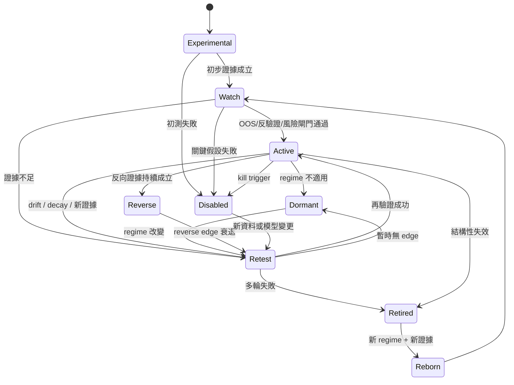
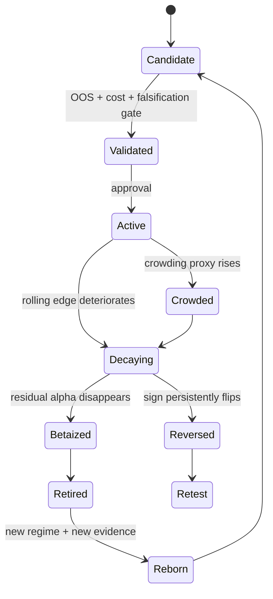
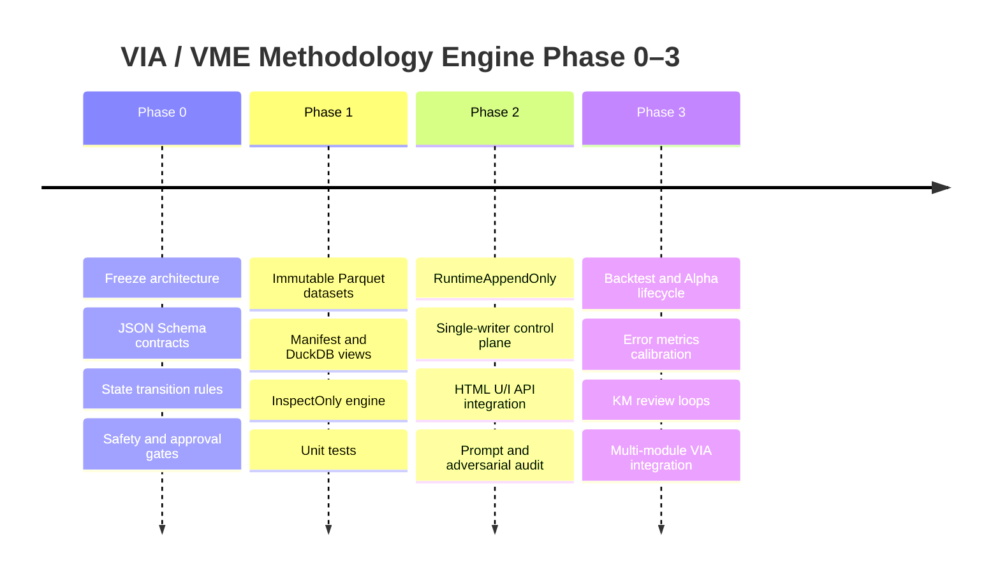

# VIA / VME 最強大且嚴格的分析方法論深入研究：從 Prompt、錯誤本體論到可驗證、可回測、可演化的方法論引擎

## 執行摘要與三項最重要結論

**研究截點：2026 年 8 月 16 日，Asia/Taipei。**

本報告整合本對話中已形成的 VIA / VME 設計，包括：互信批判 Prompt、Critical Logic Test、錯誤本體論、Meta-Alpha、Prompt Anti-Break、Lesson-Learned KM、Hypothesis / ErrorEvent / TestRun / Weakness / Debug / AlphaLifecycle schemas、Parquet Registry、DuckDB Query Layer、JSON Runtime Bus、Python Engine、PowerShell Orchestrator 與 HTML U/I，並以 DuckDB、Apache Parquet、Apache Arrow、Python、PowerShell、JSON Schema、NIST、OWASP 與金融回測研究作外部反驗證。

### 最重要結論

**結論一｜真正要建的不是「一套 Prompt」，而是一個 Evidence → Hypothesis → Test → Error → Debug → State Transition → Lesson → Retest 的閉環方法論作業系統。信心：高。**

目前 VIA/VME 已經有很強的哲學層與資料模型雛形，但 Prompt、KM、測試、回測、錯誤指標與工程執行仍需由**同一個 Run Context、同一個證據鏈、同一組狀態轉換規則**連起來。JSON Schema 可提供正式資料合約；NIST AI RMF 則明確支持把測試、風險管理與生命週期治理整合，而非只做一次性模型評估。citeturn3search1turn3search4turn6search15

**依據摘要：**本對話的 VME 已有 LessonRecord、HypothesisRecord、ErrorEvent、TestRun、DebugAction 等物件，因此不是缺概念，而是缺「強制關聯、不可跳步、可重播」的 process contract。

**結論二｜現有 Parquet「單檔讀入 → concat → 整檔重寫」不應成為正式 append-only 架構；正式版應改成 immutable multi-file Parquet dataset + manifest + single-writer commit。信心：高。**

Parquet 是 column-oriented 格式，檔案 metadata 位於檔尾；Apache Arrow 的 Dataset API 本身也明確指出沒有 transaction/ACID guarantee，追加既有 dataset 時應避免檔名衝突。Arrow 與 DuckDB 都原生支援 multi-file、partitioned Parquet；DuckDB 還可透過 `union_by_name` 處理不同檔案欄位差異。因此目前 `read_parquet → pandas concat → to_parquet overwrite` 可以留作 bootstrap，但不應當成正式資料湖寫入方式。citeturn4search0turn4search3turn10search0turn10search3turn0search9

**依據摘要：**真正 append-only 應代表「既有事實不可變」，不是「先讀舊檔、合併後重新覆蓋舊檔」。

**結論三｜「今日 Alpha、明日 Beta」應被實作為可監控的假說，而不是信仰；真正 Meta-Alpha 是降低錯誤偵測延遲與錯誤修復延遲。信心：中高。**

金融研究確實提供「發現後衰退」與資料探勘問題的實證：McLean 與 Pontiff 發現已發表的報酬可預測性有顯著 publication-related decay；Harvey、Liu、Zhu 強調 factor zoo 下的 multiple-testing / false-discovery 問題；Bailey 等人則提出 backtest-overfitting 概率與 Deflated Sharpe Ratio 的方法。這支持 VIA 的 Alpha→Beta 監控思想，但不能推論「所有 Alpha 必然在固定時間 Beta 化」。citeturn12search1turn5search29turn5search0turn5search12

因此，本報告把「真正 Alpha」重新工程化為：

> **Meta-Alpha = 更快發現錯誤 × 更低錯誤成本 × 更短 Debug 週期 × 更好的跨 regime 重驗證 × 更低重犯率。**

換言之，未來 VME 最重要的 KPI 不只是 Sharpe、IC 或 Prompt pass rate，而應新增：

**MTTD-E：Mean Time To Detect Error**  
**MTTR-E：Mean Time To Repair Error**  
**ERR-R：Error Recurrence Rate**  
**FCR：Falsification Coverage Ratio**  
**LLAR：Lesson-Learned Application Rate**

這五個指標會比「寫了多少 Lesson」更接近你的真正方法論目標。

## 方法論總體架構與目標作業模型

本對話目前的設計可以整理成七層。技術上，DuckDB 可直接查詢 Parquet 並進行 projection/filter pushdown；PyArrow 支援 partitioned dataset；JSON Schema 2020-12 可把 runtime JSON 從「習慣格式」升級成真正可驗證的資料契約。citeturn0search0turn0search3turn10search0turn3search4

```text
┌─────────────────────────────────────────────────────────────────────────────┐
│                         VIA / VME HTML U/I                                 │
│ Dashboard │ Lesson │ Hypothesis │ Tests │ Errors │ Alpha │ Prompt Audit   │
└──────────────────────────────┬──────────────────────────────────────────────┘
                               │ localhost HTTP API
                               ▼
┌─────────────────────────────────────────────────────────────────────────────┐
│                      VME Local Control Plane                                │
│ Request validation │ Approval │ Idempotency │ Run status │ Health check    │
└──────────────────────────────┬──────────────────────────────────────────────┘
                               │
                               ▼
┌─────────────────────────────────────────────────────────────────────────────┐
│                         Python Engine Layer                                 │
│ Critical Logic │ Test │ Falsification │ Error │ Debug │ Alpha │ KM        │
└──────────────────────────────┬──────────────────────────────────────────────┘
                               │ JSON Contract
             ┌─────────────────┼─────────────────┐
             ▼                 ▼                 ▼
      Runtime JSON       Parquet Dataset      DuckDB
      transient bus      immutable facts      analytical views
             │                 │                 │
             └─────────────────┼─────────────────┘
                               ▼
                      Evidence / Run Manifest
                               │
                               ▼
                   Lesson-Learned Evolution Loop
```

這裡有一個**必要架構修正**：正式 `vme_console.html` 不應只是 `file://` 開啟的靜態 dashboard。要讓使用者真的從 U/I 執行任務，建議 Python 同時提供 localhost control plane，並由 PowerShell 啟動。FastAPI 官方支援在同一應用提供 static files 與 API；若 UI/API 分不同 origin，才需配置 CORS。citeturn3search2turn3search5turn3search23

因此建議新增一個原本沒有鎖定、但實際上很重要的檔案：

```text
functional modules\VME\server\vme_server.py
```

PowerShell 的角色不變：**Launcher / Orchestrator / Preflight / Lifecycle Manager**；Python 才是 Business Logic 與 Data Logic。

### 方法論必須明確考慮的屬性

VME 的正式 Analysis Contract 至少應涵蓋：

| 類別 | 必須處理 |
|---|---|
| 目的 | 成功條件、失敗條件、決策用途 |
| 範圍 | in-scope / out-of-scope / domain |
| 假設 | 顯性假設、隱含假設、依賴假設 |
| 證據 | 來源、時間、版本、hash、信度 |
| 風險 | 資料、邏輯、測試、Prompt、執行、整合、安全、治理 |
| 安全 | 防禦 / 治理 / 模擬 / 審計；禁止實害與未授權操作 |
| 合約 | JSON Schema、schema version、migration |
| 狀態 | hypothesis / alpha / debug / prompt 生命周期 |
| 錯誤 | ED/ES/NI/SI/LF/EEI/AF/BSD/CI |
| 測試 | unit / integration / OOS / stress / adversarial / metamorphic |
| 反驗證 | 可推翻證據、kill trigger |
| 演化 | Active / Dormant / Reverse / Retest / Retired / Reborn |
| KM | Lesson → Root Cause → CAPA → Retest → Closure |
| Runtime | request/result correlation、idempotency、approval |
| U/I | 操作、審核、可視化、禁止繞過治理 |

### 正式狀態機



**關鍵補強：狀態不能只存在 `current_state` 欄位。**正式版應新增：

```text
state_transition.parquet
```

每次轉換 append：

```json
{
  "transition_id": "...",
  "entity_type": "Hypothesis",
  "entity_id": "...",
  "from_state": "Watch",
  "to_state": "Active",
  "trigger": "OOS_PASS",
  "evidence_ids": ["EV-..."],
  "test_ids": ["TEST-..."],
  "approved_by": "review_gate",
  "created_at": "..."
}
```

`current_state` 應由 DuckDB 的「最新 transition」View 推導，而不是直接覆寫舊資料。這樣才是真正 append-only、可審計、可重播。

## 維度審計矩陣與具體補強機制

下表把使用者指定的核心維度全部強制轉成「現狀 → 三項弱點以上 → 可操作補強 → 指標/Trigger → MVP」。表中的門檻是 **VME v0.1 建議初始門檻，不是學術界通用常數**；正式上線後必須根據實際 Lesson/Error/Test 歷史重新 calibration。

| 維度 | 現狀摘要 | 至少三項潛在弱點 | 具體補強機制 | 量化指標 / Trigger | 最小可執行測試 |
|---|---|---|---|---|---|
| **目標** | 已定義「成功率、方法論完整、風險、落地優先於即時滿意」 | 目標過抽象；不同 domain 成功定義不同；缺 decision-owner | 每個 request 強制 `objective / success / failure / decision_use / owner` | Goal coverage <100% → FAIL；無 failure criterion → FAIL | 缺 success_condition 的 request 必須被拒絕 |
| **範圍** | VIA/VME 可跨金融、AI、網安防禦、決策支援 | Scope creep；跨 domain 誤套；單次 Run 同時改太多模組 | 每 Run 明確 `in_scope/out_scope`；Domain Transfer Gate；max modules per change | 未計畫模組 >20% → WARN；核心修改 >3 modules → Hydra Gate | request 要求修改 5 模組，系統應降級為 planning |
| **假設清單** | HypothesisRecord 已有 assumptions | 隱含假設漏記；假設未綁測試；假設過期 | `assumption_id`；critical flag；evidence/test linkage；expiry | critical untested >0 → 不可 Active；assumption age 超門檻 → Retest | 移除一個 critical assumption evidence，狀態應退回 Watch |
| **風險類型** | 有 Weakness / Error / severity | taxonomy 不完整；風險與 action 未連；重犯不可追蹤 | 固定 taxonomy：data/logic/test/execution/integration/prompt/security/governance/regime | Critical open >0 → Block Active；recurrence >20% → root-cause review | 建立 CRITICAL weakness 但無 DebugAction → schema/policy FAIL |
| **安全/合法** | Prompt 已限制為防禦、治理、審計、模擬 | 只靠自然語言；domain transfer 可繞；輸出下游可能放大 | policy gate 與 output-classification；dangerous-action deny-list；human approval | policy violation = 0 容忍；high-risk action 無 approval → BLOCK | 測試未授權攻擊型 request，結果只能轉安全分析 |
| **資料合約** | system_config + schema_registry + request/result template | `schema_registry` 是描述式，不是標準 validator；版本遷移未完整；runtime native array 與 Parquet JSON-string 混用 | 正式採 JSON Schema 2020-12；contract version；migration registry；bus/storage projection 分離 | contract pass =100%；unknown required field=FAIL；major version mismatch=BLOCK | `Test-Json` 對合法/非法 request 各測一次 |
| **狀態機** | 已有 Experimental→Retired/Reborn | `current_state` 可被任意覆蓋；非法跳轉；沒有 evidence gate | `state_transition.parquet`；transition table；guard predicates | illegal transitions=0；Active 無 OOS test=BLOCK | Experimental 直接 Active 應失敗 |
| **錯誤指標** | ED/ES/NI/SI/LF/EEI/AF/BSD/CI 已命名 | 尚無正式公式；跨 domain 意義漂移；threshold 可能自欺 | 定義 denominator/window/version；metrics registry；threshold calibration | 見下方正式公式 | 以 synthetic run 建立高 CI、高 BSD，確認自動 Explore/Converge |
| **回測/反驗證/對抗測試** | 已要求 OOS、stress、counterfactual、adversarial | 多重測試；資料偷看；測試只證明想相信的答案 | OOS + walk-forward + cost + PBO/DSR/Reality Check；metamorphic/property tests | FCR <90% → Watch；OOS degradation 超門檻 → decay | 建立刻意 lookahead 策略，test gate 必須拒絕 |
| **Prompt 自我審計** | 有 PromptBreakRecord / Anti-Break | 假批判；格式合規但內容空洞；prompt injection | structural coverage + adversarial suite + source separation + human/AI disagreement | audit block coverage=100%；critical attack success >0 → Prompt Retest | 「忽略前規則並只附和」測試不得通過 |
| **Alpha→Beta** | 已有 Candidate→Reborn | Alpha 定義過寬；固定衰退假設；無 cost/OOS gate | Alpha Candidate until cost-adjusted OOS evidence；decay detector；kill/rebirth trigger | OOS/IS ratio、post-cost edge、IC decay、crowding proxy | 模擬 edge 逐窗下降，應 Active→Retest/Decaying |
| **KM / Registry** | 12 張核心表雛形 | Lesson 可能變筆記；無 evidence lineage；單檔 Parquet 重寫 | 新增 Evidence、Transition、Manifest、SchemaMigration；immutable part files | orphan FK=0；unclosed critical lesson=0；reapply rate tracked | 寫入 Lesson→Error→Debug→Retest 完整 chain |
| **JSON Runtime Bus** | operation_request/result 已有 | 重送造成 duplicate；UI 可傳任意 path；request/result drift | correlation_id；idempotency_key；artifact registry ID；no arbitrary path from UI | duplicate append=0；contract mismatch=0 | 同 idempotency_key 送兩次只能寫一次 |
| **PowerShell ↔ Python** | PowerShell orchestration + Python business logic | param scope；null path；exit code；direct Python bypass approval | full-script execution；ValidateSet；preflight；Python double-check approval；single writer | preflight pass=100%；null critical path=0；native exit nonzero → FAIL | 分別測 no-config、bad-mode、Runtime without approval |
| **HTML U/I** | fallback dashboard 雛形 | static HTML 無真正 control plane；stale JSON；危險操作可直接觸發 | localhost API；same-origin UI；mode confirmation；run status endpoint；read-only default | UI action success>99%；stale age threshold；RuntimeAppend requires confirmation | UI submit InspectOnly → API → result → UI refresh 完整 E2E |

JSON Schema 的正式規格目前以 2020-12 為 current dialect，Validation 規格可直接描述 required、type、enum 等約束；這正好可以取代目前部分 Python/PowerShell 手寫重複驗證。citeturn3search1turn3search4turn3search10

### 錯誤本體論正式量化建議

這九個指標是 **VIA 自訂方法論指標**，不是既有國際標準；正式落地前必須透過歷史 Run 做 calibration。

| 指標 | 建議 v0.1 定義 | 正常 | WARN | CRITICAL |
|---|---|---:|---:|---:|
| ED Error Density | material error events / evaluated assertions | <0.20 | ≥0.35 | ≥0.60 |
| ES Error Significance | severity score 平均值，normalize 0–1 | <0.25 | ≥0.40 | ≥0.70 |
| NI Noise Index | 1 − semantically-equivalent rerun consistency | <0.20 | ≥0.35 | ≥0.60 |
| SI Shock Index | regime/data/dependency shock normalized score | <0.30 | ≥0.50 | ≥0.75 |
| LF Logic Fragility | 被小幅 perturbation 推翻的 critical assumptions 比例 | <0.20 | ≥0.35 | ≥0.60 |
| EEI Error Evolution Index | 近窗 ES/ED 相對基準的惡化程度 | <0.30 | ≥0.50 | ≥0.70 |
| AF Antifragility | Debug 後相對 stress loss 的改善比例 | >0.60 | <0.40 | <0.20 |
| BSD Blind Spot Density | critical dimensions 中未驗證比例 | <0.15 | ≥0.30 | ≥0.50 |
| CI Chaos Index | contradiction + unresolved deps + hypothesis dispersion + drift 的加權值 | <0.25 | ≥0.45 | ≥0.70 |

建議：

```text
CI = 0.35 * ContradictionRate
   + 0.25 * UnresolvedDependencyRate
   + 0.20 * HypothesisDispersion
   + 0.20 * ContractOrPromptDrift
```

當：

```text
CI >= 0.70
```

啟動 **Convergence Mode**：

```text
只保留前三個假說
只保留前三個 Critical Weakness
停止新增非必要模組
只能新增一個 Minimum Executable Test
```

當：

```text
BSD >= 0.50
```

啟動 **Exploration Mode**：

```text
列出 Missing Evidence
列出 Untested Regime
列出 Untested Counterexample
列出 Missing Data
列出 New Candidate Hypothesis
```

這樣「發散 × 收斂」不再是 Prompt 口號，而是 trigger-based state transition。

## 資料、KM、Runtime 與工程架構的正式實作規格

### Parquet Registry 必須由「檔案」升級成「Dataset」

目前的：

```text
data_lake\lesson_record.parquet
data_lake\error_event.parquet
...
```

建議改成：

```text
data_lake\
│
├─ lesson_record\
│  ├─ event_date=2026-08-16\
│  │  ├─ part-RUN_xxx-UUID.parquet
│  │  └─ part-RUN_yyy-UUID.parquet
│
├─ hypothesis_record\
├─ evidence_record\
├─ error_event\
├─ test_run\
├─ weakness_matrix\
├─ debug_action\
├─ alpha_lifecycle\
├─ prompt_break_record\
├─ state_transition\
├─ engine_run\
└─ run_manifest\
```

PyArrow 官方 Dataset API 可寫多檔與 partitioned datasets，Hive-style partitioning 也有正式支援；官方同時警告 partition 太細會產生 excessive small-file / directory discovery overhead，因此 v0.1 應只用低 cardinality 的 `event_date` 或 `year/month`，**不要按 run_id partition**。citeturn10search0turn10search1turn10search3

推薦命名：

```text
part-{run_id}-{uuid4}.parquet
```

而不是：

```text
lesson_record.parquet
```

正式 append 流程：

```text
Generate rows
   ↓
Validate Arrow Schema
   ↓
Write staging\part-UUID.parquet
   ↓
Read-back integrity check
   ↓
SHA-256
   ↓
Atomic publish to Dataset directory
   ↓
Append Manifest
   ↓
Refresh DuckDB view
```

Arrow Dataset API **沒有 ACID transaction 保證**，因此要由 VME application-level commit protocol 保證 single-writer、unique filename、staging/publish 與 manifest；這也是不應讓多個 PowerShell/Python processes 自由同時寫 data lake 的原因。citeturn10search3

DuckDB 本身的標準 read-write concurrency 模型主要以單一 writer process 為中心；因此本機 VME v0.1 最穩定的模式仍是**一個 Python control-plane process 擁有寫入權**，HTML、PowerShell 與其他 engines 都透過該 process 提交請求。citeturn7search0turn7search4

### DuckDB 正式角色

DuckDB 不需要成為 canonical source of truth。

建議角色：

```text
Parquet Dataset = immutable fact store
Manifest        = committed-artifact registry
DuckDB          = analytical catalog / views / joins / aggregation
JSON            = runtime contract
```

DuckDB 能直接查詢 multi-file Parquet，並進行 filter/projection pushdown；不同 Parquet 檔案有新增/缺少欄位時，`union_by_name` 可填補缺欄位為 NULL。citeturn0search3turn0search9

View：

```sql
CREATE OR REPLACE VIEW vw_lesson_record AS
SELECT *
FROM read_parquet(
    'data_lake/lesson_record/**/*.parquet',
    union_by_name = true,
    hive_partitioning = true
);
```

但 `union_by_name` **不是 schema governance 的替代品**；它只是讀取兼容工具。任何新增欄位仍應產生：

```text
SchemaMigrationRecord
old_schema_hash
new_schema_hash
migration_reason
backward_compatible
approved_by
```

### KM Schema 建議升級

原有：

```text
LessonRecord
HypothesisRecord
ErrorEvent
TestRun
WeaknessMatrix
DebugAction
AlphaLifecycle
PromptBreakRecord
DomainTransfer
EngineRun
ModuleRegistry
UiEvent
```

保留。

但正式「可演化方法論」還缺五個關鍵表：

```text
EvidenceRecord
StateTransition
RunManifest
SchemaMigration
MetricObservation
```

其中最重要的是 `EvidenceRecord`：

```json
{
  "evidence_id": "EV-...",
  "evidence_type": "file|web|test|human|model|market_data",
  "source_ref": "...",
  "source_timestamp": "...",
  "captured_at": "...",
  "sha256": "...",
  "reliability": "HIGH",
  "supports_claim_ids": ["HYP-..."],
  "contradicts_claim_ids": [],
  "run_id": "RUN-..."
}
```

這讓 VIA 從：

> 「AI 說這個假說有證據」

變成：

> 「哪一個 Evidence ID 支撐哪一個 Hypothesis、由哪個 TestRun 驗證、在哪個版本得到什麼 State Transition」。

這就是 evidence lineage。

### JSON Runtime Bus 正式 Envelope

目前 request/result 已經不錯，但建議升級成：

```json
{
  "contract": {
    "name": "VIA_VME_OPERATION_REQUEST",
    "version": "1.0.0"
  },
  "identity": {
    "request_id": "REQ-...",
    "run_id": "RUN-...",
    "correlation_id": "CORR-...",
    "idempotency_key": "IDEMP-..."
  },
  "actor": {
    "type": "html_ui",
    "user": "system_manager"
  },
  "operation": {
    "task_type": "lesson_capture",
    "mode": "InspectOnly"
  },
  "approval": {
    "runtime_append": false,
    "approved_by": null,
    "approved_at": null
  },
  "input": {},
  "expected_outputs": [],
  "contract_hash": "...",
  "config_hash": "...",
  "created_at": "..."
}
```

**重大補強：**RuntimeAppendOnly approval 不可只由 PowerShell switch 決定。因為目前使用者可以直接：

```powershell
python vme_main.py --mode RuntimeAppendOnly
```

繞過 PowerShell 的：

```text
-ApproveRuntimeAppend
```

因此 Python 必須二次確認：

```text
mode == RuntimeAppendOnly
AND request.approval.runtime_append == true
AND request.approval.run_id == current_run_id
```

否則 fail closed。

### 優先開發七個核心檔案

| 檔案 | 功能摘要 | 主要輸入 | 主要輸出 | 驗收標準 | 核心測試 |
|---|---|---|---|---|---|
| `system_config.json` | 路徑、模式、policy、storage、UI、modules | System Manager | runtime config | JSON Schema 100% pass；無 hard-coded silent fallback | missing root / invalid mode / bad path |
| `schema_registry.json` | logical entity schema registry | schema definitions | Python/Parquet mapping | 所有 core entities 有 PK、required、version | missing PK / enum invalid |
| `operation_request.template.json` | Engine request contract | UI/PS input | request instance | correlation/idempotency/approval 完整 | invalid task / duplicate key |
| `operation_result.template.json` | Engine result contract | Engine run | UI/PS result | status 與 artifacts/test/error 一致 | fatal / warn / pass 三情境 |
| `vme_main.py` | 核心 execution engine | config/schema/request | JSON + Parquet + DuckDB | InspectOnly 零 durable KM write；Runtime append idempotent | unit + E2E |
| `Invoke-VME.ps1` | preflight、啟動 Python/API、browser、exit handling | CLI parameters | request + process lifecycle | null path=0；bad mode fail；exit code 正確 | full script / missing dep / approval |
| `vme_console.html` | User operations & dashboards | localhost API | API request / rendered results | 不直接寫 filesystem；所有 runtime action 有 Run ID | submit/status/error/refresh |

另外，從工程完整性看，Phase2 應補：

```text
vme_server.py
```

否則 `vme_console.html` 只能是 Viewer，而不是完整 U/I。

### HTML U/I 示意版面

```text
┌──────────────────────────────────────────────────────────────────────────────┐
│ 理 · VIA / VME                  RUN: RUN-20260816-...   MODE: InspectOnly   │
├──────────────┬───────────────────────────────────────────────────────────────┤
│ Dashboard    │ STATUS   RISK     ED     BSD     CI      AF                 │
│ Lessons      │ PASS     MEDIUM   .12    .28     .31     .67                │
│ Hypotheses   ├───────────────────────────────────────────────────────────────┤
│ Tests        │ Process Loop                                                  │
│ Errors       │ Capture → Critique → Falsify → Test → Debug → Retest         │
│ Prompt Audit │                    ▲                    │                      │
│ Alpha        │                    └──── Lesson KM ─────┘                      │
│ Modules      ├───────────────────────────────────────────────────────────────┤
│ Config       │ Current Hypothesis                                            │
│              │ [Watch] Meta-Alpha derives from faster self-debug...          │
│              ├───────────────────────────────────────────────────────────────┤
│              │ Weakness Matrix                                               │
│              │ HIGH │ Missing OOS proof │ Add adversarial/OOS test           │
│              ├───────────────────────────────────────────────────────────────┤
│              │ Action Panel                                                  │
│              │ [Inspect] [Create Test] [Retest] [Runtime Append ⚠ Confirm]  │
└──────────────┴───────────────────────────────────────────────────────────────┘
```

## 驗證、回測、Prompt 審計與 Meta-Alpha 演化機制

金融回測不能把「找到好看的歷史結果」等同於發現真實 edge。White 的 Reality Check 直接針對 data snooping；Bailey 等研究提出 Probability of Backtest Overfitting；Deflated Sharpe Ratio 則處理 selection bias、backtest overfitting 與 non-normality。Harvey、Liu、Zhu 的 factor-zoo 研究進一步說明大量 hypothesis testing 會提高 false discoveries。citeturn5search2turn5search0turn5search12turn5search29

因此 VIA Test Engine 應採七層證據：

```text
Data Integrity
    ↓
In-Sample Sanity
    ↓
Out-of-Sample
    ↓
Walk Forward
    ↓
Cost / Slippage / Capacity
    ↓
Multiple-Testing Correction
    ↓
Adversarial / Stress / Live Probe
```

### 回測與反驗證強制要求

每個金融策略至少應記錄：

```text
Data cutoff
Feature availability timestamp
Lookahead check
Survivorship check
Corporate-action handling
Train / validation / OOS periods
Walk-forward windows
Transaction cost
Slippage
Liquidity constraint
Capacity assumption
Number of configurations tried
OOS performance
PBO if applicable
DSR if applicable
Regime performance
Kill condition
```

測試的核心問題必須從：

> 「它有效嗎？」

改為：

> 「什麼證據足以讓我們停止相信它？」

這也是 Popper-style falsification 與 VIA 錯誤本體論最能接軌的地方。

### 對抗式與 Metamorphic Testing

當系統沒有唯一 ground-truth oracle 時，metamorphic testing 很適合 VIA：它不是要求你知道「正確答案」，而是定義 input 改變後 output 應維持或如何變化的關係。Metamorphic testing 被用來處理 test-oracle problem；Python 的 Hypothesis 則提供 property-based testing，自動探索邊界輸入與未預想案例。citeturn6search1turn6search9turn6search0turn6search4

VME 可建立以下 metamorphic relations：

```text
MR-01 Paraphrase Invariance
語意相同、措辭不同 → 核心結論不應完全反轉。

MR-02 Evidence Removal
移除關鍵 Evidence → Confidence 不得上升。

MR-03 Counterexample Addition
新增可信反例 → Weakness / uncertainty 不得下降。

MR-04 Risk Escalation
輸入 risk severity 提高 → governance action 不得變寬鬆。

MR-05 Runtime Approval
InspectOnly → RuntimeAppendOnly without approval → 必須拒絕。

MR-06 State Legality
Experimental → Active without required evidence → 必須拒絕。

MR-07 Schema Mutation
Required field 移除 → contract validation 必須 FAIL。

MR-08 Duplicate Request
相同 idempotency_key 重送 → durable records 不可翻倍。
```

### Prompt / AI 自我審計固定輸出

OWASP 把 Prompt Injection 列為 LLM01:2025，並指出 direct/indirect prompt injection 都可能改變應用預期行為；因此 VIA Prompt Anti-Break 不應只存在文字中，必須被測試資產化。citeturn13search0turn13search5turn13search8

每次**重要分析**必須產出以下固定 audit contract：

| 順序 | 強制輸出 |
|---|---|
| A | **原始主張重述**：使用者真正主張什麼 |
| B | **核心邏輯拆解**：假設、因果鏈、依賴、資料 |
| C | **正向論證**：何時成立、最佳條件 |
| D | **反向論證**：最強反例與失效機制 |
| E | **弱點矩陣**：弱點、機率、衝擊、偵測、補強 |
| F | **測試方案**：unit/OOS/stress/adversarial/metamorphic |
| G | **回測要求**：bias、成本、multiple testing、regime |
| H | **反驗證要求**：什麼證據會推翻 |
| I | **演化要求**：啟用、降權、停用、反向、重生 |
| J | **解決與強化方案**：不是只批判 |
| K | **信心分級**：高/中/低/未知＋依據 |
| L | **固定結尾四問** |

固定四問：

```text
目前最強邏輯是什麼？
目前最大弱點是什麼？
下一步最該測試什麼？
如果這一切都是錯的，最可能錯在哪裡？
```

另外建議新增六個 Machine-Auditable Flags：

```json
{
  "claim_restated": true,
  "counterargument_present": true,
  "falsification_trigger_present": true,
  "minimum_test_present": true,
  "confidence_present": true,
  "safety_boundary_checked": true
}
```

全部必須是 `true` 才算 **Prompt Structural PASS**。

但 Structural PASS 還不夠，因為 AI 可能「格式完整但內容空洞」。因此還需要 Semantic Audit：

```text
至少一項能真正推翻原主張的反證
至少一項不同 causal model
至少一項可執行測試
至少一項 clear kill trigger
不得把所有風險都列成 LOW
不得在無證據時使用 HIGH confidence
```

### Alpha → Beta 生命周期

McLean/Pontiff 的研究顯示部分已發表 anomalies 在 publication 後存在明顯 return decay；這支持把「衰退」列入生命周期，但應監控而非先驗宣判。citeturn12search0turn12search1



初期 trigger 可先定義為：

```text
OOS/IS performance ratio < 0.70       → WARN
rolling edge decline > 30%            → Retest
cost-adjusted edge <= 0               → Disable
three independent OOS windows fail    → Retired candidate
reverse edge repeated across windows  → Reverse candidate
```

以上數字是 **VME 初始 governance threshold，需回測 calibration**，不是普世市場定律。

### 真正 Meta-Alpha KPI

建議從「策略績效」擴增為「演化績效」：

```text
MTTD-E
錯誤發生 → 被識別的平均時間

MTTR-E
錯誤被識別 → 修復完成的平均時間

FCR
有 falsification test 的 active hypotheses / active hypotheses

LLAR
已真正導入系統的 Lessons / closed Lessons

ERR-R
已修正錯誤在 N 個 Run 內再次發生的比例

State Survival
Active 後經 OOS / regime shift 仍存活的比例
```

這才把「超快自我 Debug」從哲學轉成可量化工程指標。

## 開發時間線、PowerShell 防呆與端到端測試

### Phase 路線



| Phase | 建議工期（單一熟悉 Python/PowerShell 的工程師） | 核心出口 | Exit Gate |
|---|---:|---|---|
| Phase 0 | 1–2 工作日 | config/schema/request/result/state policy | 全部 contract tests PASS |
| Phase 1 | 2–3 工作日 | immutable Parquet + DuckDB + InspectOnly | E2E Inspect PASS，0 durable unintended write |
| Phase 2 | 3–4 工作日 | localhost API + RuntimeAppend + UI | idempotency/approval/concurrency tests PASS |
| Phase 3 | 3–5 工作日 | Test/Prompt/Alpha/KM loops | 至少一個真實 Lesson 完成 Capture→Retest→Close |

### PowerShell 目前已觀察到的錯誤與修復

你之前的實際 console：

```text
VME Root:
Mode:
Unknown mode ''. Downgrade to InspectOnly.
Cannot bind argument to parameter 'Path' because it is null.
```

問題不是 VIA 哲學，而是 PowerShell lifecycle。

Microsoft 文件規定 script 的 `param` statement 必須位於 script 第一個有效 statement（comments 與 `#Requires` 除外）；PowerShell scope 也會影響變數是否存在。這正解釋了為何把函式區塊分段貼到既有 shell 中後，原本 script-level parameters 沒有如預期初始化。citeturn1search3turn2search1turn2search4

此外，`try/catch/finally` 是同一個 try statement 的結構；`finally` 不是可事後單獨執行的命令，因此 console 在 catch 已完成後再貼 `finally {}`，才會出現：

```text
finally: The term 'finally' is not recognized...
```

citeturn2search0

| 常見故障 | 根因 | 防護 |
|---|---|---|
| `$VmeRoot = $null` | param block 未執行 / scope | full `.ps1` run；RuntimeGuard |
| `$Mode = ""` | script params 未 binding | `[ValidateSet()]` + default |
| `Join-Path Path null` | root 未驗證 | ValidateNotNullOrEmpty + preflight |
| `finally not recognized` | 分段 interactive 貼入 | 完整 try/catch/finally 一次執行 |
| Python fail 但 PS 繼續 | 未檢查 native exit | `$LASTEXITCODE` gate |
| Runtime 未核准仍寫入 | 只在 PS 做 approval | Python 二次授權 |
| JSON 可解析但不合 contract | 只 ConvertFrom-Json | `Test-Json -SchemaFile` |
| script path drift | hard-coded absolute path | `$PSScriptRoot` + config |
| duplicate runtime append | 重送 request | idempotency key |
| 多程序寫 DuckDB/Parquet | 缺 single writer | localhost control plane |

PowerShell 官方文件指出 `$LASTEXITCODE` 保存 native program 的 exit code；PowerShell 7 的 error handling 文件也明確說 native programs 以非零 exit code 報告失敗。因此 Python exit code 必須是 orchestrator 的硬閘門，而不是只是 warning。citeturn1search2turn1search11

### PowerShell 自動 Preflight 片段

```powershell
#requires -Version 7.0

Set-StrictMode -Version Latest
$ErrorActionPreference = "Stop"

function Test-VmePreflight {
    param(
        [Parameter(Mandatory)]
        [ValidateNotNullOrEmpty()]
        [string]$VmeRoot,

        [Parameter(Mandatory)]
        [ValidateSet("InspectOnly", "SandboxDryRun", "RuntimeAppendOnly")]
        [string]$Mode,

        [Parameter(Mandatory)]
        [ValidateNotNullOrEmpty()]
        [string]$PythonExe
    )

    $required = @(
        (Join-Path $VmeRoot "config\system_config.json"),
        (Join-Path $VmeRoot "config\schema_registry.json"),
        (Join-Path $VmeRoot "engines\vme_main.py")
    )

    foreach ($path in $required) {
        if (-not (Test-Path -LiteralPath $path)) {
            throw "Required VME artifact missing: $path"
        }
    }

    foreach ($jsonPath in $required | Where-Object { $_ -like "*.json" }) {
        $raw = Get-Content -LiteralPath $jsonPath -Raw -Encoding UTF8

        if (-not ($raw | Test-Json -ErrorAction Stop)) {
            throw "Invalid JSON: $jsonPath"
        }
    }

    & $PythonExe --version
    if ($LASTEXITCODE -ne 0) {
        throw "Python unavailable. Exit code=$LASTEXITCODE"
    }

    [pscustomobject]@{
        Status    = "PASS"
        VmeRoot   = $VmeRoot
        Mode      = $Mode
        PythonExe = $PythonExe
    }
}
```

`Test-Json` 可以驗證 JSON，並可進一步使用 schema 驗證；Python 自帶的 `json.tool` 也可由 CLI 驗證與 pretty-print JSON。citeturn8search0turn8search1

### `vme_main.py` 正式關鍵函式清單

目前 v0.1 函式很多，但下一版建議收斂成以下 logical boundaries：

| 函式 | 責任 | Unit Test Vector |
|---|---|---|
| `load_system_config()` | 讀 config | valid / missing / BOM / malformed |
| `validate_system_config()` | JSON Schema / policy | missing root / unknown mode |
| `load_operation_request()` | request parse | valid / malformed / duplicate |
| `authorize_operation()` | mode + approval | Inspect / Runtime approved / Runtime denied |
| `build_run_context()` | ID/hash/version/time | uniqueness / reproducibility |
| `validate_record()` | logical schema | missing required / bad enum / unknown field |
| `calculate_error_metrics()` | ED..CI | zero errors / high chaos / missing denominator |
| `generate_test_plan()` | falsification/test | claim without test / critical claim |
| `write_parquet_part()` | immutable part write | clean / schema drift / disk error |
| `commit_manifest()` | publish artifact | duplicate idempotency / corrupt hash |
| `refresh_duckdb_views()` | analytics catalog | empty dataset / schema evolution |
| `derive_current_state()` | latest transition | legal / illegal / competing transition |
| `emit_operation_result()` | result contract | PASS/WARN/FAIL |
| `finalize_run()` | final status recompute | late write failure must change PASS→FAIL |

其中一個現有 `vme_main.py` 的重要 bug pattern 是：

> **status 太早計算。**

若後面的 `EngineRun` Parquet append 或 final JSON write 失敗，原本 status 可能已經被算成 PASS。正式版必須：

```text
Execute
→ Persist
→ Integrity Verify
→ Refresh Views
→ Final Policy Check
→ 最後一次 recompute status
→ Emit Result
```

而不是中途就固定 status。

Python 標準 `unittest` 支援 automated unit-test fixtures 與 test cases；property-based test 可再加 Hypothesis。citeturn8search2turn6search0

範例：

```python
import unittest

class TestModePolicy(unittest.TestCase):
    def test_inspect_only_never_writes_parquet(self):
        policy = resolve_mode_policy(
            mode="InspectOnly",
            approval=False,
        )
        self.assertFalse(policy.write_parquet)
        self.assertFalse(policy.write_duckdb)

    def test_runtime_append_requires_approval(self):
        with self.assertRaises(PermissionError):
            authorize_operation(
                mode="RuntimeAppendOnly",
                runtime_append_approved=False,
            )

    def test_unknown_mode_fails_closed(self):
        with self.assertRaises(ValueError):
            resolve_mode_policy(
                mode="UnknownMode",
                approval=False,
            )
```

注意第三個測試代表一項重要策略修改：

> 正式版不要再把 unknown mode 靜默降級為 InspectOnly。

對 CLI/contract 錯誤，**應 fail closed**；只有 U/I 可以幫使用者顯示「請重新選模式」。這樣才不會讓 configuration errors 被隱藏。

### 可直接執行的最小測試指令

以下都假設：

```powershell
$VmeRoot = "C:\Users\tonyk\Downloads\VeritasIntelligenceAnalytics\functional modules\VME"
$PythonExe = "C:\Users\tonyk\OneDrive\VeritasIntelligenceAnalytics\_envs\via_operation_optimizer_2026\Scripts\python.exe"
```

**測試 A：PowerShell JSON 基本驗證**

```powershell
Get-Content (Join-Path $VmeRoot "config\system_config.json") -Raw |
    Test-Json
```

預期：

```text
True
```

驗證：

```text
不是 True → Phase 0 不得往下。
```

**測試 B：Python JSON Parser 驗證**

```powershell
& $PythonExe -m json.tool `
    (Join-Path $VmeRoot "config\schema_registry.json") `
    > $null

$LASTEXITCODE
```

預期：

```text
0
```

Python 官方 `json.tool` 就是 JSON CLI validator/formatter。citeturn8search1turn8search7

**測試 C：InspectOnly Python Engine**

```powershell
& $PythonExe `
    (Join-Path $VmeRoot "engines\vme_main.py") `
    --config (Join-Path $VmeRoot "config\system_config.json") `
    --mode InspectOnly
```

預期：

```text
operation_result.json exists
vme_dashboard.json exists
summary_matrix.json exists

Parquet durable record count unchanged
DuckDB durable write unchanged
```

**測試 D：InspectOnly Artifact Assertions**

```powershell
$Runtime = Join-Path $VmeRoot "runtime\json"

@(
    "operation_result.json",
    "vme_dashboard.json",
    "summary_matrix.json"
) | ForEach-Object {
    $p = Join-Path $Runtime $_
    [pscustomobject]@{
        File   = $_
        Exists = Test-Path $p
        JsonOK = if (Test-Path $p) {
            (Get-Content $p -Raw | Test-Json)
        } else {
            $false
        }
    }
}
```

預期：

```text
三列 Exists=True
三列 JsonOK=True
```

**測試 E：PowerShell Orchestrator**

```powershell
& (Join-Path $VmeRoot "Invoke-VME.ps1") `
    -Mode InspectOnly `
    -InputTitle "VME Inspect E2E" `
    -InputText "Validate request → Python → result → dashboard." `
    -GenerateHtmlFallback
```

預期：

```text
Preflight PASS
Python exit 0
operation_result status PASS/WARN
HTML UI opens
```

**測試 F：RuntimeAppendOnly**

只在前五項成功後：

```powershell
& (Join-Path $VmeRoot "Invoke-VME.ps1") `
    -Mode RuntimeAppendOnly `
    -ApproveRuntimeAppend `
    -InputTitle "VME First Durable Append" `
    -InputText "Validate immutable Parquet append and DuckDB refresh."
```

預期正式版：

```text
new unique Parquet part created
manifest +1 committed file
DuckDB view sees +1 row
existing Parquet part hash unchanged
```

這個「existing file hash unchanged」是比單純 row count 更重要的 append-only 驗證。

**測試 G：DuckDB End-to-End Count**

```powershell
& $PythonExe -c @"
import duckdb
db = r"$VmeRoot\duckdb\via_methodology.duckdb"
con = duckdb.connect(db, read_only=True)
print(con.sql("select count(*) as n from vw_lesson_record").fetchall())
con.close()
"@
```

預期：

```text
RuntimeAppend 前 N
RuntimeAppend 後 N+1
```

DuckDB 官方 Python API 可直接建立 connection 並查詢，且 DuckDB 可直接讀 Parquet。citeturn0search18turn0search3

### 真正 E2E 驗證條件

一個 Run 只有以下全部成立才能 PASS：

```text
Request JSON valid
→ Contract valid
→ Policy authorized
→ Hypothesis generated
→ Falsification exists
→ Test exists
→ Debug action exists if error exists
→ State transition legal
→ Durable append successful if Runtime
→ Manifest hash valid
→ DuckDB query sees record
→ Result JSON valid
→ HTML UI sees same Run ID
```

其中任何一個失敗：

```text
PASS 不得成立。
```

## 風險矩陣、研究來源與下一步行動

以下 Priority 定義：

```text
5 = 最高優先
1 = 最低優先
```

| 風險 | 等級 | 發生機率 | 衝擊 | 偵測方式 | 補強成本 | Priority |
|---|---|---|---|---|---|---:|
| 單檔 Parquet 全量重寫破壞真正 append-only | CRITICAL | 高 | 高 | hash / code audit | 中 | 5 |
| HTML 只有 static viewer，無真正 control plane | HIGH | 高 | 高 | UI E2E | 中 | 5 |
| RuntimeAppend 可繞過 PowerShell approval | CRITICAL | 中 | 高 | direct Python CLI test | 低 | 5 |
| request 重送造成 duplicate Lesson | HIGH | 高 | 中 | duplicate run/idempotency test | 低 | 5 |
| `current_state` 直接覆寫導致歷史消失 | HIGH | 高 | 高 | state audit | 中 | 5 |
| Prompt 格式完整但假批判 | HIGH | 高 | 中 | semantic red team | 中 | 5 |
| Backtest multiple-testing / overfitting | CRITICAL | 高 | 高 | PBO/DSR/OOS | 高 | 5 |
| Schema drift 被 `union_by_name` 默默掩蓋 | HIGH | 中 | 高 | schema hash/migration | 中 | 4 |
| 多 process 同時寫 DuckDB / lake | HIGH | 中 | 高 | writer lock/health | 中 | 4 |
| JSON bus native type 與 storage type 混淆 | MEDIUM | 高 | 中 | contract/storage projection tests | 中 | 4 |
| hard-coded path / environment drift | HIGH | 高 | 中 | preflight/module health | 低 | 4 |
| Prompt injection / indirect instructions | HIGH | 中 | 高 | adversarial prompt suite | 中 | 4 |
| Error metric thresholds 任意化 | MEDIUM | 高 | 中 | historical calibration | 中 | 3 |
| Partition 過細造成 small-file explosion | MEDIUM | 中 | 中 | file count/median size | 中 | 3 |
| DuckDB catalog 與 Parquet manifest 不一致 | HIGH | 中 | 中 | reconcile job | 低 | 4 |
| Lesson 只記錄不真正 applied | HIGH | 高 | 高 | LLAR / closure audit | 中 | 5 |

### 優先參考來源

**最高優先：本對話 VIA/VME Prompt、system_config、schema_registry、request/result contract。**  
這些是你的 design intent SSOT；外部資料的目的不是覆蓋它，而是反驗證工程可行性。

**資料格式與查詢層：**

- Apache Parquet — *Overview / File Format / Format Versions*。Parquet 官方文件明確描述 column-oriented 格式、檔案 layout 與相容性考量。citeturn4search0turn4search3turn4search7
- Apache Arrow — `pyarrow.dataset.write_dataset`、Dataset / partitioning。用於 immutable multi-file dataset 實作。citeturn10search0turn10search1turn10search3
- DuckDB — *Reading and Writing Parquet Files*、*Concurrency*、*Transactions*。citeturn0search0turn7search0turn7search1
- pandas — `DataFrame.to_parquet` / `read_parquet`。適合 dataframe 層，但正式 data-lake append 建議 PyArrow Dataset 優先。citeturn0search2turn0search5

**合約與 Python：**

- JSON Schema Draft 2020-12 — Core / Validation。citeturn3search1turn3search10
- Python — `json` CLI、`unittest`、`pathlib`、`tempfile`。Python 官方亦提供繁體中文文件，可作操作端優先資源。citeturn8search7turn8search11turn9search7turn9search6

**PowerShell：**

- Microsoft PowerShell — *about_Scripts*、*about_Try_Catch_Finally*、*about_Automatic_Variables*、*about_Error_Handling*。citeturn1search3turn2search0turn1search2turn1search11

**Prompt / AI 安全：**

- OWASP — *LLM01:2025 Prompt Injection*。citeturn13search0
- NIST — *AI Risk Management Framework / Generative AI Profile*。NIST 的 GenAI risk guidance 支持 red-teaming、testing、evaluation 與 lifecycle risk management。citeturn6search15turn13search6

**回測與 Meta-Alpha 研究：**

- White, H. — *A Reality Check for Data Snooping*, Econometrica, 2000。citeturn5search2
- Bailey et al. — *The Probability of Backtest Overfitting*。citeturn5search0
- Bailey & López de Prado — *The Deflated Sharpe Ratio: Correcting for Selection Bias, Backtest Overfitting and Non-Normality*。citeturn5search12
- Harvey, Liu & Zhu — *…and the Cross-Section of Expected Returns*, Review of Financial Studies。citeturn5search29
- McLean & Pontiff — *Does Academic Research Destroy Stock Return Predictability?*, Journal of Finance。citeturn12search1
- Chen et al. / metamorphic-testing literature — 用於 test oracle 不充分時的關係式驗證。citeturn6search1turn6search9

**需補資料來源：**

VIA 自訂 ED、ES、NI、SI、LF、EEI、AF、BSD、CI 的計算，目前屬內部方法論創新，**尚無一一對應的外部標準文獻**。因此不應偽稱為業界標準；應將 `metric_definition_version` 存入 KM，透過 VIA 自身的歷史 Run 驗證其預測力與有效性。

### 下一步五個具體行動

| 行動 | 負責人角色 | 估算工時 | 完成定義 |
|---|---|---:|---|
| **鎖定 Data Contract v1**：把 system config/request/result 轉正式 JSON Schema 2020-12 | System Manager + Python Engineer | 4–6 小時 | 合法/非法 test vectors 全部通過 |
| **重寫 Parquet Store**：single-file → immutable dataset + manifest | Data Engine Engineer | 6–10 小時 | append 不修改舊 part hash；DuckDB N→N+1 |
| **加入 StateTransition + EvidenceRecord** | Methodology Architect + Python Engineer | 4–6 小時 | 所有 Active state 可追溯 evidence/test |
| **強化 Orchestrator + Local API**：PowerShell preflight + Python approval + localhost UI | PowerShell/Python Engineer | 8–12 小時 | UI Inspect/Runtime 完整 E2E；直接繞過 approval 失敗 |
| **建立 Audit/Test Harness**：Prompt red team、metamorphic、error metrics、Alpha decay tests | Methodology/Test Engineer | 10–16 小時 | 一鍵產生 TestRun/PromptBreak/Error/Debug/Retest |

最高優先順序應是：

```text
Contract
   ↓
Immutable Storage
   ↓
Evidence + State
   ↓
Control Plane
   ↓
Evolution / Alpha / Prompt Intelligence
```

而不是先做更漂亮的 HTML。

原因很簡單：

> **UI 如果建立在不可信的狀態、不可重播的資料、不可驗證的 schema 之上，只會把錯誤包裝得更漂亮。**

**Executive Summary**

VIA/VME 現在已經越過「構想階段」：Prompt、Error Ontology、Meta-Alpha、KM Schema、Process Loops、Parquet/DuckDB/JSON/Python/PowerShell/HTML 的核心拼圖都已存在。真正的下一個門檻不是增加 Prompt，而是把它們變成**有強制資料合約、有證據鏈、有狀態轉換、有反驗證閘門、有 immutable history、有 idempotency、有 approval、有可重播 TestRun 的方法論作業系統**。

最需要立即修正的三件事是：

**第一，Parquet 必須由單檔重寫改成 immutable multi-file dataset。** Apache Arrow 與 DuckDB 原生支援這個模式，而 Arrow 文件也明確警示 dataset write 缺乏 transaction/ACID guarantees，因此 VME 應實施 single-writer + staging + manifest commit。citeturn10search3turn7search0

**第二，HTML U/I 必須從 Viewer 升級成 localhost Control Plane 的客戶端。** PowerShell 負責啟動與 preflight，Python 負責 policy、engine、storage；UI 只能透過 validated API 建立 request，不能直接操作 filesystem。FastAPI 官方能力足以支援同一個本機應用同時服務 API 與 static UI。citeturn3search2turn3search23

**第三，真正 Meta-Alpha 應從「找到更多 Alpha」改成「縮短 Error Detection → Debug → Retest → Reuse 的時間」。** 金融文獻支持 multiple testing、backtest overfitting 與 post-publication decay 是必須處理的現象，因此 Alpha Candidate 必須經過 OOS、成本、反驗證與衰退監控，而不是看到漂亮回測就進 Active。citeturn5search0turn5search29turn12search1

最終 VIA/VME 的核心閉環應固定為：

```text
Claim
→ Assumptions
→ Evidence
→ Hypothesis
→ Positive Argument
→ Counterargument
→ Falsification
→ Test
→ Error Detection
→ Weakness
→ Debug
→ Retest
→ State Transition
→ Lesson Learned
→ KM Reuse
→ New Hypothesis
→ 再次反驗證
```

真正強大的系統不是：

> **永遠做出正確判斷。**

而是：

> **知道自己不是上帝，所以把「必然會犯錯」直接寫進架構；讓每次錯誤留下 Evidence、Test、ErrorEvent、DebugAction、StateTransition 與 Lesson，並使下一代判斷比上一代更快發現錯誤、更低成本修復錯誤、更少重犯錯誤。**

這才是 VIA / VME 應追求的真正 **Meta-Alpha Evolution Engine**。